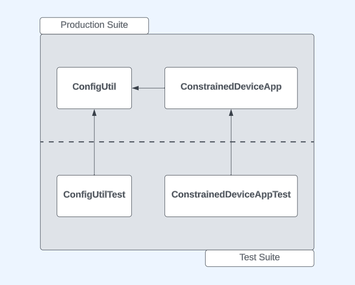

# Constrained Device Application (Connected Devices)

## Lab Module 01

## Description

### What does your implementation do?
A Constrained Device Application, or CDA, is a software application that runs on a "constrained" (ie. resource-limited) device. The purpose of the CDA is to gather sensor data, control actuators, and communicate this information to other devices.

In the context of this project, the CDA is designed to collect temperature, humidity, and pressure data from sensors. However, as this is the first module, only shell implementations have been provided. The components that were observed for this module include the <b>ConstrainedDeviceApp</b> class and the <b>ConfigUtil</b> class. ConfigUtil is a configuration utility used to manage the configuration settings of the application.

### How does your implementation work?

The ConfigUtil class is used for managing configuration settings for the CDA. It can be initialized with a specified configuration file name (or will use the default one). It provides methods to retrieve configuration values, checks for the existence of keys and sections in the configuration file, and can load separate credential files. The CDA requires certain configuration settings to behave a certain way. Upon initializing, it will make a call to ConfigUtil for it to retrieve configuration parameters required for runtime.

## Code Repository and Branch
Please click the link before to be directed to the CDA repository.

URL: https://github.com/Darren-C26/piot-python-components/tree/labmodule01

## UML Design Diagram(s)

<p style="text-align: center;">CDA Implementation UML</p>

## Unit Tests Executed
The unit tests executed for the <b>CDA</b> are listed below.
 - ConfigUtilTest
```
Finding files... done.
Importing test modules ... done.

2023-09-17 20:48:42,691:ConfigUtilTest:INFO:Testing ConfigUtil class...
2023-09-17 20:48:42,692:ConfigUtil:INFO:Loading config: ./ValidTestConfig.props
2023-09-17 20:48:42,693:ConfigUtil:DEBUG:Config: ['Mqtt.GatewayService', 'Coap.GatewayService', 'ConstrainedDevice']
2023-09-17 20:48:42,694:ConfigUtil:INFO:Created instance of ConfigUtil: <programmingtheiot.common.ConfigUtil.ConfigUtil object at 0x0000026078689330>
----------------------------------------------------------------------
Ran 8 tests in 0.003s

OK (skipped=1)
```
Test Execution Sample:

## Integration Tests Executed
The integration tests for the <b>CDA</b> are listed below.

 - GatewayDeviceAppTest

Text Execution Sample:
```
Finding files... done.
Importing test modules ... done.

2023-09-17 20:47:29,210:root:INFO:Testing ConstrainedDeviceApp class...
2023-09-17 20:47:29,210:root:INFO:Initializing CDA...
2023-09-17 20:47:29,210:root:INFO:Starting CDA...
2023-09-17 20:47:29,210:root:INFO:CDA started.
2023-09-17 20:47:29,210:root:INFO:CDA stopping...
2023-09-17 20:47:29,210:root:INFO:CDA stopped with exit code 0.
----------------------------------------------------------------------
Ran 1 test in 0.001s

OK
```