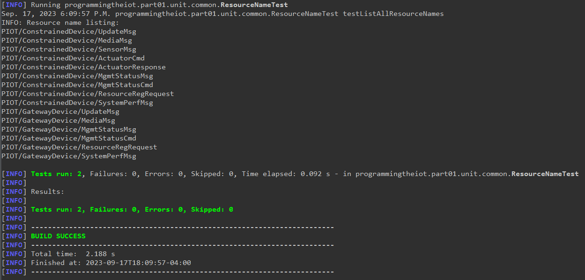
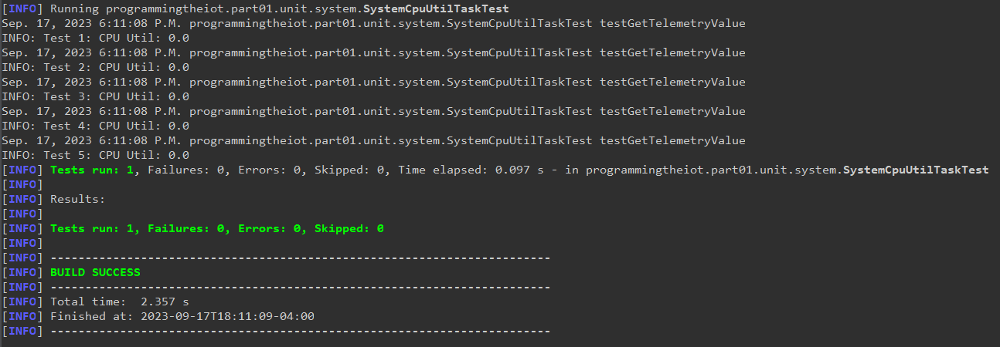
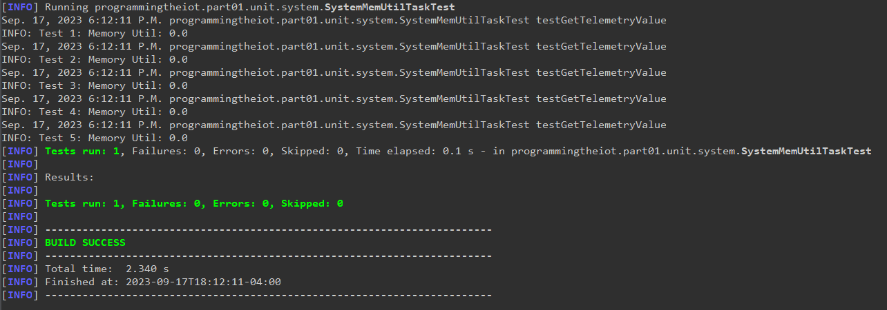
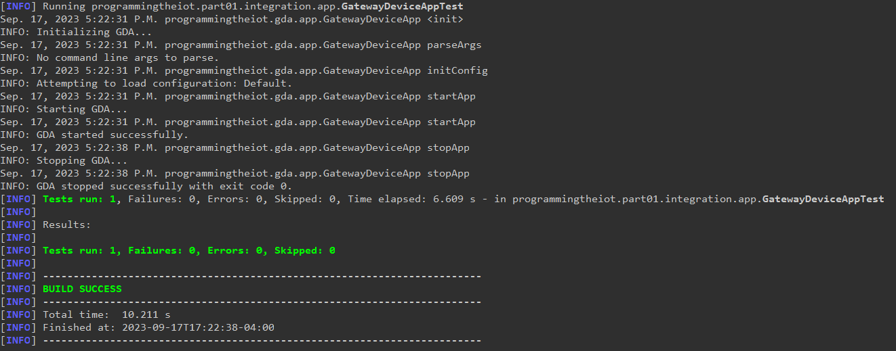
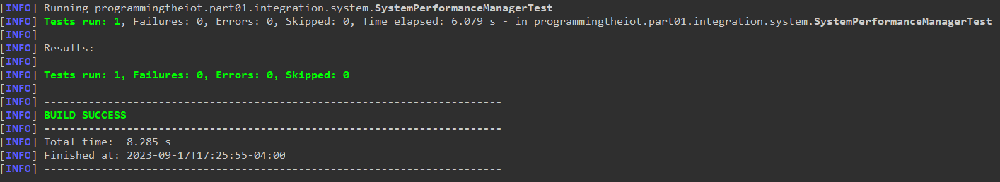

# Gateway Device Application (Connected Devices)

## Lab Module 01

# PIOT - Java Components Module01

## Description
NOTE: Include two full paragraphs describing your implementation approach by answering the questions listed below.

### What does your implementation do?

### How does your implementation work?

## Code Repository and Branch
Please click the link before to be directed to the GDA repository.

URL: https://github.com/Darren-C26/piot-java-components/tree/labmodule01

## UML Design Diagram(s)
NOTE: Include one or more UML designs representing your solution. It's expected each diagram you provide will look similar to, but not the same as, its counterpart in the book Programming the IoT.

## Unit Tests Executed
The unit tests executed for the <b>GDA</b> are listed below.
#### Required:
 - ConfigUtilTest

#### Other Tests:
 - ResourceNameTest
 - SystemCpuUtilTaskTest
 - SystemMemUtilTaskTest

Test Execution Sample (Using Maven):

## Integration Tests Executed
The integration tests for the GDA are listed below.

#### Required:
 - GatewayDeviceAppTest

#### Other Tests:
 - SystemPerformanceManagerTest

Text Execution Sample (using Maven):

