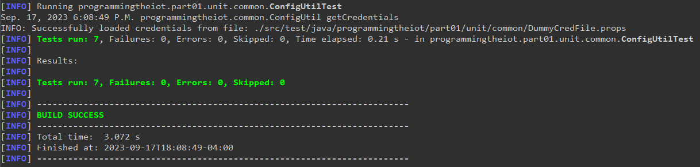

# Gateway Device Application (Connected Devices)

## Lab Module 01

## Description
NOTE: Include two full paragraphs describing your implementation approach by answering the questions listed below.

### What does your implementation do?


This lab focuses on getting the configuration environments correctly set up for the project, hence the implemenetation for the first iteration is simple in design. For this module, the implementation interfaces with a configuration utility named <b>ConfigUtil</b>. This utility wrapper (which is part of the Apache Commons configuration architecture) is used for managing the configuration settings within the application (app/system/environemt-specific configurations etc.). In the context of this application, the 

### How does your implementation work?

## Code Repository and Branch
Please click the link before to be directed to the GDA repository.

URL: https://github.com/Darren-C26/piot-java-components/tree/labmodule01

## UML Design Diagram(s)

<p style="text-align: center;">GDA Implementation UML</p>

## Unit Tests Executed
The unit tests executed for the <b>GDA</b> are listed below.
#### Required:
 - ConfigUtilTest
```
Sep. 17, 2023 10:34:55 P.M. programmingtheiot.common.ConfigUtil getCredentials
INFO: Successfully loaded credentials from file: ./src/test/java/programmingtheiot/part01/unit/common/DummyCredFile.props
```
#### Other Tests:
 - ResourceNameTest
 - SystemCpuUtilTaskTest
 - SystemMemUtilTaskTest

Test Execution Sample (Using Maven):



## Integration Tests Executed
The integration tests for the <b>GDA</b> are listed below.

#### Required:
 - GatewayDeviceAppTest
```
Sep. 17, 2023 10:33:15 P.M. programmingtheiot.gda.app.GatewayDeviceApp <init>
INFO: Initializing GDA...
Sep. 17, 2023 10:33:15 P.M. programmingtheiot.gda.app.GatewayDeviceApp parseArgs
INFO: No command line args to parse.
Sep. 17, 2023 10:33:15 P.M. programmingtheiot.gda.app.GatewayDeviceApp initConfig
INFO: Attempting to load configuration: Default.
Sep. 17, 2023 10:33:15 P.M. programmingtheiot.gda.app.GatewayDeviceApp startApp
INFO: Starting GDA...
Sep. 17, 2023 10:33:15 P.M. programmingtheiot.gda.app.GatewayDeviceApp startApp
INFO: GDA started successfully.
```

#### Other Tests:
 - SystemPerformanceManagerTest

Text Execution Sample (using Maven):


