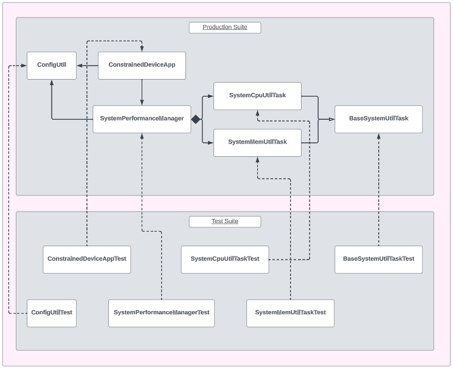

# Constrained Device Application (Connected Devices)

## Lab Module 02

## Description

### What does your implementation do?
A Constrained Device Application, or CDA, is a software application that runs on a "constrained" (ie. resource-limited) device. The purpose of the CDA is to gather sensor data, control actuators, and communicate this information to other devices.

In the context of this project, the CDA is designed to collect temperature, humidity, and pressure data from sensors. However, as this is the second module, the application has not been implemented completely. The components that were observed for this module include the <b>ConstrainedDeviceApp</b> class, the <b>ConfigUtil</b> class, the <b>SystemPerformanceManager</b> class, the <b>BaseSystemUtilTask</b> class, the <b>SystemCpuUtilTask</b> class, and the <b>SystemMemUtilTask</b> class. <b>ConfigUtil</b> is a configuration utility used to manage the configuration settings of the application.<b>SystemPerformanceManager</b> is responsible for coordinating performance monitoring tasks for the system.<b>SystemCpuUtilTask</b> and <b>SystemMemUtilTask</b> are in charge of monitoring the CPU and memory utiliaztion respectively. The abstract class <b>BaseSystemUtilTask</b> provides a common interface for the various utility tasks of the application.

### How does your implementation work?

When the CDA is initialized, it creates an instance of the <b>SystemPerformanceManager</b> class, which will serve as the primary manager for the performance monitoring. When the <b>startApp</b> method is called, the SystemPerformanceManager instance initiates (via <b>SystemPerformanceManager.startManager</b>) the monitoring of the performance metrics. In particular, this implementation monitors the CPU and memory utilization (via <b>SystemPerformanceManager.handleTelemetry</b>). After running for the specified time, the <b>stopApp</b> method will be called, which stops the SystemPerformanceManager instance (via <b>SystemPerformanceManager.stopManager</b>) and halts the monitoring of the CPU and memory metrics. Logs are used in the application to indicate the intialization, starting, and stopping of the CDA, as well as performance metrics that were obtained from the SystemPerformanceManager instance.

## Code Repository and Branch
Please click the link before to be directed to the CDA repository.

URL: https://github.com/Darren-C26/piot-python-components/tree/labmodule02

## UML Design Diagram(s)
<p align="center">

</p>

<p align="center">CDA Implementation UML (Module02)</p>

## Unit Tests Executed
The unit tests executed for the <b>CDA</b> are listed below. Sample test executions can be seen by clicking on the dropdown icon.

<details close>
<summary>ConfigUtilTest</summary>

```
Finding files... done.
Importing test modules ... done.

2023-09-22 20:42:58,167:ConfigUtilTest:INFO:Testing ConfigUtil class...
2023-09-22 20:42:58,168:ConfigUtil:INFO:Loading config: ./ValidTestConfig.props
2023-09-22 20:42:58,178:ConfigUtil:DEBUG:Config: ['Mqtt.GatewayService', 'Coap.GatewayService', 'ConstrainedDevice']
2023-09-22 20:42:58,178:ConfigUtil:INFO:Created instance of ConfigUtil: <programmingtheiot.common.ConfigUtil.ConfigUtil object at 0x000002EA46358DC0>
----------------------------------------------------------------------
Ran 8 tests in 0.012s

OK (skipped=1)
```
</details>

<br>

<details close>
<summary>SystemCpuUtilTaskTest</summary>

```
Finding files... done.
Importing test modules ... done.

2023-09-22 21:27:45,167:SystemCpuUtilTaskTest:INFO:Testing SystemCpuUtilTask class...
2023-09-22 21:27:45,167:SystemCpuUtilTaskTest:INFO:CPU utilization: 0.0
----------------------------------------------------------------------
Ran 1 test in 0.001s

OK
```
</details>
<br>

<details close>
<summary>SystemMemUtilTaskTest</summary>

```
Finding files... done.
Importing test modules ... done.

2023-09-22 21:33:36,855:SystemMemUtilTaskTest:INFO:Testing SystemMemUtilTask class...
2023-09-22 21:33:36,863:SystemMemUtilTaskTest:INFO:Virtual memory utilization: 92.4
----------------------------------------------------------------------
Ran 1 test in 0.008s

OK
```
</details>

<br>

## Integration Tests Executed
The integration tests for the <b>CDA</b> are listed below. Sample test executions can be seen by clicking on the dropdown icon.

<details close>
<summary>ConstrainedDeviceAppTest</summary>

```
Finding files... done.
Importing test modules ... done.

2023-09-22 21:59:26,688:root:INFO:Testing ConstrainedDeviceApp class...
2023-09-22 21:59:26,688:root:INFO:Initializing CDA...
2023-09-22 21:59:26,689:root:INFO:Loading config: ../../../../../../../config/PiotConfig.props
2023-09-22 21:59:26,690:root:DEBUG:Config: ['Mqtt.GatewayService', 'Coap.GatewayService', 'ConstrainedDevice']
2023-09-22 21:59:26,691:root:INFO:Created instance of ConfigUtil: <programmingtheiot.common.ConfigUtil.ConfigUtil object at 0x0000028C9E5FD210>
2023-09-22 21:59:26,691:tzlocal:DEBUG:Looking up time zone info from registry
2023-09-22 21:59:26,700:apscheduler.scheduler:INFO:Adding job tentatively -- it will be properly scheduled when the scheduler starts
2023-09-22 21:59:26,700:root:INFO:Starting CDA...
2023-09-22 21:59:26,700:root:INFO:Starting SystemPerformanceManager...
2023-09-22 21:59:26,702:apscheduler.scheduler:INFO:Added job "SystemPerformanceManager.handleTelemetry" to job store "default"
2023-09-22 21:59:26,702:apscheduler.scheduler:INFO:Scheduler started
2023-09-22 21:59:26,703:apscheduler.scheduler:DEBUG:Looking for jobs to run
2023-09-22 21:59:26,703:root:INFO:Started SystemPerformanceManager.
2023-09-22 21:59:26,703:apscheduler.scheduler:DEBUG:Next wakeup is due at 2023-09-22 21:59:31.700163-04:00 (in 4.997001 seconds)
2023-09-22 21:59:26,703:root:INFO:CDA started.
2023-09-22 21:59:26,703:root:INFO:CDA stopping...
2023-09-22 21:59:26,703:root:INFO:Stopping SystemPerformanceManager...
2023-09-22 21:59:26,703:apscheduler.scheduler:INFO:Scheduler has been shut down
2023-09-22 21:59:26,704:apscheduler.scheduler:DEBUG:Looking for jobs to run
2023-09-22 21:59:26,704:apscheduler.scheduler:DEBUG:No jobs; waiting until a job is added
2023-09-22 21:59:26,704:root:INFO:Stopped SystemPerformanceManager.
2023-09-22 21:59:26,704:root:INFO:CDA stopped with exit code 0.
----------------------------------------------------------------------
Ran 1 test in 0.016s

OK
```

</details>
<br>

<details close>
<summary>SystemPerformanceManagerTest</summary>

```
Finding files... done.
Importing test modules ... done.

2023-09-22 21:57:17,446:SystemPerformanceManagerTest:INFO:Testing SystemPerformanceManager class...
2023-09-22 21:57:17,447:ConfigUtil:INFO:Loading config: ../../../../../../../config/PiotConfig.props
2023-09-22 21:57:17,455:ConfigUtil:DEBUG:Config: ['Mqtt.GatewayService', 'Coap.GatewayService', 'ConstrainedDevice']
2023-09-22 21:57:17,455:ConfigUtil:INFO:Created instance of ConfigUtil: <programmingtheiot.common.ConfigUtil.ConfigUtil object at 0x0000015CF34A9150>
2023-09-22 21:57:17,455:win32:DEBUG:Looking up time zone info from registry
2023-09-22 21:57:17,478:base:INFO:Adding job tentatively -- it will be properly scheduled when the scheduler starts
2023-09-22 21:57:17,479:SystemPerformanceManager:INFO:Starting SystemPerformanceManager...
2023-09-22 21:57:17,481:base:INFO:Added job "SystemPerformanceManager.handleTelemetry" to job store "default"
2023-09-22 21:57:17,481:base:INFO:Scheduler started
2023-09-22 21:57:17,482:base:DEBUG:Looking for jobs to run
2023-09-22 21:57:17,482:base:DEBUG:Next wakeup is due at 2023-09-22 21:57:22.478575-04:00 (in 4.995996 seconds)
2023-09-22 21:57:17,482:SystemPerformanceManager:INFO:Started SystemPerformanceManager.
2023-09-22 21:57:22,479:base:DEBUG:Looking for jobs to run
2023-09-22 21:57:22,479:base:INFO:Running job "SystemPerformanceManager.handleTelemetry (trigger: interval[0:00:05], next run at: 2023-09-22 21:57:22 EDT)" (scheduled at 2023-09-22 21:57:22.478575-04:00)
2023-09-22 21:57:22,489:SystemPerformanceManager:DEBUG:CPU utilization is 14.7 percent, and memory utilization is 91.8 percent.
2023-09-22 21:57:22,489:base:INFO:Job "SystemPerformanceManager.handleTelemetry (trigger: interval[0:00:05], next run at: 2023-09-22 21:57:22 EDT)" executed successfully
2023-09-22 21:57:22,489:base:DEBUG:Next wakeup is due at 2023-09-22 21:57:27.478575-04:00 (in 4.989389 seconds)
2023-09-22 21:57:23,490:SystemPerformanceManager:INFO:Stopping SystemPerformanceManager...
----------------------------------------------------------------------
Ran 1 test in 6.045s2023-09-22 21:57:23,490:base:INFO:Scheduler has been shut down
2023-09-22 21:57:23,490:base:DEBUG:Looking for jobs to run
2023-09-22 21:57:23,490:base:DEBUG:No jobs; waiting until a job is added
2023-09-22 21:57:23,491:SystemPerformanceManager:INFO:Stopped SystemPerformanceManager.


OK
```

</details>