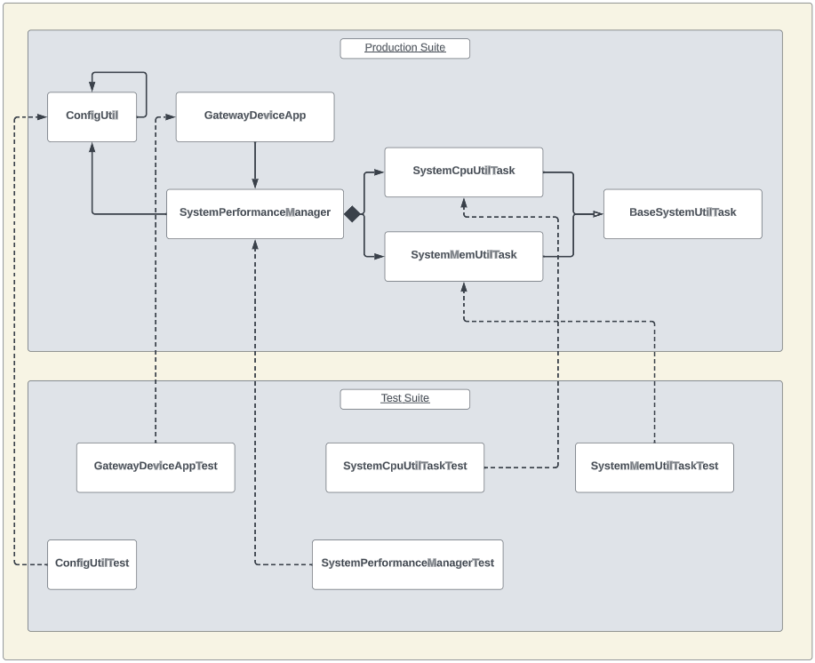

# Gateway Device Application (Connected Devices)

## Lab Module 02

## Description
### What does your implementation do?
A Gateway Device Application, or GDA, is a software application that acts as an intermediary between IoT devices (ie. constrained devices) and a cloud/edge-computing infrastructure. In particular, the GDA faciliates the communication and the exchange of data between the CDA and the cloud.

This lab builds upon the tasks performed in the previous module. - environment configuration and interfacing the GDA with the <b>ConfigUtil</b> utility. This module introduces a few more classes, namely, the <b>SystemPerformanceManager</b> class, the <b>BaseSystemUtilTask</b> class, the <b>SystemCpuUtilTask</b> class, and the <b>SystemMemUtilTask</b> class. These classes work together to collect and monitor the system performance data on the gateway device (specifically the CPU and memory utilization for this module). Descriptions for these classes are provided in the [ReadMe-CDA](https://github.com/Darren-C26/PIOT-SOFE4610U-Grp8/blob/default/labmodule02/README-CDA.md#what-does-your-implementation-do) file, and a brief breakdown is provided below.
### How does your implementation work?

The <b>ConfigUtil</b> class initializes by setting a configuration file name (can be set as a property or given the default name) and loads the configuration data from this file into an <b>INIConfiguration</b> object. The configuration settings are stored as properties, which are retrieved through various methods provided by the ConfigUtil class.

Upon booting up the GDA application, an instance of the <b>SystemPerformanceManager</b> class is created to monitor the system performance metrics. This class uses ConfigUtil to retrieve the polling rate from the configuration settings. This polling rate is used to determine the frequency at which the telemetry data is to be collected. If the configuration value is unavailable, a default value is used.<b>SystemCpuUtilTask</b> and <b>SystemMemUtilTask</b> are created to monitor the CPU and memory utiliaztion. The polling rate is used to schedule these tasks at a fixed rate. The <b>SystemPerformanceManager.handleTelemetry</b> method is responsible for collecting the telemetry data from these two classes, and logging them to the console. In the <b>getTelemetryValue</b> method in the <b>SystemCpuUtilTask</b> class, the <b>ManagementFactory</b> class is used in conjunction with the <b>getSystemLoadAverage</b> method from the <b>OperatingSystemMXbean</b> class to retrieve the system load average. For the same method in the <b>SystemCpuUtilTask</b> class, the <b>ManagementFactory</b> class is used alongside the <b>getheapMemoryUsage</b> method from the <b>MemoryMXbean</b> class to retrieve the used and maximum memory metrics. An equation is used to calculate the memory utilization (double memUtil = (memUsed / memMax) * 100.0). The <b>BaseSystemUtilTask</b> is an abstract class that provides a common interface for the various utility tasks of the application. The GDA logs its activities and system performance metrics to the console, then stops the performance monitoring task and shuts down when it needs to stop.

## Code Repository and Branch
Please click the link before to be directed to the GDA repository.

URL: https://github.com/Darren-C26/piot-java-components/tree/labmodule02

## UML Design Diagram(s)
<p align="center">

</p>

<p align="center">GDA Implementation UML (Module02)</p>

## Unit Tests Executed
The unit tests executed for the <b>GDA</b> are listed below. Sample test executions can be seen by clicking on the dropdown icon.

#### Required:

<details close>
<summary>ConfigUtilTest</summary>

```
Sep. 22, 2023 7:02:11 P.M. programmingtheiot.common.ConfigUtil getCredentials
INFO: Successfully loaded credentials from file: ./src/test/java/programmingtheiot/part01/unit/common/DummyCredFile.props
```
</details>
<br>

<details close>
<summary>SystemCpuUtilTaskTest</summary>

```
Sep. 22, 2023 7:56:50 P.M. programmingtheiot.part01.unit.system.SystemCpuUtilTaskTest testGetTelemetryValue
INFO: Test 1: CPU Util not supported on this OS: -1.0
Sep. 22, 2023 7:56:50 P.M. programmingtheiot.part01.unit.system.SystemCpuUtilTaskTest testGetTelemetryValue
INFO: Test 2: CPU Util not supported on this OS: -1.0
Sep. 22, 2023 7:56:50 P.M. programmingtheiot.part01.unit.system.SystemCpuUtilTaskTest testGetTelemetryValue
INFO: Test 3: CPU Util not supported on this OS: -1.0
Sep. 22, 2023 7:56:50 P.M. programmingtheiot.part01.unit.system.SystemCpuUtilTaskTest testGetTelemetryValue
INFO: Test 4: CPU Util not supported on this OS: -1.0
Sep. 22, 2023 7:56:50 P.M. programmingtheiot.part01.unit.system.SystemCpuUtilTaskTest testGetTelemetryValue
INFO: Test 5: CPU Util not supported on this OS: -1.0
```
</details>
<br>

<details close>
<summary>SystemMemUtilTaskTest</summary>

```
Sep. 22, 2023 8:03:37 P.M. programmingtheiot.part01.unit.system.SystemMemUtilTaskTest testGetTelemetryValue
INFO: Test 1: Memory Util: 0.19753087
Sep. 22, 2023 8:03:37 P.M. programmingtheiot.part01.unit.system.SystemMemUtilTaskTest testGetTelemetryValue
INFO: Test 2: Memory Util: 0.19753087
Sep. 22, 2023 8:03:37 P.M. programmingtheiot.part01.unit.system.SystemMemUtilTaskTest testGetTelemetryValue
INFO: Test 3: Memory Util: 0.19753087
Sep. 22, 2023 8:03:37 P.M. programmingtheiot.part01.unit.system.SystemMemUtilTaskTest testGetTelemetryValue
INFO: Test 4: Memory Util: 0.19753087
Sep. 22, 2023 8:03:37 P.M. programmingtheiot.part01.unit.system.SystemMemUtilTaskTest testGetTelemetryValue
INFO: Test 5: Memory Util: 0.19753087
```
</details>
<br>

#### Other Tests:
 - ResourceNameTest


## Integration Tests Executed
The integration tests for the <b>GDA</b> are listed below. Sample test executions can be seen by clicking on the dropdown icon.

<details close>
<summary>GatewayDeviceAppTest</summary>

```
Sep. 22, 2023 8:29:43 P.M. programmingtheiot.gda.app.GatewayDeviceApp <init>
INFO: Initializing GDA...
Sep. 22, 2023 8:29:43 P.M. programmingtheiot.gda.app.GatewayDeviceApp startApp
INFO: Starting GDA...
Sep. 22, 2023 8:29:43 P.M. programmingtheiot.gda.system.SystemPerformanceManager startManager
INFO: SystemPerformanceManager is starting...
Sep. 22, 2023 8:29:43 P.M. programmingtheiot.gda.app.GatewayDeviceApp startApp
INFO: GDA started successfully.
Sep. 22, 2023 8:29:44 P.M. programmingtheiot.gda.system.SystemPerformanceManager handleTelemetry
INFO: CPU utilization: -1.0, Mem utilization: 0.34567901
Sep. 22, 2023 8:30:44 P.M. programmingtheiot.gda.system.SystemPerformanceManager handleTelemetry
INFO: CPU utilization: -1.0, Mem utilization: 0.34567901
Sep. 22, 2023 8:30:48 P.M. programmingtheiot.gda.app.GatewayDeviceApp stopApp
INFO: Stopping GDA...
Sep. 22, 2023 8:30:48 P.M. programmingtheiot.gda.system.SystemPerformanceManager stopManager
INFO: SystemPerformanceManager is stopped.
Sep. 22, 2023 8:30:48 P.M. programmingtheiot.gda.app.GatewayDeviceApp stopApp
INFO: GDA stopped successfully with exit code 0.
```
</details>

<br>

<details close>
<summary>SystemPerformanceManagerTest</summary>

```
Sep. 22, 2023 7:29:30 P.M. programmingtheiot.gda.system.SystemPerformanceManager startManager
INFO: SystemPerformanceManager is starting...
Sep. 22, 2023 7:29:36 P.M. programmingtheiot.gda.system.SystemPerformanceManager stopManager
INFO: SystemPerformanceManager is stopped.
```
</details>