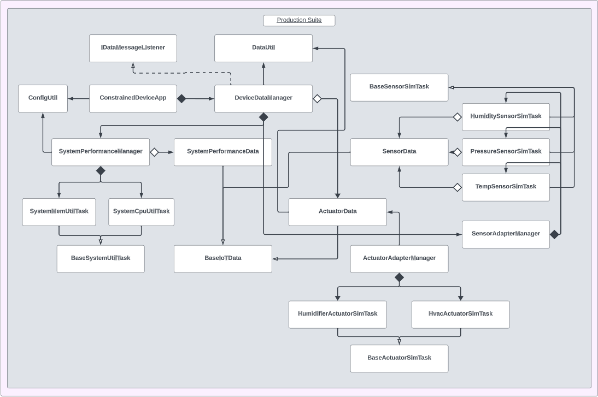

# Constrained Device Application (Connected Devices)

## Lab Module 05

## Description

### What does your implementation do?
A Constrained Device Application, or CDA, is a software application that runs on a "constrained" (ie. resource-limited) device. The purpose of the CDA is to gather sensor data, control actuators, and communicate this information to other devices.

This module's primary focus is on establishing a shared data format between the CDA and GDA, facilitating effective communication between them. To achieve this, an intermediary translation process is employed, which plays a crucial role in ensuring seamless interoperability between the two components.

### How does your implementation work?

When the CDA is initialized, it creates an instance of the <b>DeviceDataManager</b> class and starts it. This class acts as the primary interface in the CDA - it manages the data collection and acutation activities for the application. It will also be used to communicate with the GDA, as will be seen in future modules.

The CDA uses simulated sensors to generate sensor data for testing. In particular, humidity, pressure, and tempmerature values are simulated by their respective classes (<b>HumiditySensorSimTask</b>, <b>PressureSensorSimTask</b>, and <b>TemperatureSensorSimTask</b> respectively). A class called <b>SensorAdapterManager</b> is used to managing and simulating the behavior of the sensors. It periodically generates sensor data and contains <b>DataMessageListeners</b> to recieve this data.

Similary, the CDA also contains simulated actuators - these are the instances of the <b>ActuatorSimTask</b> and <b>HvacActuatorSimTask</b> class. Another class named <b>ActuatorAdapterManager</b> is used to handle actuator command responses.
 
 Logs are used in the application to indicate the intialization, starting, and stopping of the CDA, as well as activities performed by the APScheduler.

## Code Repository and Branch
Please click the link before to be directed to the CDA repository.

URL: https://github.com/Darren-C26/piot-python-components/tree/labmodule05

## UML Design Diagram(s)
<p align="center">

</p>

<p align="center">CDA Implementation UML (Module03)</p>

## Unit Tests Executed
The unit tests executed for the <b>CDA</b> are listed below. Sample test executions can be seen by clicking on the dropdown icon.

<b>Tests from Previous Modules (Re-run):</b>
<details close>
<summary>ConfigUtilTest</summary>

```
Finding files... done.
Importing test modules ... done.

2023-09-29 20:38:04,288:ConfigUtilTest:INFO:Testing ConfigUtil class...
2023-09-29 20:38:04,288:ConfigUtil:INFO:Loading config: ./ValidTestConfig.props
2023-09-29 20:38:04,298:ConfigUtil:DEBUG:Config: ['Mqtt.GatewayService', 'Coap.GatewayService', 'ConstrainedDevice']
2023-09-29 20:38:04,298:ConfigUtil:INFO:Created instance of ConfigUtil: <programmingtheiot.common.ConfigUtil.ConfigUtil object at 0x0000020C2DB0D4E0>
----------------------------------------------------------------------
Ran 8 tests in 0.011s

OK (skipped=1)
```
</details>

<br>

<details close>
<summary>SystemCpuUtilTaskTest</summary>

```
Finding files... done.
Importing test modules ... done.

2023-09-29 20:38:43,642:SystemCpuUtilTaskTest:INFO:Testing SystemCpuUtilTask class...
2023-09-29 20:38:43,643:SystemCpuUtilTaskTest:INFO:CPU utilization: 0.0
----------------------------------------------------------------------
Ran 1 test in 0.001s

OK
```
</details>
<br>

<details close>
<summary>SystemMemUtilTaskTest</summary>

```
Finding files... done.
Importing test modules ... done.

2023-09-29 20:39:04,009:SystemMemUtilTaskTest:INFO:Testing SystemMemUtilTask class...
2023-09-29 20:39:04,014:SystemMemUtilTaskTest:INFO:Virtual memory utilization: 88.8
----------------------------------------------------------------------
Ran 1 test in 0.006s

OK
```
</details>

<br>

<details close>
<summary>ActuatorDataTest</summary>

```
Finding files... done.
Importing test modules ... done.

2023-09-29 20:36:10,691:ActuatorDataTest:INFO:Testing ActuatorData class...
2023-09-29 20:36:10,691:ConfigUtil:INFO:Loading config: ../../../../../../../config/PiotConfig.props
2023-09-29 20:36:10,692:ConfigUtil:DEBUG:Config: ['Mqtt.GatewayService', 'Coap.GatewayService', 'ConstrainedDevice']
2023-09-29 20:36:10,692:ConfigUtil:INFO:Created instance of ConfigUtil: <programmingtheiot.common.ConfigUtil.ConfigUtil object at 0x000001D436342140>
2023-09-29 20:36:10,693:ActuatorDataTest:INFO:Actuator data as string: name=Not Set,typeID=0,timeStamp=2023-09-30T00:36:10.691572+00:00,statusCode=0,hasError=False,locationID=constraineddevice001,elevation=0.0,latitude=0.0,longitude=0.0
2023-09-29 20:36:10,693:ActuatorDataTest:INFO:Actuator data as string: name=ActuatorDataFooBar,typeID=0,timeStamp=2023-09-30T00:36:10.693571+00:00,statusCode=0,hasError=False,locationID=constraineddevice001,elevation=0.0,latitude=0.0,longitude=0.0
2023-09-29 20:36:10,694:ActuatorDataTest:INFO:Actuator data as string: name=ActuatorDataFooBar,typeID=0,timeStamp=2023-09-30T00:36:10.694571+00:00,statusCode=0,hasError=False,locationID=constraineddevice001,elevation=0.0,latitude=0.0,longitude=0.0
----------------------------------------------------------------------
Ran 3 tests in 0.003s

OK
```

</details>
<br>

<details close>
<summary>SensorDataTest</summary>

```
Finding files... done.
Importing test modules ... done.

2023-09-29 20:35:35,485:SensorDataTest:INFO:Testing SensorData class...
2023-09-29 20:35:35,485:ConfigUtil:INFO:Loading config: ../../../../../../../config/PiotConfig.props
2023-09-29 20:35:35,488:ConfigUtil:DEBUG:Config: ['Mqtt.GatewayService', 'Coap.GatewayService', 'ConstrainedDevice']
2023-09-29 20:35:35,488:ConfigUtil:INFO:Created instance of ConfigUtil: <programmingtheiot.common.ConfigUtil.ConfigUtil object at 0x000001BE4B4A2140>
2023-09-29 20:35:35,489:SensorDataTest:INFO:Sensor data as string: name=Not Set,typeID=0,timeStamp=2023-09-30T00:35:35.485571+00:00,statusCode=0,hasError=False,locationID=constraineddevice001,elevation=0.0,latitude=0.0,longitude=0.0
2023-09-29 20:35:35,489:SensorDataTest:INFO:Sensor data as string: name=SensorDataFooBar,typeID=0,timeStamp=2023-09-30T00:35:35.489570+00:00,statusCode=0,hasError=False,locationID=constraineddevice001,elevation=0.0,latitude=0.0,longitude=0.0
2023-09-29 20:35:35,490:SensorDataTest:INFO:Sensor data as string: name=SensorDataFooBar,typeID=0,timeStamp=2023-09-30T00:35:35.490565+00:00,statusCode=0,hasError=False,locationID=constraineddevice001,elevation=0.0,latitude=0.0,longitude=0.0
----------------------------------------------------------------------
Ran 3 tests in 0.005s

OK
```

</details>
<br>

<details close>
<summary>SystemPerformanceDataTest</summary>

```
Finding files... done.
Importing test modules ... done.

2023-09-29 20:34:02,542:SystemPerformanceDataTest:INFO:Testing SystemPerformanceData class...
2023-09-29 20:34:02,542:ConfigUtil:INFO:Loading config: ../../../../../../../config/PiotConfig.props
2023-09-29 20:34:02,543:ConfigUtil:DEBUG:Config: ['Mqtt.GatewayService', 'Coap.GatewayService', 'ConstrainedDevice']
2023-09-29 20:34:02,544:ConfigUtil:INFO:Created instance of ConfigUtil: <programmingtheiot.common.ConfigUtil.ConfigUtil object at 0x000001C2BAC120B0>
2023-09-29 20:34:02,544:SystemPerformanceDataTest:INFO:System perf data as string: name=SystemPerfMsg,typeID=9000,timeStamp=2023-09-30T00:34:02.542946+00:00,statusCode=0,hasError=False,locationID=constraineddevice001,elevation=0.0,latitude=0.0,longitude=0.0
2023-09-29 20:34:02,544:SystemPerformanceDataTest:INFO:System perf data as string: name=SystemPerformanceDataFooBar,typeID=9000,timeStamp=2023-09-30T00:34:02.544948+00:00,statusCode=0,hasError=False,locationID=constraineddevice001,elevation=0.0,latitude=0.0,longitude=0.0
2023-09-29 20:34:02,544:SystemPerformanceDataTest:INFO:System perf data as string: name=SystemPerformanceDataFooBar,typeID=9000,timeStamp=2023-09-30T00:34:02.544948+00:00,statusCode=0,hasError=False,locationID=constraineddevice001,elevation=0.0,latitude=0.0,longitude=0.0
----------------------------------------------------------------------
Ran 3 tests in 0.003s

OK
```

</details>
<br>

<details close>
<summary>HumiditySensorSimTaskTest</summary>

```
Finding files... done.
Importing test modules ... done.
2023-09-29 20:10:22,706:HumiditySensorSimTaskTest:INFO:Testing HumiditySensorSimTask class...

2023-09-29 20:10:22,706:ConfigUtil:INFO:Loading config: ../../../../../../../config/PiotConfig.props
2023-09-29 20:10:22,707:ConfigUtil:DEBUG:Config: ['Mqtt.GatewayService', 'Coap.GatewayService', 'ConstrainedDevice']
2023-09-29 20:10:22,707:ConfigUtil:INFO:Created instance of ConfigUtil: <programmingtheiot.common.ConfigUtil.ConfigUtil object at 0x000001B36FCD3BB0>
2023-09-29 20:10:22,707:HumiditySensorSimTaskTest:INFO:SensorData: name=HumiditySensor,typeID=1010,timeStamp=2023-09-30T00:10:22.707745+00:00,statusCode=0,hasError=False,locationID=constraineddevice001,elevation=0.0,latitude=0.0,longitude=0.0
2023-09-29 20:10:22,707:HumiditySensorSimTaskTest:INFO:Humidity data: 38.994777
----------------------------------------------------------------------
Ran 2 tests in 0.002s

OK
```

</details>
<br>

<details close>
<summary>PressureSensorSimTaskTest</summary>

```
Finding files... done.
Importing test modules ... done.
2023-09-29 20:09:47,160:PressureSensorSimTaskTest:INFO:Testing PressureSensorSimTask class...

2023-09-29 20:09:47,160:ConfigUtil:INFO:Loading config: ../../../../../../../config/PiotConfig.props
2023-09-29 20:09:47,161:ConfigUtil:DEBUG:Config: ['Mqtt.GatewayService', 'Coap.GatewayService', 'ConstrainedDevice']
2023-09-29 20:09:47,161:ConfigUtil:INFO:Created instance of ConfigUtil: <programmingtheiot.common.ConfigUtil.ConfigUtil object at 0x000002B004CAFC40>
2023-09-29 20:09:47,162:PressureSensorSimTaskTest:INFO:SensorData: name=PressureSensor,typeID=1012,timeStamp=2023-09-30T00:09:47.162459+00:00,statusCode=0,hasError=False,locationID=constraineddevice001,elevation=0.0,latitude=0.0,longitude=0.0
2023-09-29 20:09:47,162:PressureSensorSimTaskTest:INFO:Pressure data: 997.974112
----------------------------------------------------------------------
Ran 2 tests in 0.003s

OK
```

</details>
<br>

<details close>
<summary>TemperatureSensorSimTaskTest</summary>

```
Finding files... done.
Importing test modules ... done.
2023-09-29 20:08:26,895:TemperatureSensorSimTaskTest:INFO:Testing TemperatureSensorSimTask class...

2023-09-29 20:08:26,896:ConfigUtil:INFO:Loading config: ../../../../../../../config/PiotConfig.props
2023-09-29 20:08:26,897:ConfigUtil:DEBUG:Config: ['Mqtt.GatewayService', 'Coap.GatewayService', 'ConstrainedDevice']
2023-09-29 20:08:26,897:ConfigUtil:INFO:Created instance of ConfigUtil: <programmingtheiot.common.ConfigUtil.ConfigUtil object at 0x000002824DD4FBB0>
2023-09-29 20:08:26,897:TemperatureSensorSimTaskTest:INFO:Temperature SensorData: name=TempSensor,typeID=1013,timeStamp=2023-09-30T00:08:26.897828+00:00,statusCode=0,hasError=False,locationID=constraineddevice001,elevation=0.0,latitude=0.0,longitude=0.0
2023-09-29 20:08:26,898:TemperatureSensorSimTaskTest:INFO:Temperature data: 18.009321
----------------------------------------------------------------------
Ran 2 tests in 0.003s

OK
```

</details>
<br>

<details close>
<summary>HumidifierActuatorSimTaskTest</summary>

```
Finding files... done.
Importing test modules ... done.

2023-09-29 20:06:20,122:HumidifierActuatorSimTaskTest:INFO:Testing HumidifierActuatorSimTask class...
2023-09-29 20:06:20,122:ConfigUtil:INFO:Loading config: ../../../../../../../config/PiotConfig.props
2023-09-29 20:06:20,123:ConfigUtil:DEBUG:Config: ['Mqtt.GatewayService', 'Coap.GatewayService', 'ConstrainedDevice']
2023-09-29 20:06:20,123:ConfigUtil:INFO:Created instance of ConfigUtil: <programmingtheiot.common.ConfigUtil.ConfigUtil object at 0x000001159A2D22F0>
2023-09-29 20:06:20,123:BaseActuatorSimTask:DEBUG:New actuator command and value to be applied: 1 18.2
2023-09-29 20:06:20,123:BaseActuatorSimTask:INFO:Activating actuator...
2023-09-29 20:06:20,123:BaseActuatorSimTask:INFO:Simulating HumidifierActuator actuator ON: 
*******
* O N *
*******
HumidifierActuator VALUE -> 18.2
=======
2023-09-29 20:06:20,123:HumidifierActuatorSimTaskTest:INFO:ActuatorData: name=Not Set,typeID=1002,timeStamp=2023-09-30T00:06:20.123912+00:00,statusCode=0,hasError=False,locationID=constraineddevice001,elevation=0.0,latitude=0.0,longitude=0.0
2023-09-29 20:06:20,123:BaseActuatorSimTask:DEBUG:New actuator command and value to be applied: 1 21.4
2023-09-29 20:06:20,123:BaseActuatorSimTask:INFO:Activating actuator...
2023-09-29 20:06:20,123:BaseActuatorSimTask:INFO:Simulating HumidifierActuator actuator ON: 
*******
* O N *
*******
HumidifierActuator VALUE -> 21.4
=======
2023-09-29 20:06:20,123:HumidifierActuatorSimTaskTest:INFO:ActuatorData: name=Not Set,typeID=1002,timeStamp=2023-09-30T00:06:20.123912+00:00,statusCode=0,hasError=False,locationID=constraineddevice001,elevation=0.0,latitude=0.0,longitude=0.0
2023-09-29 20:06:20,123:BaseActuatorSimTask:DEBUG:New actuator command and value to be applied: 0 21.4
2023-09-29 20:06:20,124:BaseActuatorSimTask:INFO:Deactivating actuator...
2023-09-29 20:06:20,124:BaseActuatorSimTask:INFO:Simulating HumidifierActuator actuator OFF: 
*******
* OFF *
*******
2023-09-29 20:06:20,124:HumidifierActuatorSimTaskTest:INFO:ActuatorData: name=Not Set,typeID=1002,timeStamp=2023-09-30T00:06:20.124884+00:00,statusCode=0,hasError=False,locationID=constraineddevice001,elevation=0.0,latitude=0.0,longitude=0.0
----------------------------------------------------------------------
Ran 2 tests in 0.003s

OK (skipped=1)
```

</details>
<br>

<details close>
<summary>HvacActuatorSimTaskTest</summary>

```
Finding files... done.
Importing test modules ... done.

2023-09-29 20:02:48,792:HvacActuatorSimTaskTest:INFO:Testing HvacActuatorSimTask class...
2023-09-29 20:02:48,793:ConfigUtil:INFO:Loading config: ../../../../../../../config/PiotConfig.props
2023-09-29 20:02:48,794:ConfigUtil:DEBUG:Config: ['Mqtt.GatewayService', 'Coap.GatewayService', 'ConstrainedDevice']
2023-09-29 20:02:48,794:ConfigUtil:INFO:Created instance of ConfigUtil: <programmingtheiot.common.ConfigUtil.ConfigUtil object at 0x000001A21E8522F0>
2023-09-29 20:02:48,794:BaseActuatorSimTask:DEBUG:New actuator command and value to be applied: 1 18.2
2023-09-29 20:02:48,795:BaseActuatorSimTask:INFO:Activating actuator...
2023-09-29 20:02:48,795:BaseActuatorSimTask:INFO:Simulating HvacActuator actuator ON: 
*******
* O N *
*******
HvacActuator VALUE -> 18.2
=======
2023-09-29 20:02:48,795:HvacActuatorSimTaskTest:INFO:ActuatorData: name=Not Set,typeID=1001,timeStamp=2023-09-30T00:02:48.795134+00:00,statusCode=0,hasError=False,locationID=constraineddevice001,elevation=0.0,latitude=0.0,longitude=0.0
2023-09-29 20:02:48,795:BaseActuatorSimTask:DEBUG:New actuator command and value to be applied: 1 21.4
2023-09-29 20:02:48,796:BaseActuatorSimTask:INFO:Activating actuator...
2023-09-29 20:02:48,796:BaseActuatorSimTask:INFO:Simulating HvacActuator actuator ON: 
*******
* O N *
*******
HvacActuator VALUE -> 21.4
=======
2023-09-29 20:02:48,796:HvacActuatorSimTaskTest:INFO:ActuatorData: name=Not Set,typeID=1001,timeStamp=2023-09-30T00:02:48.796141+00:00,statusCode=0,hasError=False,locationID=constraineddevice001,elevation=0.0,latitude=0.0,longitude=0.0
2023-09-29 20:02:48,796:BaseActuatorSimTask:DEBUG:New actuator command and value to be applied: 0 21.4
2023-09-29 20:02:48,796:BaseActuatorSimTask:INFO:Deactivating actuator...
2023-09-29 20:02:48,796:BaseActuatorSimTask:INFO:Simulating HvacActuator actuator OFF: 
*******
* OFF *
*******
2023-09-29 20:02:48,796:HvacActuatorSimTaskTest:INFO:ActuatorData: name=Not Set,typeID=1001,timeStamp=2023-09-30T00:02:48.796141+00:00,statusCode=0,hasError=False,locationID=constraineddevice001,elevation=0.0,latitude=0.0,longitude=0.0
----------------------------------------------------------------------
Ran 2 tests in 0.004s

OK (skipped=1)
```

</details>

<br>


<b>New Tests Executed:</b>

<br>

<details close>
<summary>DataUtilTest</summary>

```
Finding files... done.
Importing test modules ... done.

2023-10-06 23:59:19,249:DataUtilTest:INFO:Testing DataUtil class...
2023-10-06 23:59:19,249:DataUtil:INFO:Created DataUtil instance.
2023-10-06 23:59:19,249:DataUtilTest:INFO:================================================
2023-10-06 23:59:19,250:DataUtilTest:INFO:DataUtil test execution...
2023-10-06 23:59:19,250:DataUtilTest:INFO:================================================
2023-10-06 23:59:19,250:DataUtilTest:INFO:

----- [ActuatorData Conversions from JSON] -----
2023-10-06 23:59:19,250:DataUtil:WARNING:JSON data is empty or null. Returning null.
2023-10-06 23:59:19,250:DataUtil:WARNING:JSON data is empty or null. Returning null.
2023-10-06 23:59:19,250:ConfigUtil:INFO:Loading config: ../../../../../../../config/PiotConfig.props
2023-10-06 23:59:19,251:ConfigUtil:DEBUG:Config: ['Mqtt.GatewayService', 'Coap.GatewayService', 'ConstrainedDevice']
2023-10-06 23:59:19,251:ConfigUtil:INFO:Created instance of ConfigUtil: <programmingtheiot.common.ConfigUtil.ConfigUtil object at 0x00000157C3841CC0>
2023-10-06 23:59:19,252:DataUtilTest:INFO:Sample JSON: {
    "timeStamp": "2023-10-07T03:59:19.250697+00:00",
    "hasError": false,
    "name": "FooBar ActuatorData",
    "typeID": 0,
    "statusCode": 0,
    "latitude": 0.0,
    "longitude": 0.0,
    "elevation": 0.0,
    "locationID": "constraineddevice001",
    "value": 0.0,
    "command": 0,
    "stateData": "",
    "isResponse": false
}
2023-10-06 23:59:19,252:DataUtilTest:INFO:JSON to ActuatorData: name=FooBar ActuatorData,typeID=0,timeStamp=2023-10-07T03:59:19.250697+00:00,statusCode=0,hasError=False,locationID=constraineddevice001,elevation=0.0,latitude=0.0,longitude=0.0
2023-10-06 23:59:19,252:DataUtilTest:INFO:ActuatorData back to JSON: {
    "timeStamp": "2023-10-07T03:59:19.250697+00:00",
    "hasError": false,
    "name": "FooBar ActuatorData",
    "typeID": 0,
    "statusCode": 0,
    "latitude": 0.0,
    "longitude": 0.0,
    "elevation": 0.0,
    "locationID": "constraineddevice001",
    "value": 0.0,
    "command": 0,
    "stateData": "",
    "isResponse": false
}
2023-10-06 23:59:19,252:DataUtilTest:INFO:================================================
2023-10-06 23:59:19,253:DataUtilTest:INFO:DataUtil test execution...
2023-10-06 23:59:19,253:DataUtilTest:INFO:================================================
2023-10-06 23:59:19,253:DataUtilTest:INFO:

----- [JSON Conversions from ActuatorData] -----
2023-10-06 23:59:19,254:DataUtilTest:INFO:Sample ActuatorData: name=FooBar2 Actuator,typeID=0,timeStamp=2023-10-07T03:59:19.253698+00:00,statusCode=0,hasError=False,locationID=constraineddevice001,elevation=0.0,latitude=0.0,longitude=0.0
2023-10-06 23:59:19,254:DataUtilTest:INFO:ActuatorData to JSON: {
    "timeStamp": "2023-10-07T03:59:19.253698+00:00",
    "hasError": false,
    "name": "FooBar2 Actuator",
    "typeID": 0,
    "statusCode": 0,
    "latitude": 0.0,
    "longitude": 0.0,
    "elevation": 0.0,
    "locationID": "constraineddevice001",
    "value": 0.0,
    "command": 0,
    "stateData": "",
    "isResponse": false
}
2023-10-06 23:59:19,254:DataUtilTest:INFO:JSON back to ActuatorData: name=FooBar2 Actuator,typeID=0,timeStamp=2023-10-07T03:59:19.253698+00:00,statusCode=0,hasError=False,locationID=constraineddevice001,elevation=0.0,latitude=0.0,longitude=0.0
2023-10-06 23:59:19,254:DataUtilTest:INFO:ActuatorData back to JSON: {
    "timeStamp": "2023-10-07T03:59:19.253698+00:00",
    "hasError": false,
    "name": "FooBar2 Actuator",
    "typeID": 0,
    "statusCode": 0,
    "latitude": 0.0,
    "longitude": 0.0,
    "elevation": 0.0,
    "locationID": "constraineddevice001",
    "value": 0.0,
    "command": 0,
    "stateData": "",
    "isResponse": false
}
2023-10-06 23:59:19,254:DataUtilTest:INFO:================================================
2023-10-06 23:59:19,254:DataUtilTest:INFO:DataUtil test execution...
2023-10-06 23:59:19,254:DataUtilTest:INFO:================================================
2023-10-06 23:59:19,254:DataUtilTest:INFO:

----- [SensorData Conversions from JSON] -----
2023-10-06 23:59:19,254:DataUtil:WARNING:JSON data is empty or null. Returning null.
2023-10-06 23:59:19,254:DataUtil:WARNING:JSON data is empty or null. Returning null.
2023-10-06 23:59:19,255:DataUtilTest:INFO:Sample JSON: {
    "timeStamp": "2023-10-07T03:59:19.255717+00:00",
    "hasError": false,
    "name": "FooBar SensorData",
    "typeID": 0,
    "statusCode": 0,
    "latitude": 0.0,
    "longitude": 0.0,
    "elevation": 0.0,
    "locationID": "constraineddevice001",
    "value": 0.0,
    "command": 0,
    "stateData": "",
    "isResponse": false
}
2023-10-06 23:59:19,255:DataUtilTest:INFO:JSON to SensorData: name=FooBar SensorData,typeID=0,timeStamp=2023-10-07T03:59:19.255717+00:00,statusCode=0,hasError=False,locationID=constraineddevice001,elevation=0.0,latitude=0.0,longitude=0.0
2023-10-06 23:59:19,255:DataUtilTest:INFO:SensorData back to JSON: {
    "timeStamp": "2023-10-07T03:59:19.255717+00:00",
    "hasError": false,
    "name": "FooBar SensorData",
    "typeID": 0,
    "statusCode": 0,
    "latitude": 0.0,
    "longitude": 0.0,
    "elevation": 0.0,
    "locationID": "constraineddevice001",
    "value": 0.0,
    "command": 0,
    "stateData": "",
    "isResponse": false
}
2023-10-06 23:59:19,255:DataUtilTest:INFO:================================================
2023-10-06 23:59:19,256:DataUtilTest:INFO:DataUtil test execution...
2023-10-06 23:59:19,256:DataUtilTest:INFO:================================================
2023-10-06 23:59:19,256:DataUtilTest:INFO:

----- [JSON Conversions from SensorData] -----
2023-10-06 23:59:19,256:DataUtilTest:INFO:Sample SensorData: name=Foobar2 Sensor,typeID=0,timeStamp=2023-10-07T03:59:19.256696+00:00,statusCode=0,hasError=False,locationID=constraineddevice001,elevation=0.0,latitude=0.0,longitude=0.0
2023-10-06 23:59:19,256:DataUtilTest:INFO:SensorData to JSON: {
    "timeStamp": "2023-10-07T03:59:19.256696+00:00",
    "hasError": false,
    "name": "Foobar2 Sensor",
    "typeID": 0,
    "statusCode": 0,
    "latitude": 0.0,
    "longitude": 0.0,
    "elevation": 0.0,
    "locationID": "constraineddevice001",
    "value": 0.0,
    "command": 0,
    "stateData": "",
    "isResponse": false
}
2023-10-06 23:59:19,256:DataUtilTest:INFO:JSON back to SensorData: name=Foobar2 Sensor,typeID=0,timeStamp=2023-10-07T03:59:19.256696+00:00,statusCode=0,hasError=False,locationID=constraineddevice001,elevation=0.0,latitude=0.0,longitude=0.0
2023-10-06 23:59:19,256:DataUtilTest:INFO:SensorData back to JSON: {
    "timeStamp": "2023-10-07T03:59:19.256696+00:00",
    "hasError": false,
    "name": "Foobar2 Sensor",
    "typeID": 0,
    "statusCode": 0,
    "latitude": 0.0,
    "longitude": 0.0,
    "elevation": 0.0,
    "locationID": "constraineddevice001",
    "value": 0.0,
    "command": 0,
    "stateData": "",
    "isResponse": false
}
2023-10-06 23:59:19,256:DataUtilTest:INFO:================================================
2023-10-06 23:59:19,257:DataUtilTest:INFO:DataUtil test execution...
2023-10-06 23:59:19,257:DataUtilTest:INFO:================================================
2023-10-06 23:59:19,257:DataUtilTest:INFO:

----- [SystemPerformanceData Conversions from JSON] -----
2023-10-06 23:59:19,257:DataUtil:WARNING:JSON data is empty or null. Returning null.
2023-10-06 23:59:19,257:DataUtil:WARNING:JSON data is empty or null. Returning null.
2023-10-06 23:59:19,257:DataUtilTest:INFO:Sample JSON: {
    "timeStamp": "2023-10-07T03:59:19.257696+00:00",
    "hasError": false,
    "name": "FooBar SystemPerformanceData",
    "typeID": 9000,
    "statusCode": 0,
    "latitude": 0.0,
    "longitude": 0.0,
    "elevation": 0.0,
    "locationID": "constraineddevice001",
    "cpuUtil": 0.0,
    "memUtil": 0.0,
    "diskUtil": 0.0
}
2023-10-06 23:59:19,257:DataUtilTest:INFO:JSON to SystemPerformanceData: name=FooBar SystemPerformanceData,typeID=9000,timeStamp=2023-10-07T03:59:19.257696+00:00,statusCode=0,hasError=False,locationID=constraineddevice001,elevation=0.0,latitude=0.0,longitude=0.0
2023-10-06 23:59:19,257:DataUtilTest:INFO:SystemPerformanceData back to JSON: {
    "timeStamp": "2023-10-07T03:59:19.257696+00:00",
    "hasError": false,
    "name": "FooBar SystemPerformanceData",
    "typeID": 9000,
    "statusCode": 0,
    "latitude": 0.0,
    "longitude": 0.0,
    "elevation": 0.0,
    "locationID": "constraineddevice001",
    "cpuUtil": 0.0,
    "memUtil": 0.0,
    "diskUtil": 0.0
}
2023-10-06 23:59:19,258:DataUtilTest:INFO:================================================
2023-10-06 23:59:19,258:DataUtilTest:INFO:DataUtil test execution...
2023-10-06 23:59:19,258:DataUtilTest:INFO:================================================
2023-10-06 23:59:19,258:DataUtilTest:INFO:

----- [JSON Conversions from SystemPerformanceData] -----
2023-10-06 23:59:19,259:DataUtilTest:INFO:Sample SystemPerformanceData: name=Foobar2 SystemPerformanceData,typeID=9000,timeStamp=2023-10-07T03:59:19.258698+00:00,statusCode=0,hasError=False,locationID=constraineddevice001,elevation=0.0,latitude=0.0,longitude=0.0
2023-10-06 23:59:19,259:DataUtilTest:INFO:SystemPerformanceData to JSON: {
    "timeStamp": "2023-10-07T03:59:19.258698+00:00",
    "hasError": false,
    "name": "Foobar2 SystemPerformanceData",
    "typeID": 9000,
    "statusCode": 0,
    "latitude": 0.0,
    "longitude": 0.0,
    "elevation": 0.0,
    "locationID": "constraineddevice001",
    "cpuUtil": 0.0,
    "memUtil": 0.0,
    "diskUtil": 0.0
}
2023-10-06 23:59:19,259:DataUtilTest:INFO:JSON back to SystemPerformanceData: name=Foobar2 SystemPerformanceData,typeID=9000,timeStamp=2023-10-07T03:59:19.258698+00:00,statusCode=0,hasError=False,locationID=constraineddevice001,elevation=0.0,latitude=0.0,longitude=0.0
2023-10-06 23:59:19,259:DataUtilTest:INFO:SystemPerformanceData back to JSON: {
    "timeStamp": "2023-10-07T03:59:19.258698+00:00",
    "hasError": false,
    "name": "Foobar2 SystemPerformanceData",
    "typeID": 9000,
    "statusCode": 0,
    "latitude": 0.0,
    "longitude": 0.0,
    "elevation": 0.0,
    "locationID": "constraineddevice001",
    "cpuUtil": 0.0,
    "memUtil": 0.0,
    "diskUtil": 0.0
}
----------------------------------------------------------------------
Ran 6 tests in 0.010s

OK

```
</details>

<br>


## Integration Tests Executed
The integration tests for the <b>CDA</b> are listed below. Sample test executions can be seen by clicking on the dropdown icon.

<b>Tests from Previous Modules (Re-run):</b>


<details close>
<summary>ConstrainedDeviceAppTest</summary>

```
Finding files... done.
Importing test modules ... done.

2023-09-29 20:44:54,858:root:INFO:Testing ConstrainedDeviceApp class...
2023-09-29 20:44:54,858:root:INFO:Initializing CDA...
2023-09-29 20:44:54,859:root:INFO:Loading config: ../../../../../../../config/PiotConfig.props
2023-09-29 20:44:54,860:root:DEBUG:Config: ['Mqtt.GatewayService', 'Coap.GatewayService', 'ConstrainedDevice']
2023-09-29 20:44:54,860:root:INFO:Created instance of ConfigUtil: <programmingtheiot.common.ConfigUtil.ConfigUtil object at 0x000001D381BFF1F0>
2023-09-29 20:44:54,860:tzlocal:DEBUG:Looking up time zone info from registry
2023-09-29 20:44:54,870:apscheduler.scheduler:INFO:Adding job tentatively -- it will be properly scheduled when the scheduler starts
2023-09-29 20:44:54,870:root:INFO:Local system performance tracking enabled
2023-09-29 20:44:54,870:apscheduler.scheduler:INFO:Adding job tentatively -- it will be properly scheduled when the scheduler starts
2023-09-29 20:44:54,871:root:INFO:Current time set to: Fri Sep 29 20:44:54 2023
2023-09-29 20:44:54,871:root:INFO:timeEntries tuple. Array Size: 1440  ND Size: 1440  Dimensions: 1  Shape: (1440,)  Type: float64
2023-09-29 20:44:54,871:root:DEBUG:Noise=10.000000; Noise Scale=0.100000; Mean Magnitude=1.000000
2023-09-29 20:44:54,871:root:INFO:dataEntries tuple. Array Size: 1440  ND Size: 1440  Dimensions: 1  Shape: (1440,)  Type: float64
2023-09-29 20:44:54,871:root:INFO:Current time set to: Fri Sep 29 20:44:54 2023
2023-09-29 20:44:54,871:root:INFO:timeEntries tuple. Array Size: 1440  ND Size: 1440  Dimensions: 1  Shape: (1440,)  Type: float64
2023-09-29 20:44:54,871:root:DEBUG:Noise=10.000000; Noise Scale=10.000000; Mean Magnitude=3.000000
2023-09-29 20:44:54,872:root:INFO:dataEntries tuple. Array Size: 1440  ND Size: 1440  Dimensions: 1  Shape: (1440,)  Type: float64
2023-09-29 20:44:54,872:root:INFO:Current time set to: Fri Sep 29 20:44:54 2023
2023-09-29 20:44:54,872:root:INFO:timeEntries tuple. Array Size: 1440  ND Size: 1440  Dimensions: 1  Shape: (1440,)  Type: float64
2023-09-29 20:44:54,872:root:DEBUG:Noise=10.000000; Noise Scale=0.100000; Mean Magnitude=1.000000
2023-09-29 20:44:54,872:root:INFO:dataEntries tuple. Array Size: 1440  ND Size: 1440  Dimensions: 1  Shape: (1440,)  Type: float64
2023-09-29 20:44:54,873:root:INFO:Local sensor tracking enabled
2023-09-29 20:44:54,873:root:INFO:Local actuation capabilities enabled
2023-09-29 20:44:54,873:root:INFO:Starting CDA...
2023-09-29 20:44:54,873:root:INFO:Starting DeviceDataManager...
2023-09-29 20:44:54,873:root:INFO:Starting SystemPerformanceManager...
2023-09-29 20:44:54,874:apscheduler.scheduler:INFO:Added job "SystemPerformanceManager.handleTelemetry" to job store "default"
2023-09-29 20:44:54,874:apscheduler.scheduler:INFO:Scheduler started
2023-09-29 20:44:54,875:apscheduler.scheduler:DEBUG:Looking for jobs to run
2023-09-29 20:44:54,875:root:INFO:Started SystemPerformanceManager.
2023-09-29 20:44:54,875:root:INFO:Started SensorAdapterManager.
2023-09-29 20:44:54,875:apscheduler.scheduler:DEBUG:Next wakeup is due at 2023-09-29 20:44:59.870490-04:00 (in 4.995000 seconds)
2023-09-29 20:44:54,875:apscheduler.scheduler:INFO:Added job "SensorAdapterManager.handleTelemetry" to job store "default"
2023-09-29 20:44:54,875:apscheduler.scheduler:INFO:Scheduler started
2023-09-29 20:44:54,876:apscheduler.scheduler:DEBUG:Looking for jobs to run
2023-09-29 20:44:54,876:root:INFO:Started DeviceDataManager.
2023-09-29 20:44:54,876:apscheduler.scheduler:DEBUG:Next wakeup is due at 2023-09-29 20:44:59.870490-04:00 (in 4.993979 seconds)
2023-09-29 20:44:54,876:root:INFO:CDA started.
2023-09-29 20:44:54,876:root:INFO:CDA stopping...
2023-09-29 20:44:54,876:root:INFO:Stopping DeviceDataManager...
2023-09-29 20:44:54,876:root:INFO:Stopping SystemPerformanceManager...
2023-09-29 20:44:54,876:apscheduler.scheduler:INFO:Scheduler has been shut down
2023-09-29 20:44:54,876:apscheduler.scheduler:DEBUG:Looking for jobs to run
2023-09-29 20:44:54,876:apscheduler.scheduler:DEBUG:No jobs; waiting until a job is added
2023-09-29 20:44:54,877:root:INFO:Stopped SystemPerformanceManager.
2023-09-29 20:44:54,877:root:INFO:Stopped SensorAdapterManager.
2023-09-29 20:44:54,877:apscheduler.scheduler:INFO:Scheduler has been shut down
2023-09-29 20:44:54,877:apscheduler.scheduler:DEBUG:Looking for jobs to run
2023-09-29 20:44:54,877:apscheduler.scheduler:DEBUG:No jobs; waiting until a job is added
2023-09-29 20:44:54,877:root:INFO:Stopped DeviceDataManager.
2023-09-29 20:44:54,877:root:INFO:CDA stopped with exit code 0.
----------------------------------------------------------------------
Ran 1 test in 0.019s
```

</details>
<br>

<details close>
<summary>SystemPerformanceManagerTest</summary>

```
Finding files... done.
Importing test modules ... done.

2023-09-29 20:41:08,059:SystemPerformanceManagerTest:INFO:Testing SystemPerformanceManager class...
2023-09-29 20:41:08,059:ConfigUtil:INFO:Loading config: ../../../../../../../config/PiotConfig.props
2023-09-29 20:41:08,060:ConfigUtil:DEBUG:Config: ['Mqtt.GatewayService', 'Coap.GatewayService', 'ConstrainedDevice']
2023-09-29 20:41:08,060:ConfigUtil:INFO:Created instance of ConfigUtil: <programmingtheiot.common.ConfigUtil.ConfigUtil object at 0x000001AFE04793C0>
2023-09-29 20:41:08,060:win32:DEBUG:Looking up time zone info from registry
2023-09-29 20:41:08,068:base:INFO:Adding job tentatively -- it will be properly scheduled when the scheduler starts
2023-09-29 20:41:08,069:SystemPerformanceManager:INFO:Starting SystemPerformanceManager...
2023-09-29 20:41:08,069:base:INFO:Added job "SystemPerformanceManager.handleTelemetry" to job store "default"
2023-09-29 20:41:08,069:base:INFO:Scheduler started
2023-09-29 20:41:08,070:base:DEBUG:Looking for jobs to run
2023-09-29 20:41:08,070:SystemPerformanceManager:INFO:Started SystemPerformanceManager.
2023-09-29 20:41:08,070:base:DEBUG:Next wakeup is due at 2023-09-29 20:41:13.068462-04:00 (in 4.997999 seconds)
2023-09-29 20:41:13,081:base:DEBUG:Looking for jobs to run
2023-09-29 20:41:13,081:base:INFO:Running job "SystemPerformanceManager.handleTelemetry (trigger: interval[0:00:05], next run at: 2023-09-29 20:41:13 EDT)" (scheduled at 2023-09-29 20:41:13.068462-04:00)
2023-09-29 20:41:13,090:SystemPerformanceManager:DEBUG:CPU utilization is 19.1 percent, and memory utilization is 88.8 percent.
2023-09-29 20:41:13,090:base:INFO:Job "SystemPerformanceManager.handleTelemetry (trigger: interval[0:00:05], next run at: 2023-09-29 20:41:13 EDT)" executed successfully
2023-09-29 20:41:13,090:base:DEBUG:Next wakeup is due at 2023-09-29 20:41:18.068462-04:00 (in 4.977538 seconds)
2023-09-29 20:41:14,075:SystemPerformanceManager:INFO:Stopping SystemPerformanceManager...
2023-09-29 20:41:14,075:base:INFO:Scheduler has been shut down
2023-09-29 20:41:14,076:base:DEBUG:Looking for jobs to run
2023-09-29 20:41:14,076:base:DEBUG:No jobs; waiting until a job is added
2023-09-29 20:41:14,076:SystemPerformanceManager:INFO:Stopped SystemPerformanceManager.
----------------------------------------------------------------------
Ran 1 test in 6.018s

OK
```

</details>
<br>


<details close>
<summary>SensorAdapterManagerTest</summary>

```
Finding files... done.
Importing test modules ... done.

2023-09-29 19:56:03,781:SensorAdapterManagerTest:INFO:Testing SensorAdapterManager class...
2023-09-29 19:56:03,781:ConfigUtil:INFO:Loading config: ../../../../../../../config/PiotConfig.props
2023-09-29 19:56:03,800:ConfigUtil:DEBUG:Config: ['Mqtt.GatewayService', 'Coap.GatewayService', 'ConstrainedDevice']
2023-09-29 19:56:03,800:ConfigUtil:INFO:Created instance of ConfigUtil: <programmingtheiot.common.ConfigUtil.ConfigUtil object at 0x000001D535DE6D40>
2023-09-29 19:56:03,801:win32:DEBUG:Looking up time zone info from registry
2023-09-29 19:56:03,811:base:INFO:Adding job tentatively -- it will be properly scheduled when the scheduler starts
2023-09-29 19:56:03,811:SensorDataGenerator:INFO:Current time set to: Fri Sep 29 19:56:03 2023
2023-09-29 19:56:03,812:SensorDataGenerator:INFO:timeEntries tuple. Array Size: 1440  ND Size: 1440  Dimensions: 1  Shape: (1440,)  Type: float64
2023-09-29 19:56:03,812:SensorDataGenerator:DEBUG:Noise=10.000000; Noise Scale=0.100000; Mean Magnitude=1.000000
2023-09-29 19:56:03,812:SensorDataGenerator:INFO:dataEntries tuple. Array Size: 1440  ND Size: 1440  Dimensions: 1  Shape: (1440,)  Type: float64
2023-09-29 19:56:03,812:SensorDataGenerator:INFO:Current time set to: Fri Sep 29 19:56:03 2023
2023-09-29 19:56:03,812:SensorDataGenerator:INFO:timeEntries tuple. Array Size: 1440  ND Size: 1440  Dimensions: 1  Shape: (1440,)  Type: float64
2023-09-29 19:56:03,812:SensorDataGenerator:DEBUG:Noise=10.000000; Noise Scale=10.000000; Mean Magnitude=3.000000
2023-09-29 19:56:03,813:SensorDataGenerator:INFO:dataEntries tuple. Array Size: 1440  ND Size: 1440  Dimensions: 1  Shape: (1440,)  Type: float64
2023-09-29 19:56:03,813:SensorDataGenerator:INFO:Current time set to: Fri Sep 29 19:56:03 2023
2023-09-29 19:56:03,813:SensorDataGenerator:INFO:timeEntries tuple. Array Size: 1440  ND Size: 1440  Dimensions: 1  Shape: (1440,)  Type: float64
2023-09-29 19:56:03,813:SensorDataGenerator:DEBUG:Noise=10.000000; Noise Scale=0.100000; Mean Magnitude=1.000000
2023-09-29 19:56:03,813:SensorDataGenerator:INFO:dataEntries tuple. Array Size: 1440  ND Size: 1440  Dimensions: 1  Shape: (1440,)  Type: float64
2023-09-29 19:56:03,813:SensorAdapterManager:INFO:Started SensorAdapterManager.
2023-09-29 19:56:03,815:base:INFO:Added job "SensorAdapterManager.handleTelemetry" to job store "default"
2023-09-29 19:56:03,815:base:INFO:Scheduler started
2023-09-29 19:56:03,816:base:DEBUG:Looking for jobs to run
2023-09-29 19:56:03,816:base:DEBUG:Next wakeup is due at 2023-09-29 19:56:08.811183-04:00 (in 4.994996 seconds)
2023-09-29 19:56:08,816:base:DEBUG:Looking for jobs to run
2023-09-29 19:56:08,818:base:INFO:Running job "SensorAdapterManager.handleTelemetry (trigger: interval[0:00:05], next run at: 2023-09-29 19:56:08 EDT)" (scheduled at 2023-09-29 19:56:08.811183-04:00)
2023-09-29 19:56:08,819:SensorAdapterManager:DEBUG:Generated humidity data: name=HumiditySensor,typeID=1010,timeStamp=2023-09-29T23:56:08.818528+00:00,statusCode=0,hasError=False,locationID=constraineddevice001,elevation=0.0,latitude=0.0,longitude=0.0
2023-09-29 19:56:08,819:base:DEBUG:Next wakeup is due at 2023-09-29 19:56:13.811183-04:00 (in 4.991466 seconds)
2023-09-29 19:56:08,820:SensorAdapterManager:DEBUG:Generated pressure data: name=PressureSensor,typeID=1012,timeStamp=2023-09-29T23:56:08.818528+00:00,statusCode=0,hasError=False,locationID=constraineddevice001,elevation=0.0,latitude=0.0,longitude=0.0
2023-09-29 19:56:08,820:SensorAdapterManager:DEBUG:Generated temp data: name=TempSensor,typeID=1013,timeStamp=2023-09-29T23:56:08.818528+00:00,statusCode=0,hasError=False,locationID=constraineddevice001,elevation=0.0,latitude=0.0,longitude=0.0
2023-09-29 19:56:08,821:DefaultDataMessageListener:INFO:Sensor Message: name=HumiditySensor,typeID=1010,timeStamp=2023-09-29T23:56:08.818528+00:00,statusCode=0,hasError=False,locationID=constraineddevice001,elevation=0.0,latitude=0.0,longitude=0.0
2023-09-29 19:56:08,821:DefaultDataMessageListener:INFO:Sensor Message: name=PressureSensor,typeID=1012,timeStamp=2023-09-29T23:56:08.818528+00:00,statusCode=0,hasError=False,locationID=constraineddevice001,elevation=0.0,latitude=0.0,longitude=0.0
2023-09-29 19:56:08,821:DefaultDataMessageListener:INFO:Sensor Message: name=TempSensor,typeID=1013,timeStamp=2023-09-29T23:56:08.818528+00:00,statusCode=0,hasError=False,locationID=constraineddevice001,elevation=0.0,latitude=0.0,longitude=0.0
2023-09-29 19:56:08,821:base:INFO:Job "SensorAdapterManager.handleTelemetry (trigger: interval[0:00:05], next run at: 2023-09-29 19:56:13 EDT)" executed successfully

.

.

2023-09-29 19:56:58,821:base:DEBUG:Looking for jobs to run
2023-09-29 19:56:58,821:base:DEBUG:Next wakeup is due at 2023-09-29 19:57:03.811183-04:00 (in 4.989206 seconds)
2023-09-29 19:56:58,822:base:INFO:Running job "SensorAdapterManager.handleTelemetry (trigger: interval[0:00:05], next run at: 2023-09-29 19:57:03 EDT)" (scheduled at 2023-09-29 19:56:58.811183-04:00)
2023-09-29 19:56:58,822:SensorAdapterManager:DEBUG:Generated humidity data: name=HumiditySensor,typeID=1010,timeStamp=2023-09-29T23:56:58.822605+00:00,statusCode=0,hasError=False,locationID=constraineddevice001,elevation=0.0,latitude=0.0,longitude=0.0
2023-09-29 19:56:58,822:SensorAdapterManager:DEBUG:Generated pressure data: name=PressureSensor,typeID=1012,timeStamp=2023-09-29T23:56:58.822605+00:00,statusCode=0,hasError=False,locationID=constraineddevice001,elevation=0.0,latitude=0.0,longitude=0.0
2023-09-29 19:56:58,822:SensorAdapterManager:DEBUG:Generated temp data: name=TempSensor,typeID=1013,timeStamp=2023-09-29T23:56:58.822605+00:00,statusCode=0,hasError=False,locationID=constraineddevice001,elevation=0.0,latitude=0.0,longitude=0.0
2023-09-29 19:56:58,822:DefaultDataMessageListener:INFO:Sensor Message: name=HumiditySensor,typeID=1010,timeStamp=2023-09-29T23:56:58.822605+00:00,statusCode=0,hasError=False,locationID=constraineddevice001,elevation=0.0,latitude=0.0,longitude=0.0
2023-09-29 19:56:58,822:DefaultDataMessageListener:INFO:Sensor Message: name=PressureSensor,typeID=1012,timeStamp=2023-09-29T23:56:58.822605+00:00,statusCode=0,hasError=False,locationID=constraineddevice001,elevation=0.0,latitude=0.0,longitude=0.0
2023-09-29 19:56:58,822:DefaultDataMessageListener:INFO:Sensor Message: name=TempSensor,typeID=1013,timeStamp=2023-09-29T23:56:58.822605+00:00,statusCode=0,hasError=False,locationID=constraineddevice001,elevation=0.0,latitude=0.0,longitude=0.0
2023-09-29 19:56:58,822:base:INFO:Job "SensorAdapterManager.handleTelemetry (trigger: interval[0:00:05], next run at: 2023-09-29 19:57:03 EDT)" executed successfully
2023-09-29 19:57:03,813:base:DEBUG:Looking for jobs to run
2023-09-29 19:57:03,814:base:DEBUG:Next wakeup is due at 2023-09-29 19:57:08.811183-04:00 (in 4.997056 seconds)
2023-09-29 19:57:03,814:base:INFO:Running job "SensorAdapterManager.handleTelemetry (trigger: interval[0:00:05], next run at: 2023-09-29 19:57:08 EDT)" (scheduled at 2023-09-29 19:57:03.811183-04:00)
2023-09-29 19:57:03,814:SensorAdapterManager:DEBUG:Generated humidity data: name=HumiditySensor,typeID=1010,timeStamp=2023-09-29T23:57:03.814471+00:00,statusCode=0,hasError=False,locationID=constraineddevice001,elevation=0.0,latitude=0.0,longitude=0.0
2023-09-29 19:57:03,814:SensorAdapterManager:DEBUG:Generated pressure data: name=PressureSensor,typeID=1012,timeStamp=2023-09-29T23:57:03.814471+00:00,statusCode=0,hasError=False,locationID=constraineddevice001,elevation=0.0,latitude=0.0,longitude=0.0
2023-09-29 19:57:03,814:SensorAdapterManager:DEBUG:Generated temp data: name=TempSensor,typeID=1013,timeStamp=2023-09-29T23:57:03.814471+00:00,statusCode=0,hasError=False,locationID=constraineddevice001,elevation=0.0,latitude=0.0,longitude=0.0
2023-09-29 19:57:03,814:DefaultDataMessageListener:INFO:Sensor Message: name=HumiditySensor,typeID=1010,timeStamp=2023-09-29T23:57:03.814471+00:00,statusCode=0,hasError=False,locationID=constraineddevice001,elevation=0.0,latitude=0.0,longitude=0.0
2023-09-29 19:57:03,814:DefaultDataMessageListener:INFO:Sensor Message: name=PressureSensor,typeID=1012,timeStamp=2023-09-29T23:57:03.814471+00:00,statusCode=0,hasError=False,locationID=constraineddevice001,elevation=0.0,latitude=0.0,longitude=0.0
2023-09-29 19:57:03,814:DefaultDataMessageListener:INFO:Sensor Message: name=TempSensor,typeID=1013,timeStamp=2023-09-29T23:57:03.814471+00:00,statusCode=0,hasError=False,locationID=constraineddevice001,elevation=0.0,latitude=0.0,longitude=0.0
2023-09-29 19:57:03,814:base:INFO:Job "SensorAdapterManager.handleTelemetry (trigger: interval[0:00:05], next run at: 2023-09-29 19:57:08 EDT)" executed successfully
2023-09-29 19:57:03,830:SensorAdapterManager:INFO:Stopped SensorAdapterManager.
2023-09-29 19:57:03,830:base:INFO:Scheduler has been shut down
2023-09-29 19:57:03,830:base:DEBUG:Looking for jobs to run
2023-09-29 19:57:03,830:base:DEBUG:No jobs; waiting until a job is added
----------------------------------------------------------------------
Ran 1 test in 60.050s

OK
```

</details>
<br>

<details close>
<summary>ActuatorAdapterManagerTest</summary>

```
Finding files... done.
Importing test modules ... done.

2023-09-29 19:51:16,379:ActuatorAdapterManagerTest:INFO:Testing ActuatorAdapterManager class...
2023-09-29 19:51:16,380:ConfigUtil:INFO:Loading config: ../../../../../../../config/PiotConfig.props
2023-09-29 19:51:16,380:ConfigUtil:DEBUG:Config: ['Mqtt.GatewayService', 'Coap.GatewayService', 'ConstrainedDevice']
2023-09-29 19:51:16,381:ConfigUtil:INFO:Created instance of ConfigUtil: <programmingtheiot.common.ConfigUtil.ConfigUtil object at 0x000001E04A0578B0>
2023-09-29 19:51:16,381:ActuatorAdapterManager:INFO:Actuator command received for location ID constraineddevice001. Processing...
2023-09-29 19:51:16,381:BaseActuatorSimTask:DEBUG:New actuator command and value to be applied: 1 50.0
2023-09-29 19:51:16,381:BaseActuatorSimTask:INFO:Activating actuator...
2023-09-29 19:51:16,381:BaseActuatorSimTask:INFO:Simulating HumidifierActuator actuator ON: 
*******
* O N *
*******
HumidifierActuator VALUE -> 50.0
=======
2023-09-29 19:51:16,381:ActuatorAdapterManager:INFO:Actuator command received for location ID constraineddevice001. Processing...
2023-09-29 19:51:16,382:BaseActuatorSimTask:DEBUG:New actuator command and value to be applied: 0 50.0
2023-09-29 19:51:16,382:BaseActuatorSimTask:INFO:Deactivating actuator...
2023-09-29 19:51:16,382:BaseActuatorSimTask:INFO:Simulating HumidifierActuator actuator OFF: 
*******
* OFF *
*******
2023-09-29 19:51:16,382:ActuatorAdapterManager:INFO:Actuator command received for location ID constraineddevice001. Processing...
2023-09-29 19:51:16,382:BaseActuatorSimTask:DEBUG:New actuator command and value to be applied: 1 22.5
2023-09-29 19:51:16,382:BaseActuatorSimTask:INFO:Activating actuator...
2023-09-29 19:51:16,382:BaseActuatorSimTask:INFO:Simulating HvacActuator actuator ON: 
*******
* O N *
*******
HvacActuator VALUE -> 22.5
=======
2023-09-29 19:51:16,382:ActuatorAdapterManager:INFO:Actuator command received for location ID constraineddevice001. Processing...
2023-09-29 19:51:16,382:BaseActuatorSimTask:DEBUG:New actuator command and value to be applied: 0 22.5
2023-09-29 19:51:16,382:BaseActuatorSimTask:INFO:Deactivating actuator...
2023-09-29 19:51:16,382:BaseActuatorSimTask:INFO:Simulating HvacActuator actuator OFF: 
*******
* OFF *
*******
----------------------------------------------------------------------
Ran 2 tests in 0.003s

OK
```

</details>
<br>

<details close>
<summary>DeviceDataManagerNoCommsTest</summary>

```
Finding files... done.
Importing test modules ... done.

2023-09-29 19:37:28,349:DeviceDataManagerNoCommsTest:INFO:Testing DeviceDataManager class...
2023-09-29 19:37:28,349:ConfigUtil:INFO:Loading config: ../../../../../../../config/PiotConfig.props
2023-09-29 19:37:28,350:ConfigUtil:DEBUG:Config: ['Mqtt.GatewayService', 'Coap.GatewayService', 'ConstrainedDevice']
2023-09-29 19:37:28,350:ConfigUtil:INFO:Created instance of ConfigUtil: <programmingtheiot.common.ConfigUtil.ConfigUtil object at 0x000002442D8432E0>
2023-09-29 19:37:28,353:win32:DEBUG:Looking up time zone info from registry
2023-09-29 19:37:28,363:base:INFO:Adding job tentatively -- it will be properly scheduled when the scheduler starts
2023-09-29 19:37:28,363:DeviceDataManager:INFO:Local system performance tracking enabled
2023-09-29 19:37:28,363:base:INFO:Adding job tentatively -- it will be properly scheduled when the scheduler starts
2023-09-29 19:37:28,364:SensorDataGenerator:INFO:Current time set to: Fri Sep 29 19:37:28 2023
2023-09-29 19:37:28,364:SensorDataGenerator:INFO:timeEntries tuple. Array Size: 1440  ND Size: 1440  Dimensions: 1  Shape: (1440,)  Type: float64
2023-09-29 19:37:28,365:SensorDataGenerator:DEBUG:Noise=10.000000; Noise Scale=0.100000; Mean Magnitude=1.000000
2023-09-29 19:37:28,365:SensorDataGenerator:INFO:dataEntries tuple. Array Size: 1440  ND Size: 1440  Dimensions: 1  Shape: (1440,)  Type: float64
2023-09-29 19:37:28,365:SensorDataGenerator:INFO:Current time set to: Fri Sep 29 19:37:28 2023
2023-09-29 19:37:28,365:SensorDataGenerator:INFO:timeEntries tuple. Array Size: 1440  ND Size: 1440  Dimensions: 1  Shape: (1440,)  Type: float64
2023-09-29 19:37:28,365:SensorDataGenerator:DEBUG:Noise=10.000000; Noise Scale=10.000000; Mean Magnitude=3.000000
2023-09-29 19:37:28,365:SensorDataGenerator:INFO:dataEntries tuple. Array Size: 1440  ND Size: 1440  Dimensions: 1  Shape: (1440,)  Type: float64
2023-09-29 19:37:28,365:SensorDataGenerator:INFO:Current time set to: Fri Sep 29 19:37:28 2023
2023-09-29 19:37:28,365:SensorDataGenerator:INFO:timeEntries tuple. Array Size: 1440  ND Size: 1440  Dimensions: 1  Shape: (1440,)  Type: float64
2023-09-29 19:37:28,365:SensorDataGenerator:DEBUG:Noise=10.000000; Noise Scale=0.100000; Mean Magnitude=1.000000
2023-09-29 19:37:28,365:SensorDataGenerator:INFO:dataEntries tuple. Array Size: 1440  ND Size: 1440  Dimensions: 1  Shape: (1440,)  Type: float64
2023-09-29 19:37:28,365:DeviceDataManager:INFO:Local sensor tracking enabled
2023-09-29 19:37:28,365:DeviceDataManager:INFO:Local actuation capabilities enabled
2023-09-29 19:37:28,365:DeviceDataManager:INFO:Starting DeviceDataManager...
2023-09-29 19:37:28,365:SystemPerformanceManager:INFO:Starting SystemPerformanceManager...
2023-09-29 19:37:28,367:base:INFO:Added job "SystemPerformanceManager.handleTelemetry" to job store "default"
2023-09-29 19:37:28,367:base:INFO:Scheduler started
2023-09-29 19:37:28,367:base:DEBUG:Looking for jobs to run
2023-09-29 19:37:28,367:SystemPerformanceManager:INFO:Started SystemPerformanceManager.
2023-09-29 19:37:28,368:SensorAdapterManager:INFO:Started SensorAdapterManager.
2023-09-29 19:37:28,368:base:DEBUG:Next wakeup is due at 2023-09-29 19:37:33.363804-04:00 (in 4.995578 seconds)
2023-09-29 19:37:28,368:base:INFO:Added job "SensorAdapterManager.handleTelemetry" to job store "default"
2023-09-29 19:37:28,368:base:INFO:Scheduler started
2023-09-29 19:37:28,368:base:DEBUG:Looking for jobs to run
2023-09-29 19:37:28,368:DeviceDataManager:INFO:Started DeviceDataManager.
2023-09-29 19:37:28,368:base:DEBUG:Next wakeup is due at 2023-09-29 19:37:33.363804-04:00 (in 4.995027 seconds)
2023-09-29 19:37:33,366:base:DEBUG:Looking for jobs to run
2023-09-29 19:37:33,366:base:DEBUG:Looking for jobs to run
2023-09-29 19:37:33,366:base:INFO:Running job "SensorAdapterManager.handleTelemetry (trigger: interval[0:00:05], next run at: 2023-09-29 19:37:33 EDT)" (scheduled at 2023-09-29 19:37:33.363804-04:00)
2023-09-29 19:37:33,367:SensorAdapterManager:DEBUG:Generated humidity data: name=HumiditySensor,typeID=1010,timeStamp=2023-09-29T23:37:33.367890+00:00,statusCode=0,hasError=False,locationID=constraineddevice001,elevation=0.0,latitude=0.0,longitude=0.0
2023-09-29 19:37:33,367:SensorAdapterManager:DEBUG:Generated pressure data: name=PressureSensor,typeID=1012,timeStamp=2023-09-29T23:37:33.367890+00:00,statusCode=0,hasError=False,locationID=constraineddevice001,elevation=0.0,latitude=0.0,longitude=0.0
2023-09-29 19:37:33,367:SensorAdapterManager:DEBUG:Generated temp data: name=TempSensor,typeID=1013,timeStamp=2023-09-29T23:37:33.367890+00:00,statusCode=0,hasError=False,locationID=constraineddevice001,elevation=0.0,latitude=0.0,longitude=0.0
2023-09-29 19:37:33,367:DeviceDataManager:DEBUG:Incoming sensor data received (from sensor manager): name=HumiditySensor,typeID=1010,timeStamp=2023-09-29T23:37:33.367890+00:00,statusCode=0,hasError=False,locationID=constraineddevice001,elevation=0.0,latitude=0.0,longitude=0.0
2023-09-29 19:37:33,367:DeviceDataManager:DEBUG:Incoming sensor data received (from sensor manager): name=PressureSensor,typeID=1012,timeStamp=2023-09-29T23:37:33.367890+00:00,statusCode=0,hasError=False,locationID=constraineddevice001,elevation=0.0,latitude=0.0,longitude=0.0
2023-09-29 19:37:33,367:DeviceDataManager:DEBUG:Incoming sensor data received (from sensor manager): name=TempSensor,typeID=1013,timeStamp=2023-09-29T23:37:33.367890+00:00,statusCode=0,hasError=False,locationID=constraineddevice001,elevation=0.0,latitude=0.0,longitude=0.0
2023-09-29 19:37:33,367:base:DEBUG:Next wakeup is due at 2023-09-29 19:37:38.363804-04:00 (in 4.995914 seconds)
2023-09-29 19:37:33,367:DeviceDataManager:INFO:Handle temp change: True - type ID: 1013
2023-09-29 19:37:33,368:DeviceDataManager:INFO:Actuator data: name=Not Set,typeID=1001,timeStamp=2023-09-29T23:37:33.368891+00:00,statusCode=0,hasError=False,locationID=constraineddevice001,elevation=0.0,latitude=0.0,longitude=0.0
2023-09-29 19:37:33,368:DeviceDataManager:INFO:Processing actuator command message.
2023-09-29 19:37:33,368:ActuatorAdapterManager:INFO:Actuator command received for location ID constraineddevice001. Processing...
2023-09-29 19:37:33,368:BaseActuatorSimTask:DEBUG:New actuator command and value is a repeat. Ignoring: 0 0.0
2023-09-29 19:37:33,368:base:INFO:Job "SensorAdapterManager.handleTelemetry (trigger: interval[0:00:05], next run at: 2023-09-29 19:37:38 EDT)" executed successfully
2023-09-29 19:37:33,368:base:INFO:Running job "SystemPerformanceManager.handleTelemetry (trigger: interval[0:00:05], next run at: 2023-09-29 19:37:33 EDT)" (scheduled at 2023-09-29 19:37:33.363804-04:00)
2023-09-29 19:37:33,374:SystemPerformanceManager:DEBUG:CPU utilization is 21.9 percent, and memory utilization is 89.5 percent.
2023-09-29 19:37:33,374:base:INFO:Job "SystemPerformanceManager.handleTelemetry (trigger: interval[0:00:05], next run at: 2023-09-29 19:37:33 EDT)" executed successfully
2023-09-29 19:37:33,374:base:DEBUG:Next wakeup is due at 2023-09-29 19:37:38.363804-04:00 (in 4.988882 seconds)
2023-09-29 19:37:38,369:base:DEBUG:Looking for jobs to run
2023-09-29 19:37:38,369:base:DEBUG:Next wakeup is due at 2023-09-29 19:37:43.363804-04:00 (in 4.993818 seconds)
2023-09-29 19:37:38,370:base:DEBUG:Looking for jobs to run
2023-09-29 19:37:38,370:base:DEBUG:Next wakeup is due at 2023-09-29 19:37:43.363804-04:00 (in 4.993160 seconds)
2023-09-29 19:37:38,370:base:INFO:Running job "SensorAdapterManager.handleTelemetry (trigger: interval[0:00:05], next run at: 2023-09-29 19:37:43 EDT)" (scheduled at 2023-09-29 19:37:38.363804-04:00)
2023-09-29 19:37:38,371:SensorAdapterManager:DEBUG:Generated humidity data: name=HumiditySensor,typeID=1010,timeStamp=2023-09-29T23:37:38.371679+00:00,statusCode=0,hasError=False,locationID=constraineddevice001,elevation=0.0,latitude=0.0,longitude=0.0
2023-09-29 19:37:38,371:SensorAdapterManager:DEBUG:Generated pressure data: name=PressureSensor,typeID=1012,timeStamp=2023-09-29T23:37:38.371679+00:00,statusCode=0,hasError=False,locationID=constraineddevice001,elevation=0.0,latitude=0.0,longitude=0.0
2023-09-29 19:37:38,371:SensorAdapterManager:DEBUG:Generated temp data: name=TempSensor,typeID=1013,timeStamp=2023-09-29T23:37:38.371679+00:00,statusCode=0,hasError=False,locationID=constraineddevice001,elevation=0.0,latitude=0.0,longitude=0.0
2023-09-29 19:37:38,371:DeviceDataManager:DEBUG:Incoming sensor data received (from sensor manager): name=HumiditySensor,typeID=1010,timeStamp=2023-09-29T23:37:38.371679+00:00,statusCode=0,hasError=False,locationID=constraineddevice001,elevation=0.0,latitude=0.0,longitude=0.0
2023-09-29 19:37:38,371:DeviceDataManager:DEBUG:Incoming sensor data received (from sensor manager): name=PressureSensor,typeID=1012,timeStamp=2023-09-29T23:37:38.371679+00:00,statusCode=0,hasError=False,locationID=constraineddevice001,elevation=0.0,latitude=0.0,longitude=0.0
2023-09-29 19:37:38,371:DeviceDataManager:DEBUG:Incoming sensor data received (from sensor manager): name=TempSensor,typeID=1013,timeStamp=2023-09-29T23:37:38.371679+00:00,statusCode=0,hasError=False,locationID=constraineddevice001,elevation=0.0,latitude=0.0,longitude=0.0
2023-09-29 19:37:38,371:DeviceDataManager:INFO:Handle temp change: True - type ID: 1013
2023-09-29 19:37:38,371:DeviceDataManager:INFO:Actuator data: name=Not Set,typeID=1001,timeStamp=2023-09-29T23:37:38.371679+00:00,statusCode=0,hasError=False,locationID=constraineddevice001,elevation=0.0,latitude=0.0,longitude=0.0
2023-09-29 19:37:38,372:DeviceDataManager:INFO:Processing actuator command message.
2023-09-29 19:37:38,372:ActuatorAdapterManager:INFO:Actuator command received for location ID constraineddevice001. Processing...
2023-09-29 19:37:38,372:BaseActuatorSimTask:DEBUG:New actuator command and value is a repeat. Ignoring: 0 0.0
2023-09-29 19:37:38,372:base:INFO:Job "SensorAdapterManager.handleTelemetry (trigger: interval[0:00:05], next run at: 2023-09-29 19:37:43 EDT)" executed successfully
2023-09-29 19:37:38,372:base:INFO:Running job "SystemPerformanceManager.handleTelemetry (trigger: interval[0:00:05], next run at: 2023-09-29 19:37:43 EDT)" (scheduled at 2023-09-29 19:37:38.363804-04:00)
2023-09-29 19:37:38,379:SystemPerformanceManager:DEBUG:CPU utilization is 15.3 percent, and memory utilization is 89.6 percent.
2023-09-29 19:37:38,379:base:INFO:Job "SystemPerformanceManager.handleTelemetry (trigger: interval[0:00:05], next run at: 2023-09-29 19:37:43 EDT)" executed successfully
2023-09-29 19:37:43,378:base:DEBUG:Looking for jobs to run
2023-09-29 19:37:43,378:base:DEBUG:Looking for jobs to run
2023-09-29 19:37:43,378:base:DEBUG:Next wakeup is due at 2023-09-29 19:37:48.363804-04:00 (in 4.985580 seconds)
2023-09-29 19:37:43,378:base:INFO:Running job "SystemPerformanceManager.handleTelemetry (trigger: interval[0:00:05], next run at: 2023-09-29 19:37:48 EDT)" (scheduled at 2023-09-29 19:37:43.363804-04:00)
2023-09-29 19:37:43,379:base:DEBUG:Next wakeup is due at 2023-09-29 19:37:48.363804-04:00 (in 4.984676 seconds)
2023-09-29 19:37:43,379:base:INFO:Running job "SensorAdapterManager.handleTelemetry (trigger: interval[0:00:05], next run at: 2023-09-29 19:37:48 EDT)" (scheduled at 2023-09-29 19:37:43.363804-04:00)
2023-09-29 19:37:43,385:SystemPerformanceManager:DEBUG:CPU utilization is 19.1 percent, and memory utilization is 89.6 percent.
2023-09-29 19:37:43,385:SensorAdapterManager:DEBUG:Generated humidity data: name=HumiditySensor,typeID=1010,timeStamp=2023-09-29T23:37:43.385113+00:00,statusCode=0,hasError=False,locationID=constraineddevice001,elevation=0.0,latitude=0.0,longitude=0.0
2023-09-29 19:37:43,385:base:INFO:Job "SystemPerformanceManager.handleTelemetry (trigger: interval[0:00:05], next run at: 2023-09-29 19:37:48 EDT)" executed successfully
2023-09-29 19:37:43,385:SensorAdapterManager:DEBUG:Generated pressure data: name=PressureSensor,typeID=1012,timeStamp=2023-09-29T23:37:43.385113+00:00,statusCode=0,hasError=False,locationID=constraineddevice001,elevation=0.0,latitude=0.0,longitude=0.0
2023-09-29 19:37:43,386:SensorAdapterManager:DEBUG:Generated temp data: name=TempSensor,typeID=1013,timeStamp=2023-09-29T23:37:43.385113+00:00,statusCode=0,hasError=False,locationID=constraineddevice001,elevation=0.0,latitude=0.0,longitude=0.0
2023-09-29 19:37:43,386:DeviceDataManager:DEBUG:Incoming sensor data received (from sensor manager): name=HumiditySensor,typeID=1010,timeStamp=2023-09-29T23:37:43.385113+00:00,statusCode=0,hasError=False,locationID=constraineddevice001,elevation=0.0,latitude=0.0,longitude=0.0
2023-09-29 19:37:43,386:DeviceDataManager:DEBUG:Incoming sensor data received (from sensor manager): name=PressureSensor,typeID=1012,timeStamp=2023-09-29T23:37:43.385113+00:00,statusCode=0,hasError=False,locationID=constraineddevice001,elevation=0.0,latitude=0.0,longitude=0.0
2023-09-29 19:37:43,386:DeviceDataManager:DEBUG:Incoming sensor data received (from sensor manager): name=TempSensor,typeID=1013,timeStamp=2023-09-29T23:37:43.385113+00:00,statusCode=0,hasError=False,locationID=constraineddevice001,elevation=0.0,latitude=0.0,longitude=0.0
2023-09-29 19:37:43,386:DeviceDataManager:INFO:Handle temp change: True - type ID: 1013
2023-09-29 19:37:43,386:DeviceDataManager:INFO:Actuator data: name=Not Set,typeID=1001,timeStamp=2023-09-29T23:37:43.386114+00:00,statusCode=0,hasError=False,locationID=constraineddevice001,elevation=0.0,latitude=0.0,longitude=0.0
2023-09-29 19:37:43,386:DeviceDataManager:INFO:Processing actuator command message.
2023-09-29 19:37:43,386:ActuatorAdapterManager:INFO:Actuator command received for location ID constraineddevice001. Processing...
2023-09-29 19:37:43,386:BaseActuatorSimTask:DEBUG:New actuator command and value to be applied: 1 20.0
2023-09-29 19:37:43,386:BaseActuatorSimTask:INFO:Activating actuator...
2023-09-29 19:37:43,386:BaseActuatorSimTask:INFO:Simulating HvacActuator actuator ON: 
*******
* O N *
*******
HvacActuator VALUE -> 20.0
=======
2023-09-29 19:37:43,386:base:INFO:Job "SensorAdapterManager.handleTelemetry (trigger: interval[0:00:05], next run at: 2023-09-29 19:37:48 EDT)" executed successfully
2023-09-29 19:37:48,374:base:DEBUG:Looking for jobs to run
2023-09-29 19:37:48,374:DeviceDataManager:INFO:Stopping DeviceDataManager...
2023-09-29 19:37:48,374:base:DEBUG:Looking for jobs to run
2023-09-29 19:37:48,374:base:DEBUG:Next wakeup is due at 2023-09-29 19:37:53.363804-04:00 (in 4.989571 seconds)
2023-09-29 19:37:48,374:base:INFO:Running job "SystemPerformanceManager.handleTelemetry (trigger: interval[0:00:05], next run at: 2023-09-29 19:37:53 EDT)" (scheduled at 2023-09-29 19:37:48.363804-04:00)
2023-09-29 19:37:48,374:SystemPerformanceManager:INFO:Stopping SystemPerformanceManager...
2023-09-29 19:37:48,375:base:DEBUG:Next wakeup is due at 2023-09-29 19:37:53.363804-04:00 (in 4.988543 seconds)
2023-09-29 19:37:48,375:base:INFO:Running job "SensorAdapterManager.handleTelemetry (trigger: interval[0:00:05], next run at: 2023-09-29 19:37:53 EDT)" (scheduled at 2023-09-29 19:37:48.363804-04:00)
2023-09-29 19:37:48,382:SystemPerformanceManager:DEBUG:CPU utilization is 13.8 percent, and memory utilization is 89.7 percent.
2023-09-29 19:37:48,382:SensorAdapterManager:DEBUG:Generated humidity data: name=HumiditySensor,typeID=1010,timeStamp=2023-09-29T23:37:48.382827+00:00,statusCode=0,hasError=False,locationID=constraineddevice001,elevation=0.0,latitude=0.0,longitude=0.0
2023-09-29 19:37:48,383:base:INFO:Job "SystemPerformanceManager.handleTelemetry (trigger: interval[0:00:05], next run at: 2023-09-29 19:37:53 EDT)" executed successfully
2023-09-29 19:37:48,383:SensorAdapterManager:DEBUG:Generated pressure data: name=PressureSensor,typeID=1012,timeStamp=2023-09-29T23:37:48.382827+00:00,statusCode=0,hasError=False,locationID=constraineddevice001,elevation=0.0,latitude=0.0,longitude=0.0
2023-09-29 19:37:48,383:base:INFO:Scheduler has been shut down
2023-09-29 19:37:48,383:SensorAdapterManager:DEBUG:Generated temp data: name=TempSensor,typeID=1013,timeStamp=2023-09-29T23:37:48.382827+00:00,statusCode=0,hasError=False,locationID=constraineddevice001,elevation=0.0,latitude=0.0,longitude=0.0
2023-09-29 19:37:48,383:base:DEBUG:Looking for jobs to run
2023-09-29 19:37:48,383:DeviceDataManager:DEBUG:Incoming sensor data received (from sensor manager): name=HumiditySensor,typeID=1010,timeStamp=2023-09-29T23:37:48.382827+00:00,statusCode=0,hasError=False,locationID=constraineddevice001,elevation=0.0,latitude=0.0,longitude=0.0
2023-09-29 19:37:48,384:base:DEBUG:No jobs; waiting until a job is added
2023-09-29 19:37:48,384:DeviceDataManager:DEBUG:Incoming sensor data received (from sensor manager): name=PressureSensor,typeID=1012,timeStamp=2023-09-29T23:37:48.382827+00:00,statusCode=0,hasError=False,locationID=constraineddevice001,elevation=0.0,latitude=0.0,longitude=0.0
2023-09-29 19:37:48,384:SystemPerformanceManager:INFO:Stopped SystemPerformanceManager.
2023-09-29 19:37:48,384:SensorAdapterManager:INFO:Stopped SensorAdapterManager.
2023-09-29 19:37:48,384:DeviceDataManager:DEBUG:Incoming sensor data received (from sensor manager): name=TempSensor,typeID=1013,timeStamp=2023-09-29T23:37:48.382827+00:00,statusCode=0,hasError=False,locationID=constraineddevice001,elevation=0.0,latitude=0.0,longitude=0.0
2023-09-29 19:37:48,384:DeviceDataManager:INFO:Handle temp change: True - type ID: 1013
2023-09-29 19:37:48,385:DeviceDataManager:INFO:Actuator data: name=Not Set,typeID=1001,timeStamp=2023-09-29T23:37:48.385233+00:00,statusCode=0,hasError=False,locationID=constraineddevice001,elevation=0.0,latitude=0.0,longitude=0.0
2023-09-29 19:37:48,385:DeviceDataManager:INFO:Processing actuator command message.
2023-09-29 19:37:48,385:ActuatorAdapterManager:INFO:Actuator command received for location ID constraineddevice001. Processing...
2023-09-29 19:37:48,385:BaseActuatorSimTask:DEBUG:New actuator command and value is a repeat. Ignoring: 1 20.0
2023-09-29 19:37:48,385:base:INFO:Job "SensorAdapterManager.handleTelemetry (trigger: interval[0:00:05], next run at: 2023-09-29 19:37:53 EDT)" executed successfully
2023-09-29 19:37:48,385:base:INFO:Scheduler has been shut down
2023-09-29 19:37:48,385:base:DEBUG:Looking for jobs to run
2023-09-29 19:37:48,385:base:DEBUG:No jobs; waiting until a job is added
2023-09-29 19:37:48,385:DeviceDataManager:INFO:Stopped DeviceDataManager.
----------------------------------------------------------------------
Ran 1 test in 20.037s

OK
```

</details>
<br>


<b>New Tests Executed:</b>

<details close>
<summary>DataIntegrationTest</summary>
```
Finding files... done.
Importing test modules ... done.

2023-10-07 00:00:23,865:DataIntegrationTest:INFO:Running DataIntegrationTest test cases...
2023-10-07 00:00:23,865:DataUtil:INFO:Created DataUtil instance.
2023-10-07 00:00:23,865:ConfigUtil:INFO:Loading config: ../../../../../../../config/PiotConfig.props
2023-10-07 00:00:23,867:ConfigUtil:DEBUG:Config: ['Mqtt.GatewayService', 'Coap.GatewayService', 'ConstrainedDevice']
2023-10-07 00:00:23,867:ConfigUtil:INFO:Created instance of ConfigUtil: <programmingtheiot.common.ConfigUtil.ConfigUtil object at 0x0000019EAE4F28C0>
2023-10-07 00:00:23,867:DataIntegrationTest:INFO:================================================
2023-10-07 00:00:23,868:DataIntegrationTest:INFO:DataIntegrationTest test execution...
2023-10-07 00:00:23,868:DataIntegrationTest:INFO:================================================
2023-10-07 00:00:23,868:DataIntegrationTest:INFO:

----- [ActuatorData JSON from file to object] -----
2023-10-07 00:00:23,876:DataUtil:WARNING:JSON data contains key not mappable to object: timeStampMillis
2023-10-07 00:00:23,877:DataIntegrationTest:INFO:ActuatorData JSON from GDA: {"command":0,"value":0.0,"isResponse":false,"stateData":"","name":"Not Set","timeStamp":"2023-10-07T03:51:20.941837300Z","statusCode":0,"typeID":0,"locationID":"gatewaydevice001","latitude":0.0,"longitude":0.0,"elevation":0.0,"timeStampMillis":1696650680941}
2023-10-07 00:00:23,877:DataIntegrationTest:INFO:ActuatorData object: name=Not Set,typeID=0,timeStamp=2023-10-07T03:51:20.941837300Z,statusCode=0,hasError=False,locationID=gatewaydevice001,elevation=0.0,latitude=0.0,longitude=0.0
2023-10-07 00:00:23,877:DataIntegrationTest:INFO:================================================
2023-10-07 00:00:23,877:DataIntegrationTest:INFO:DataIntegrationTest test execution...
2023-10-07 00:00:23,877:DataIntegrationTest:INFO:================================================
2023-10-07 00:00:23,877:DataIntegrationTest:INFO:

----- [SensorData JSON from file to object] -----
2023-10-07 00:00:23,885:DataUtil:WARNING:JSON data contains key not mappable to object: timeStampMillis
2023-10-07 00:00:23,885:DataIntegrationTest:INFO:SensorData JSON from GDA: {"value":0.0,"name":"Not Set","timeStamp":"2023-10-07T03:51:20.946854400Z","statusCode":0,"typeID":0,"locationID":"gatewaydevice001","latitude":0.0,"longitude":0.0,"elevation":0.0,"timeStampMillis":1696650680946}
2023-10-07 00:00:23,885:DataIntegrationTest:INFO:SensorData object: name=Not Set,typeID=0,timeStamp=2023-10-07T03:51:20.946854400Z,statusCode=0,hasError=False,locationID=gatewaydevice001,elevation=0.0,latitude=0.0,longitude=0.0
2023-10-07 00:00:23,886:DataIntegrationTest:INFO:================================================
2023-10-07 00:00:23,886:DataIntegrationTest:INFO:DataIntegrationTest test execution...
2023-10-07 00:00:23,886:DataIntegrationTest:INFO:================================================
2023-10-07 00:00:23,886:DataIntegrationTest:INFO:

----- [SystemPerformanceData JSON from file to object] -----
2023-10-07 00:00:23,895:DataUtil:WARNING:JSON data contains key not mappable to object: timeStampMillis
2023-10-07 00:00:23,895:DataIntegrationTest:INFO:SystemPerformanceData JSON from GDA: {"cpuUtil":0.0,"diskUtil":0.0,"memUtil":0.0,"name":"SysPerfData","timeStamp":"2023-10-07T03:51:20.928839900Z","statusCode":0,"typeID":0,"locationID":"gatewaydevice001","latitude":0.0,"longitude":0.0,"elevation":0.0,"timeStampMillis":1696650680928}
2023-10-07 00:00:23,895:DataIntegrationTest:INFO:SystemPerformanceData object: name=SysPerfData,typeID=0,timeStamp=2023-10-07T03:51:20.928839900Z,statusCode=0,hasError=False,locationID=gatewaydevice001,elevation=0.0,latitude=0.0,longitude=0.0
2023-10-07 00:00:23,895:DataIntegrationTest:INFO:================================================
2023-10-07 00:00:23,895:DataIntegrationTest:INFO:DataIntegrationTest test execution...
2023-10-07 00:00:23,895:DataIntegrationTest:INFO:================================================
2023-10-07 00:00:23,895:DataIntegrationTest:INFO:

----- [ActuatorData to JSON to file] -----
2023-10-07 00:00:23,895:DataIntegrationTest:INFO:Sample ActuatorData JSON (validated): {
    "timeStamp": "2023-10-07T04:00:23.895907+00:00",
    "hasError": false,
    "name": "Not Set",
    "typeID": 0,
    "statusCode": 0,
    "latitude": 0.0,
    "longitude": 0.0,
    "elevation": 0.0,
    "locationID": "constraineddevice001",
    "value": 0.0,
    "command": 0,
    "stateData": "",
    "isResponse": false
}
2023-10-07 00:00:23,895:DataIntegrationTest:INFO:Writing ActuatorData JSON to CDA data path: /tmp/cda-data/ActuatorData.dat
2023-10-07 00:00:23,897:DataIntegrationTest:INFO:================================================
2023-10-07 00:00:23,897:DataIntegrationTest:INFO:DataIntegrationTest test execution...
2023-10-07 00:00:23,897:DataIntegrationTest:INFO:================================================
2023-10-07 00:00:23,897:DataIntegrationTest:INFO:

----- [SensorData to JSON to file] -----
2023-10-07 00:00:23,899:DataIntegrationTest:INFO:Sample SensorData JSON (validated): {
    "timeStamp": "2023-10-07T04:00:23.897906+00:00",
    "hasError": false,
    "name": "Not Set",
    "typeID": 0,
    "statusCode": 0,
    "latitude": 0.0,
    "longitude": 0.0,
    "elevation": 0.0,
    "locationID": "constraineddevice001",
    "value": 0.0,
    "command": 0,
    "stateData": "",
    "isResponse": false
}
2023-10-07 00:00:23,899:DataIntegrationTest:INFO:Writing SensorData JSON to CDA data path: /tmp/cda-data/SensorData.dat
2023-10-07 00:00:23,900:DataIntegrationTest:INFO:================================================
2023-10-07 00:00:23,901:DataIntegrationTest:INFO:DataIntegrationTest test execution...
2023-10-07 00:00:23,901:DataIntegrationTest:INFO:================================================
2023-10-07 00:00:23,901:DataIntegrationTest:INFO:

----- [SystemPerformanceData to JSON to file] -----
2023-10-07 00:00:23,901:DataIntegrationTest:INFO:Sample SystemPerformanceData JSON (validated): {
    "timeStamp": "2023-10-07T04:00:23.901991+00:00",
    "hasError": false,
    "name": "SystemPerfMsg",
    "typeID": 9000,
    "statusCode": 0,
    "latitude": 0.0,
    "longitude": 0.0,
    "elevation": 0.0,
    "locationID": "constraineddevice001",
    "cpuUtil": 0.0,
    "memUtil": 0.0,
    "diskUtil": 0.0
}
2023-10-07 00:00:23,901:DataIntegrationTest:INFO:Writing SystemPerformanceData JSON to CDA data path: /tmp/cda-data/SystemPerformanceData.dat
----------------------------------------------------------------------
Ran 6 tests in 0.039s

OK
```
</details>

<br>