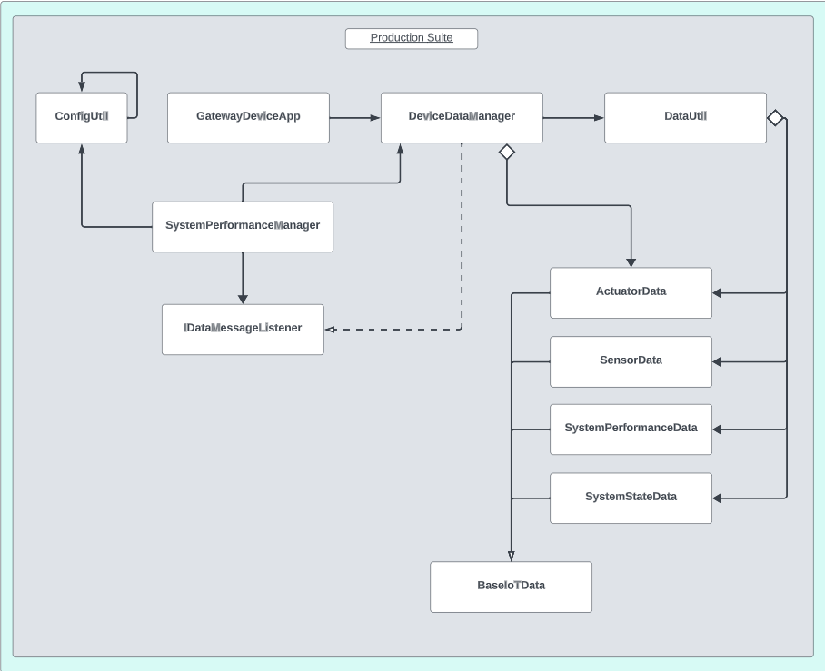

# Gateway Device Application (Connected Devices) - Format Corrected

## Lab Module 05

## Description
### What does your implementation do?
A Gateway Device Application, or GDA, is a software application that acts as an intermediary between IoT devices (ie. constrained devices) and a cloud/edge-computing infrastructure. In particular, the GDA faciliates the communication and the exchange of data between the CDA and the cloud.

This module focuses on eastablishing a common data format between the CDA and GDA so that they can talk to each other. This requires intermediary translation, which is observed within this activity.

### How does your implementation work?

When the GDA is initialized, it establishes a suite of data container classes, such as <b>ActuatorData</b>, <b>SensorData</b>, and <b>SystemPerformanceData</b>, mirroring the ones used by CDAs. These container classes ensure uniformity in representing IoT data, simplifying the handling and administration of data across the ecosystem. Additionally, the GDA employs a <b>DataUtil</b> class to facilitate the conversion of data instances into <b>JSON</b> format for transmission and vice versa. This data translation is particularly crucial due to potential language and protocol disparities among various IoT components. The DataUtil class serves as a vital bridge, ensuring seamless translation to and from a standardized JSON format, promoting interoperability. Subsequently, the GDA proficiently manages the received data, encompassing functions like analytics, historical data storage, and transmission to cloud-based services for further processing. This data management encompasses various tasks, including filtering, aggregation, and decision-making based on the incoming data stream.

## Code Repository and Branch
Please click the link before to be directed to the <b>GDA</b> repository.

URL: https://github.com/Darren-C26/piot-java-components/tree/labmodule05

## UML Design Diagram(s)
<p align="center">

</p>

<p align="center">GDA Implementation UML (Module05)</p>

## Unit Tests Executed
The unit tests executed for the <b>GDA</b> are listed below. Sample test executions can be seen by clicking on the dropdown icon.

<b>Tests from Previous Modules (Re-run):</b>
<details close>
<summary>ConfigUtilTest</summary>

```
Sep. 22, 2023 7:02:11 P.M. programmingtheiot.common.ConfigUtil getCredentials
INFO: Successfully loaded credentials from file: ./src/test/java/programmingtheiot/part01/unit/common/DummyCredFile.props
```
</details>
<br>

<details close>
<summary>SystemCpuUtilTaskTest</summary>

```
Sep. 22, 2023 7:56:50 P.M. programmingtheiot.part01.unit.system.SystemCpuUtilTaskTest testGetTelemetryValue
INFO: Test 1: CPU Util not supported on this OS: -1.0
Sep. 22, 2023 7:56:50 P.M. programmingtheiot.part01.unit.system.SystemCpuUtilTaskTest testGetTelemetryValue
INFO: Test 2: CPU Util not supported on this OS: -1.0
Sep. 22, 2023 7:56:50 P.M. programmingtheiot.part01.unit.system.SystemCpuUtilTaskTest testGetTelemetryValue
INFO: Test 3: CPU Util not supported on this OS: -1.0
Sep. 22, 2023 7:56:50 P.M. programmingtheiot.part01.unit.system.SystemCpuUtilTaskTest testGetTelemetryValue
INFO: Test 4: CPU Util not supported on this OS: -1.0
Sep. 22, 2023 7:56:50 P.M. programmingtheiot.part01.unit.system.SystemCpuUtilTaskTest testGetTelemetryValue
INFO: Test 5: CPU Util not supported on this OS: -1.0
```
</details>
<br>

<details close>
<summary>SystemMemUtilTaskTest</summary>

```
Sep. 22, 2023 8:03:37 P.M. programmingtheiot.part01.unit.system.SystemMemUtilTaskTest testGetTelemetryValue
INFO: Test 1: Memory Util: 0.19753087
Sep. 22, 2023 8:03:37 P.M. programmingtheiot.part01.unit.system.SystemMemUtilTaskTest testGetTelemetryValue
INFO: Test 2: Memory Util: 0.19753087
Sep. 22, 2023 8:03:37 P.M. programmingtheiot.part01.unit.system.SystemMemUtilTaskTest testGetTelemetryValue
INFO: Test 3: Memory Util: 0.19753087
Sep. 22, 2023 8:03:37 P.M. programmingtheiot.part01.unit.system.SystemMemUtilTaskTest testGetTelemetryValue
INFO: Test 4: Memory Util: 0.19753087
Sep. 22, 2023 8:03:37 P.M. programmingtheiot.part01.unit.system.SystemMemUtilTaskTest testGetTelemetryValue
INFO: Test 5: Memory Util: 0.19753087
```
</details>

<br>

<b>New Tests Executed:</b>

<details close>
<summary>ActuatorDataTest</summary>
</details>

<br>

<details close>
<summary>SensorDataTest</summary>
</details>

<br>

<details close>
<summary>SystemPerformanceDataTest</summary>

```
Oct. 06, 2023 11:47:20 P.M. programmingtheiot.part02.unit.data.SystemPerformanceDataTest testFullUpdate
INFO: Created first data obj: name=SysPerfData,typeID=0,timeStamp=2023-10-07T03:47:20.963446900Z,statusCode=0,hasError=false,locationID=gatewaydevice001,latitude=0.0,longitude=0.0,elevation=0.0,cpuUtil=0.0,diskUtil=0.0,memUtil=0.0
Oct. 06, 2023 11:47:21 P.M. programmingtheiot.part02.unit.data.SystemPerformanceDataTest testFullUpdate
INFO: Created second data obj: name=SystemPerformanceDataFooBar,typeID=0,timeStamp=2023-10-07T03:47:21.016448600Z,statusCode=0,hasError=false,locationID=gatewaydevice001,latitude=0.0,longitude=0.0,elevation=0.0,cpuUtil=10.0,diskUtil=10.0,memUtil=10.0
Oct. 06, 2023 11:47:21 P.M. programmingtheiot.part02.unit.data.SystemPerformanceDataTest testFullUpdate
INFO: Updated second data obj: name=SystemPerformanceDataFooBar,typeID=0,timeStamp=2023-10-07T03:47:21.016448600Z,statusCode=0,hasError=false,locationID=gatewaydevice001,latitude=0.0,longitude=0.0,elevation=0.0,cpuUtil=10.0,diskUtil=10.0,memUtil=10.0
Oct. 06, 2023 11:47:21 P.M. programmingtheiot.part02.unit.data.SystemPerformanceDataTest testDefaultValues
INFO: Created data obj: name=SysPerfData,typeID=0,timeStamp=2023-10-07T03:47:21.023447700Z,statusCode=0,hasError=false,locationID=gatewaydevice001,latitude=0.0,longitude=0.0,elevation=0.0,cpuUtil=0.0,diskUtil=0.0,memUtil=0.0
Oct. 06, 2023 11:47:21 P.M. programmingtheiot.part02.unit.data.SystemPerformanceDataTest testParameterUpdates
INFO: Created data obj: name=SystemPerformanceDataFooBar,typeID=0,timeStamp=2023-10-07T03:47:21.025497500Z,statusCode=0,hasError=false,locationID=gatewaydevice001,latitude=0.0,longitude=0.0,elevation=0.0,cpuUtil=10.0,diskUtil=10.0,memUtil=10.0

```
</details>

<br>

<details close>
<summary>SystemStateDataTest</summary>

```

```
</details>

<br>

<details close>
<summary>DataUtilTest</summary>
</details>

<br>


## Integration Tests Executed
The integration tests for the <b>GDA</b> are listed below. Sample test executions can be seen by clicking on the dropdown icon.

<b>Tests from Previous Modules (Re-run):</b>
<details close>
<summary>DataIntegrationTest</summary>

```
Oct. 06, 2023 11:51:20 P.M. programmingtheiot.part02.integration.data.DataIntegrationTest testReadActuatorDataFromCdaDataPath
INFO: 

----- [ActuatorData JSON from file to object] -----
Oct. 06, 2023 11:51:20 P.M. programmingtheiot.part02.integration.data.DataIntegrationTest testReadActuatorDataFromCdaDataPath
INFO: ActuatorData JSON from CDA: {
    "timeStamp": "2023-10-07T01:28:10.585023+00:00",
    "hasError": false,
    "name": "Not Set",
    "typeID": 0,
    "statusCode": 0,
    "latitude": 0.0,
    "longitude": 0.0,
    "elevation": 0.0,
    "locationID": "constraineddevice001",
    "value": 0.0,
    "command": 0,
    "stateData": "",
    "isResponse": false
}
Oct. 06, 2023 11:51:20 P.M. programmingtheiot.part02.integration.data.DataIntegrationTest testReadActuatorDataFromCdaDataPath
INFO: ActuatorData object: name=Not Set,typeID=0,timeStamp=2023-10-07T01:28:10.585023+00:00,statusCode=0,hasError=false,locationID=constraineddevice001,latitude=0.0,longitude=0.0,elevation=0.0,command=0,isResponse=false,value=0.0
Oct. 06, 2023 11:51:20 P.M. programmingtheiot.part02.integration.data.DataIntegrationTest testWriteSystemPerformanceDataToGdaDataPath
INFO: 

----- [SystemPerformanceData to JSON to file] -----
Oct. 06, 2023 11:51:20 P.M. programmingtheiot.part02.integration.data.DataIntegrationTest testWriteSystemPerformanceDataToGdaDataPath
INFO: Sample SystemPerformanceData JSON (validated): {"cpuUtil":0.0,"diskUtil":0.0,"memUtil":0.0,"name":"SysPerfData","timeStamp":"2023-10-07T03:51:20.928839900Z","statusCode":0,"typeID":0,"locationID":"gatewaydevice001","latitude":0.0,"longitude":0.0,"elevation":0.0,"timeStampMillis":1696650680928}
Oct. 06, 2023 11:51:20 P.M. programmingtheiot.part02.integration.data.DataIntegrationTest testWriteSystemPerformanceDataToGdaDataPath
INFO: Writing SystemPerformanceData JSON to GDA data path: \tmp\gda-data\SystemPerformanceData.dat
Oct. 06, 2023 11:51:20 P.M. programmingtheiot.part02.integration.data.DataIntegrationTest testReadSystemPerformanceDataFromCdaDataPath
INFO: 

----- [SystemPerformanceData JSON from file to object] -----
Oct. 06, 2023 11:51:20 P.M. programmingtheiot.part02.integration.data.DataIntegrationTest testReadSystemPerformanceDataFromCdaDataPath
INFO: SystemPerformanceData JSON from CDA: {
    "timeStamp": "2023-10-07T01:28:10.590036+00:00",
    "hasError": false,
    "name": "SystemPerfMsg",
    "typeID": 9000,
    "statusCode": 0,
    "latitude": 0.0,
    "longitude": 0.0,
    "elevation": 0.0,
    "locationID": "constraineddevice001",
    "cpuUtil": 0.0,
    "memUtil": 0.0,
    "diskUtil": 0.0
}
Oct. 06, 2023 11:51:20 P.M. programmingtheiot.part02.integration.data.DataIntegrationTest testReadSystemPerformanceDataFromCdaDataPath
INFO: SystemPerformanceData object: name=SystemPerfMsg,typeID=9000,timeStamp=2023-10-07T01:28:10.590036+00:00,statusCode=0,hasError=false,locationID=constraineddevice001,latitude=0.0,longitude=0.0,elevation=0.0,cpuUtil=0.0,diskUtil=0.0,memUtil=0.0
Oct. 06, 2023 11:51:20 P.M. programmingtheiot.part02.integration.data.DataIntegrationTest testWriteActuatorDataToGdaDataPath
INFO: 

----- [ActuatorData to JSON to file] -----
Oct. 06, 2023 11:51:20 P.M. programmingtheiot.part02.integration.data.DataIntegrationTest testWriteActuatorDataToGdaDataPath
INFO: Sample ActuatorData JSON (validated): {"command":0,"value":0.0,"isResponse":false,"stateData":"","name":"Not Set","timeStamp":"2023-10-07T03:51:20.941837300Z","statusCode":0,"typeID":0,"locationID":"gatewaydevice001","latitude":0.0,"longitude":0.0,"elevation":0.0,"timeStampMillis":1696650680941}
Oct. 06, 2023 11:51:20 P.M. programmingtheiot.part02.integration.data.DataIntegrationTest testWriteActuatorDataToGdaDataPath
INFO: Writing ActuatorData JSON to GDA data path: \tmp\gda-data\ActuatorData.dat
Oct. 06, 2023 11:51:20 P.M. programmingtheiot.part02.integration.data.DataIntegrationTest testWriteSensorDataToGdaDataPath
INFO: 

----- [SensorData to JSON to file] -----
Oct. 06, 2023 11:51:20 P.M. programmingtheiot.part02.integration.data.DataIntegrationTest testWriteSensorDataToGdaDataPath
INFO: Sample SensorData JSON (validated): {"value":0.0,"name":"Not Set","timeStamp":"2023-10-07T03:51:20.946854400Z","statusCode":0,"typeID":0,"locationID":"gatewaydevice001","latitude":0.0,"longitude":0.0,"elevation":0.0,"timeStampMillis":1696650680946}
Oct. 06, 2023 11:51:20 P.M. programmingtheiot.part02.integration.data.DataIntegrationTest testWriteSensorDataToGdaDataPath
INFO: Writing SensorData JSON to GDA data path: \tmp\gda-data\SensorData.dat
Oct. 06, 2023 11:51:20 P.M. programmingtheiot.part02.integration.data.DataIntegrationTest testReadSensorDataFromCdaDataPath
INFO: 

----- [SensorData JSON from file to object] -----
Oct. 06, 2023 11:51:20 P.M. programmingtheiot.part02.integration.data.DataIntegrationTest testReadSensorDataFromCdaDataPath
INFO: SensorData JSON from CDA: {
    "timeStamp": "2023-10-07T01:28:10.587024+00:00",
    "hasError": false,
    "name": "Not Set",
    "typeID": 0,
    "statusCode": 0,
    "latitude": 0.0,
    "longitude": 0.0,
    "elevation": 0.0,
    "locationID": "constraineddevice001",
    "value": 0.0,
    "command": 0,
    "stateData": "",
    "isResponse": false
}
Oct. 06, 2023 11:51:20 P.M. programmingtheiot.part02.integration.data.DataIntegrationTest testReadSensorDataFromCdaDataPath
INFO: SensorData object: name=Not Set,typeID=0,timeStamp=2023-10-07T01:28:10.587024+00:00,statusCode=0,hasError=false,locationID=constraineddevice001,latitude=0.0,longitude=0.0,elevation=0.0,value=0.0

```
</details>

<br>
<details close>
<summary>GatewayDeviceAppTest</summary>

```
Oct. 06, 2023 10:49:00 P.M. programmingtheiot.gda.app.GatewayDeviceApp <init>
INFO: Initializing GDA...
Oct. 06, 2023 10:49:00 P.M. programmingtheiot.gda.app.GatewayDeviceApp startApp
INFO: Starting GDA...
Oct. 06, 2023 10:49:00 P.M. programmingtheiot.gda.app.DeviceDataManager startManager
INFO: Starting DeviceDataManager...
Oct. 06, 2023 10:49:00 P.M. programmingtheiot.gda.system.SystemPerformanceManager startManager
INFO: SystemPerformanceManager is starting...
Oct. 06, 2023 10:49:00 P.M. programmingtheiot.gda.app.GatewayDeviceApp startApp
INFO: GDA started successfully.
Oct. 06, 2023 10:49:01 P.M. programmingtheiot.gda.system.SystemPerformanceManager handleTelemetry
INFO: CPU utilization: -1.0, Mem utilization: 0.34567901
Oct. 06, 2023 10:49:01 P.M. programmingtheiot.gda.app.DeviceDataManager handleSystemPerformanceMessage
INFO: Handling system performance message: SysPerfData
Oct. 06, 2023 10:50:01 P.M. programmingtheiot.gda.system.SystemPerformanceManager handleTelemetry
INFO: CPU utilization: -1.0, Mem utilization: 0.34567901
Oct. 06, 2023 10:50:01 P.M. programmingtheiot.gda.app.DeviceDataManager handleSystemPerformanceMessage
INFO: Handling system performance message: SysPerfData
Oct. 06, 2023 10:50:05 P.M. programmingtheiot.gda.app.GatewayDeviceApp stopApp
INFO: Stopping GDA...
Oct. 06, 2023 10:50:05 P.M. programmingtheiot.gda.app.DeviceDataManager stopManager
INFO: Stopping DeviceDataManager...
Oct. 06, 2023 10:50:05 P.M. programmingtheiot.gda.system.SystemPerformanceManager stopManager
INFO: SystemPerformanceManager is stopped.
Oct. 06, 2023 10:50:05 P.M. programmingtheiot.gda.app.GatewayDeviceApp stopApp
INFO: GDA stopped successfully with exit code 0.

```
</details>

<br>

<details close>
<summary>SystemPerformanceManagerTest</summary>

```
Oct. 06, 2023 11:49:08 P.M. programmingtheiot.gda.system.SystemPerformanceManager startManager
INFO: SystemPerformanceManager is starting...
Oct. 06, 2023 11:49:09 P.M. programmingtheiot.gda.system.SystemPerformanceManager handleTelemetry
INFO: CPU utilization: -1.0, Mem utilization: 0.34567901
Oct. 06, 2023 11:50:08 P.M. programmingtheiot.gda.system.SystemPerformanceManager stopManager
INFO: SystemPerformanceManager is stopped.
```
</details>

<br>

<b>New Tests Executed:</b>

<details close>
<summary>DeviceDataManagerNoCommsTest</summary>

```
Oct. 06, 2023 11:52:32 P.M. programmingtheiot.gda.app.DeviceDataManager startManager
INFO: Starting DeviceDataManager...
Oct. 06, 2023 11:52:32 P.M. programmingtheiot.gda.system.SystemPerformanceManager startManager
INFO: SystemPerformanceManager is starting...
Oct. 06, 2023 11:52:33 P.M. programmingtheiot.gda.system.SystemPerformanceManager handleTelemetry
INFO: CPU utilization: -1.0, Mem utilization: 0.34567901
Oct. 06, 2023 11:52:33 P.M. programmingtheiot.gda.app.DeviceDataManager handleSystemPerformanceMessage
INFO: Handling system performance message: SysPerfData
Oct. 06, 2023 11:52:38 P.M. programmingtheiot.gda.app.DeviceDataManager stopManager
INFO: Stopping DeviceDataManager...
Oct. 06, 2023 11:52:38 P.M. programmingtheiot.gda.system.SystemPerformanceManager stopManager
INFO: SystemPerformanceManager is stopped.

```
</details>

<br>
