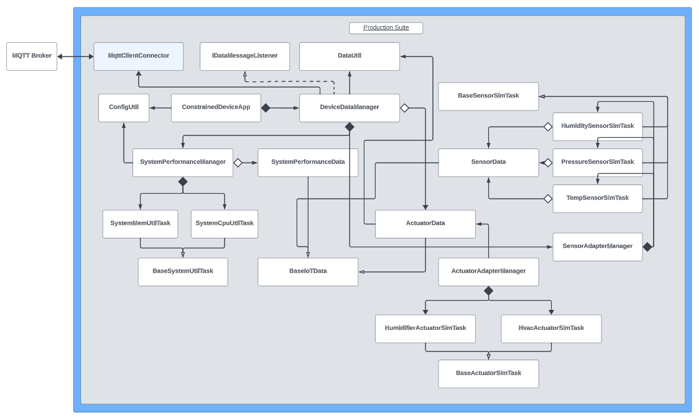

# Constrained Device Application (Connected Devices)

## Lab Module 06

## Description

### What does your implementation do?
A Constrained Device Application, or CDA, is a software application that runs on a "constrained" (ie. resource-limited) device. The purpose of the CDA is to gather sensor data, control actuators, and communicate this information to other devices.

This module's primary focus is on integrating an MQTT Broker with the CDA for communication. An adapter is used in conjunction with the <b>paho-mqtt</b> library to connect to an MQTT server in order to publish messages and subscribe to a topic.

### How does your implementation work?

The implementation strategy revolves around the **MqttClientConnector** class. This class is a crucial component in the CDA implementation, acting as an intermediary for MQTT client functionality. It delegates MQTT client calls to the **paho-mqtt Client**, providing flexibility in choosing different MQTT client implementations. The connector initializes itself by reading key parameters like the MQTT broker's host, port, and keep-alive values from the configuration file.

The **connectClient()** method ensures proper connection to the MQTT server. If the MQTT client doesn't exist, it initializes one. The method then checks the connection status; if not connected, it establishes a connection with the MQTT broker, starting a background network loop to handle messages. This loop is essential for seamless message processing and includes automatic reconnection capabilities. The **disconnectClient()** method is responsible for gracefully disconnecting the client, ensuring resource cleanup and stopping the network loop. The **publishMessage()**, **subscribeToTopic()**, and **setDataMessageListener()** methods manage publishing, subscribing, and data message listening.

The integration of the **MqttClientConnector** into the CDA is performed within the **DeviceDataManager**. This involves initializing an instance of the MqttClientConnector, subscribing to actuator commands when the DeviceDataManager starts, and unsubscribing when it stops. In the DeviceDataManager's constructor, a boolean flag is checked to determine whether to enable the MQTT client. If enabled, an instance of MqttClientConnector is created. In the DeviceDataManager's **startManager()** function, the MQTT client is connected, and it subscribes to the relevant topic for actuator commands. When the **stopManager()** function is called, the MQTT client is disconnected, and it unsubscribes from the topic. The integration ensures that the CDA can communicate with IoT devices over MQTT by leveraging the MqttClientConnector for MQTT interactions.

## Code Repository and Branch
Please click the link before to be directed to the <b>CDA</b> repository.

URL: https://github.com/Darren-C26/piot-python-components/tree/labmodule06

## UML Design Diagram(s)
<p align="center">

</p>

<p align="center">CDA Implementation UML (Module06)</p>

<br>

## Unit Tests Executed
The unit tests executed for the <b>CDA</b> are listed below. Sample test executions can be seen by clicking on the dropdown icon.

<b>Tests from Previous Modules (Re-run):</b>
<details close>
<summary>ConfigUtilTest</summary>

```
2023-10-27 23:42:45,112:ConfigUtilTest:INFO:Testing ConfigUtil class...
2023-10-27 23:42:45,112:ConfigUtil:INFO:Loading config: ./ValidTestConfig.props
2023-10-27 23:42:45,124:ConfigUtil:DEBUG:Config: ['Mqtt.GatewayService', 'Coap.GatewayService', 'ConstrainedDevice']
2023-10-27 23:42:45,124:ConfigUtil:INFO:Created instance of ConfigUtil: <programmingtheiot.common.ConfigUtil.ConfigUtil object at 0x000002432812D210>
.s......
----------------------------------------------------------------------
Ran 8 tests in 0.013s

OK (skipped=1)
```
</details>

<br>

<details close>
<summary>SystemCpuUtilTaskTest</summary>

```
2023-10-27 23:43:43,951:SystemCpuUtilTaskTest:INFO:Testing SystemCpuUtilTask class...
2023-10-27 23:43:43,952:SystemCpuUtilTaskTest:INFO:CPU utilization: 0.0
.
----------------------------------------------------------------------
Ran 1 test in 0.001s

OK
```
</details>
<br>

<details close>
<summary>SystemMemUtilTaskTest</summary>

```
2023-10-27 23:44:10,953:SystemMemUtilTaskTest:INFO:Testing SystemMemUtilTask class...
2023-10-27 23:44:10,961:SystemMemUtilTaskTest:INFO:Virtual memory utilization: 89.2
.
----------------------------------------------------------------------
Ran 1 test in 0.008s

OK
```
</details>

<br>

<details close>
<summary>ActuatorDataTest</summary>

```
2023-10-27 23:44:53,652:ActuatorDataTest:INFO:Testing ActuatorData class...
2023-10-27 23:44:53,652:ConfigUtil:INFO:Loading config: ../../../../../../../config/PiotConfig.props
2023-10-27 23:44:53,653:ConfigUtil:DEBUG:Config: ['Mqtt.GatewayService', 'Coap.GatewayService', 'ConstrainedDevice']
2023-10-27 23:44:53,653:ConfigUtil:INFO:Created instance of ConfigUtil: <programmingtheiot.common.ConfigUtil.ConfigUtil object at 0x00000235D2EEB4C0>
C:\Users\Owner\Documents\Fall 2023\IoT Design and Analysis\programmingtheiot\python-components\src\test\python\programmingtheiot\part02\unit\data\ActuatorDataTest.py:44: DeprecationWarning: Please use assertEqual instead.
  self.assertEquals(ad.getCommand(), ConfigConst.DEFAULT_COMMAND)
2023-10-27 23:44:53,655:ActuatorDataTest:INFO:Actuator data as string: name=Not Set,typeID=0,timeStamp=2023-10-28T03:44:53.652161+00:00,statusCode=0,hasError=False,locationID=constraineddevice001,elevation=0.0,latitude=0.0,longitude=0.0
.2023-10-27 23:44:53,655:ActuatorDataTest:INFO:Actuator data as string: name=ActuatorDataFooBar,typeID=0,timeStamp=2023-10-28T03:44:53.655289+00:00,statusCode=0,hasError=False,locationID=constraineddevice001,elevation=0.0,latitude=0.0,longitude=0.0
.2023-10-27 23:44:53,656:ActuatorDataTest:INFO:Actuator data as string: name=ActuatorDataFooBar,typeID=0,timeStamp=2023-10-28T03:44:53.656162+00:00,statusCode=0,hasError=False,locationID=constraineddevice001,elevation=0.0,latitude=0.0,longitude=0.0
.
----------------------------------------------------------------------
Ran 3 tests in 0.004s

OK
```

</details>
<br>

<details close>
<summary>SensorDataTest</summary>

```
2023-10-27 23:45:12,751:SensorDataTest:INFO:Testing SensorData class...
2023-10-27 23:45:12,751:ConfigUtil:INFO:Loading config: ../../../../../../../config/PiotConfig.props
2023-10-27 23:45:12,752:ConfigUtil:DEBUG:Config: ['Mqtt.GatewayService', 'Coap.GatewayService', 'ConstrainedDevice']
2023-10-27 23:45:12,752:ConfigUtil:INFO:Created instance of ConfigUtil: <programmingtheiot.common.ConfigUtil.ConfigUtil object at 0x000001860986F5E0>
C:\Users\Owner\Documents\Fall 2023\IoT Design and Analysis\programmingtheiot\python-components\src\test\python\programmingtheiot\part02\unit\data\SensorDataTest.py:46: DeprecationWarning: Please use assertEqual instead.
  self.assertEquals(sd.getName(), ConfigConst.NOT_SET)
2023-10-27 23:45:12,752:SensorDataTest:INFO:Sensor data as string: name=Not Set,typeID=0,timeStamp=2023-10-28T03:45:12.751560+00:00,statusCode=0,hasError=False,locationID=constraineddevice001,elevation=0.0,latitude=0.0,longitude=0.0
.2023-10-27 23:45:12,753:SensorDataTest:INFO:Sensor data as string: name=SensorDataFooBar,typeID=0,timeStamp=2023-10-28T03:45:12.753561+00:00,statusCode=0,hasError=False,locationID=constraineddevice001,elevation=0.0,latitude=0.0,longitude=0.0
.2023-10-27 23:45:12,753:SensorDataTest:INFO:Sensor data as string: name=SensorDataFooBar,typeID=0,timeStamp=2023-10-28T03:45:12.753561+00:00,statusCode=0,hasError=False,locationID=constraineddevice001,elevation=0.0,latitude=0.0,longitude=0.0
.
----------------------------------------------------------------------
Ran 3 tests in 0.002s

OK
```

</details>
<br>

<details close>
<summary>SystemPerformanceDataTest</summary>

```
2023-10-27 23:45:31,700:SystemPerformanceDataTest:INFO:Testing SystemPerformanceData class...
2023-10-27 23:45:31,700:ConfigUtil:INFO:Loading config: ../../../../../../../config/PiotConfig.props
2023-10-27 23:45:31,701:ConfigUtil:DEBUG:Config: ['Mqtt.GatewayService', 'Coap.GatewayService', 'ConstrainedDevice']
2023-10-27 23:45:31,702:ConfigUtil:INFO:Created instance of ConfigUtil: <programmingtheiot.common.ConfigUtil.ConfigUtil object at 0x000001674068B6D0>
C:\Users\Owner\Documents\Fall 2023\IoT Design and Analysis\programmingtheiot\python-components\src\test\python\programmingtheiot\part02\unit\data\SystemPerformanceDataTest.py:45: DeprecationWarning: Please use assertEqual instead.
  self.assertEquals(spd.getName(), ConfigConst.SYSTEM_PERF_NAME)
2023-10-27 23:45:31,702:SystemPerformanceDataTest:INFO:System perf data as string: name=SystemPerfMsg,typeID=9000,timeStamp=2023-10-28T03:45:31.700978+00:00,statusCode=0,hasError=False,locationID=constraineddevice001,elevation=0.0,latitude=0.0,longitude=0.0
.2023-10-27 23:45:31,703:SystemPerformanceDataTest:INFO:System perf data as string: name=SystemPerformanceDataFooBar,typeID=9000,timeStamp=2023-10-28T03:45:31.703975+00:00,statusCode=0,hasError=False,locationID=constraineddevice001,elevation=0.0,latitude=0.0,longitude=0.0
.2023-10-27 23:45:31,703:SystemPerformanceDataTest:INFO:System perf data as string: name=SystemPerformanceDataFooBar,typeID=9000,timeStamp=2023-10-28T03:45:31.703975+00:00,statusCode=0,hasError=False,locationID=constraineddevice001,elevation=0.0,latitude=0.0,longitude=0.0
.
----------------------------------------------------------------------
Ran 3 tests in 0.003s

OK
```

</details>
<br>

<details close>
<summary>HumiditySensorSimTaskTest</summary>

```
2023-10-27 23:46:00,943:HumiditySensorSimTaskTest:INFO:Testing HumiditySensorSimTask class...
2023-10-27 23:46:00,943:ConfigUtil:INFO:Loading config: ../../../../../../../config/PiotConfig.props
2023-10-27 23:46:00,944:ConfigUtil:DEBUG:Config: ['Mqtt.GatewayService', 'Coap.GatewayService', 'ConstrainedDevice']
2023-10-27 23:46:00,944:ConfigUtil:INFO:Created instance of ConfigUtil: <programmingtheiot.common.ConfigUtil.ConfigUtil object at 0x000001B9015DCF70>
2023-10-27 23:46:00,945:HumiditySensorSimTaskTest:INFO:SensorData: name=HumiditySensor,typeID=1010,timeStamp=2023-10-28T03:46:00.945638+00:00,statusCode=0,hasError=False,locationID=constraineddevice001,elevation=0.0,latitude=0.0,longitude=0.0
.2023-10-27 23:46:00,945:HumiditySensorSimTaskTest:INFO:Humidity data: 38.752455
.
----------------------------------------------------------------------
Ran 2 tests in 0.002s

OK

```

</details>
<br>

<details close>
<summary>PressureSensorSimTaskTest</summary>

```
2023-10-27 23:46:21,972:PressureSensorSimTaskTest:INFO:Testing PressureSensorSimTask class...
2023-10-27 23:46:21,973:ConfigUtil:INFO:Loading config: ../../../../../../../config/PiotConfig.props
2023-10-27 23:46:21,973:ConfigUtil:DEBUG:Config: ['Mqtt.GatewayService', 'Coap.GatewayService', 'ConstrainedDevice']
2023-10-27 23:46:21,973:ConfigUtil:INFO:Created instance of ConfigUtil: <programmingtheiot.common.ConfigUtil.ConfigUtil object at 0x000002C322F60DF0>
2023-10-27 23:46:21,974:PressureSensorSimTaskTest:INFO:SensorData: name=PressureSensor,typeID=1012,timeStamp=2023-10-28T03:46:21.974022+00:00,statusCode=0,hasError=False,locationID=constraineddevice001,elevation=0.0,latitude=0.0,longitude=0.0
.2023-10-27 23:46:21,974:PressureSensorSimTaskTest:INFO:Pressure data: 1001.196179
.
----------------------------------------------------------------------
Ran 2 tests in 0.002s

OK
```

</details>
<br>

<details close>
<summary>TemperatureSensorSimTaskTest</summary>

```
2023-10-27 23:46:53,783:TemperatureSensorSimTaskTest:INFO:Testing TemperatureSensorSimTask class...
2023-10-27 23:46:53,785:ConfigUtil:INFO:Loading config: ../../../../../../../config/PiotConfig.props
2023-10-27 23:46:53,785:ConfigUtil:DEBUG:Config: ['Mqtt.GatewayService', 'Coap.GatewayService', 'ConstrainedDevice']
2023-10-27 23:46:53,785:ConfigUtil:INFO:Created instance of ConfigUtil: <programmingtheiot.common.ConfigUtil.ConfigUtil object at 0x00000236CD66CF10>
2023-10-27 23:46:53,785:TemperatureSensorSimTaskTest:INFO:Temperature SensorData: name=TempSensor,typeID=1013,timeStamp=2023-10-28T03:46:53.785888+00:00,statusCode=0,hasError=False,locationID=constraineddevice001,elevation=0.0,latitude=0.0,longitude=0.0
.2023-10-27 23:46:53,785:TemperatureSensorSimTaskTest:INFO:Temperature data: 18.958065
.
----------------------------------------------------------------------
Ran 2 tests in 0.002s

OK
```

</details>
<br>

<details close>
<summary>HumidifierActuatorSimTaskTest</summary>

```
2023-10-27 23:47:13,458:HumidifierActuatorSimTaskTest:INFO:Testing HumidifierActuatorSimTask class...
2023-10-27 23:47:13,458:ConfigUtil:INFO:Loading config: ../../../../../../../config/PiotConfig.props
2023-10-27 23:47:13,459:ConfigUtil:DEBUG:Config: ['Mqtt.GatewayService', 'Coap.GatewayService', 'ConstrainedDevice']
2023-10-27 23:47:13,459:ConfigUtil:INFO:Created instance of ConfigUtil: <programmingtheiot.common.ConfigUtil.ConfigUtil object at 0x0000017F99918DF0>
2023-10-27 23:47:13,459:BaseActuatorSimTask:DEBUG:New actuator command and value to be applied: 1 18.2
2023-10-27 23:47:13,459:BaseActuatorSimTask:INFO:Activating actuator...
2023-10-27 23:47:13,459:BaseActuatorSimTask:INFO:Simulating HumidifierActuator actuator ON: 
*******
* O N *
*******
HumidifierActuator VALUE -> 18.2
=======
C:\Users\Owner\Documents\Fall 2023\IoT Design and Analysis\programmingtheiot\python-components\src\test\python\programmingtheiot\part02\unit\sim\HumidifierActuatorSimTaskTest.py:49: DeprecationWarning: Please use assertEqual instead.
  self.assertEquals(adr.getValue(), self.DEFAULT_VAL_A)
2023-10-27 23:47:13,460:HumidifierActuatorSimTaskTest:INFO:ActuatorData: name=Not Set,typeID=1002,timeStamp=2023-10-28T03:47:13.459501+00:00,statusCode=0,hasError=False,locationID=constraineddevice001,elevation=0.0,latitude=0.0,longitude=0.0
2023-10-27 23:47:13,461:BaseActuatorSimTask:DEBUG:New actuator command and value to be applied: 1 21.4
2023-10-27 23:47:13,461:BaseActuatorSimTask:INFO:Activating actuator...
2023-10-27 23:47:13,461:BaseActuatorSimTask:INFO:Simulating HumidifierActuator actuator ON: 
*******
* O N *
*******
HumidifierActuator VALUE -> 21.4
=======
2023-10-27 23:47:13,461:HumidifierActuatorSimTaskTest:INFO:ActuatorData: name=Not Set,typeID=1002,timeStamp=2023-10-28T03:47:13.461501+00:00,statusCode=0,hasError=False,locationID=constraineddevice001,elevation=0.0,latitude=0.0,longitude=0.0
2023-10-27 23:47:13,461:BaseActuatorSimTask:DEBUG:New actuator command and value to be applied: 0 21.4
2023-10-27 23:47:13,461:BaseActuatorSimTask:INFO:Deactivating actuator...
2023-10-27 23:47:13,461:BaseActuatorSimTask:INFO:Simulating HumidifierActuator actuator OFF: 
*******
* OFF *
*******
2023-10-27 23:47:13,461:HumidifierActuatorSimTaskTest:INFO:ActuatorData: name=Not Set,typeID=1002,timeStamp=2023-10-28T03:47:13.461501+00:00,statusCode=0,hasError=False,locationID=constraineddevice001,elevation=0.0,latitude=0.0,longitude=0.0
.s
----------------------------------------------------------------------
Ran 2 tests in 0.004s

OK (skipped=1)
```

</details>
<br>

<details close>
<summary>HvacActuatorSimTaskTest</summary>

```
2023-10-27 23:47:41,688:HvacActuatorSimTaskTest:INFO:Testing HvacActuatorSimTask class...
2023-10-27 23:47:41,689:ConfigUtil:INFO:Loading config: ../../../../../../../config/PiotConfig.props
2023-10-27 23:47:41,690:ConfigUtil:DEBUG:Config: ['Mqtt.GatewayService', 'Coap.GatewayService', 'ConstrainedDevice']
2023-10-27 23:47:41,690:ConfigUtil:INFO:Created instance of ConfigUtil: <programmingtheiot.common.ConfigUtil.ConfigUtil object at 0x000001D5971A6D10>
2023-10-27 23:47:41,690:BaseActuatorSimTask:DEBUG:New actuator command and value to be applied: 1 18.2
2023-10-27 23:47:41,690:BaseActuatorSimTask:INFO:Activating actuator...
2023-10-27 23:47:41,690:BaseActuatorSimTask:INFO:Simulating HvacActuator actuator ON: 
*******
* O N *
*******
HvacActuator VALUE -> 18.2
=======
C:\Users\Owner\Documents\Fall 2023\IoT Design and Analysis\programmingtheiot\python-components\src\test\python\programmingtheiot\part02\unit\sim\HvacActuatorSimTaskTest.py:49: DeprecationWarning: Please use assertEqual instead.
  self.assertEquals(adr.getValue(), self.DEFAULT_VAL_A)
2023-10-27 23:47:41,692:HvacActuatorSimTaskTest:INFO:ActuatorData: name=Not Set,typeID=1001,timeStamp=2023-10-28T03:47:41.690701+00:00,statusCode=0,hasError=False,locationID=constraineddevice001,elevation=0.0,latitude=0.0,longitude=0.0
2023-10-27 23:47:41,692:BaseActuatorSimTask:DEBUG:New actuator command and value to be applied: 1 21.4
2023-10-27 23:47:41,692:BaseActuatorSimTask:INFO:Activating actuator...
2023-10-27 23:47:41,692:BaseActuatorSimTask:INFO:Simulating HvacActuator actuator ON: 
*******
* O N *
*******
HvacActuator VALUE -> 21.4
=======
2023-10-27 23:47:41,692:HvacActuatorSimTaskTest:INFO:ActuatorData: name=Not Set,typeID=1001,timeStamp=2023-10-28T03:47:41.692048+00:00,statusCode=0,hasError=False,locationID=constraineddevice001,elevation=0.0,latitude=0.0,longitude=0.0
2023-10-27 23:47:41,692:BaseActuatorSimTask:DEBUG:New actuator command and value to be applied: 0 21.4
2023-10-27 23:47:41,692:BaseActuatorSimTask:INFO:Deactivating actuator...
2023-10-27 23:47:41,692:BaseActuatorSimTask:INFO:Simulating HvacActuator actuator OFF: 
*******
* OFF *
*******
2023-10-27 23:47:41,692:HvacActuatorSimTaskTest:INFO:ActuatorData: name=Not Set,typeID=1001,timeStamp=2023-10-28T03:47:41.692554+00:00,statusCode=0,hasError=False,locationID=constraineddevice001,elevation=0.0,latitude=0.0,longitude=0.0
.s
----------------------------------------------------------------------
Ran 2 tests in 0.003s

OK (skipped=1)
```

</details>

<br>

<details close>
<summary>DataUtilTest</summary>

```
2023-10-27 23:48:07,871:DataUtilTest:INFO:Testing DataUtil class...
2023-10-27 23:48:07,871:DataUtil:INFO:Created DataUtil instance.
2023-10-27 23:48:07,872:DataUtilTest:INFO:================================================
2023-10-27 23:48:07,872:DataUtilTest:INFO:DataUtil test execution...
2023-10-27 23:48:07,872:DataUtilTest:INFO:================================================
2023-10-27 23:48:07,872:DataUtilTest:INFO:

----- [ActuatorData Conversions from JSON] -----
2023-10-27 23:48:07,872:DataUtil:WARNING:JSON data is empty or null. Returning null.
2023-10-27 23:48:07,872:DataUtil:WARNING:JSON data is empty or null. Returning null.
2023-10-27 23:48:07,872:ConfigUtil:INFO:Loading config: ../../../../../../../config/PiotConfig.props
2023-10-27 23:48:07,872:ConfigUtil:DEBUG:Config: ['Mqtt.GatewayService', 'Coap.GatewayService', 'ConstrainedDevice']
2023-10-27 23:48:07,872:ConfigUtil:INFO:Created instance of ConfigUtil: <programmingtheiot.common.ConfigUtil.ConfigUtil object at 0x000001D74FBB8F40>
2023-10-27 23:48:07,872:DataUtilTest:INFO:Sample JSON: {
    "timeStamp": "2023-10-28T03:48:07.872040+00:00",
    "hasError": false,
    "name": "FooBar ActuatorData",
    "typeID": 0,
    "statusCode": 0,
    "latitude": 0.0,
    "longitude": 0.0,
    "elevation": 0.0,
    "locationID": "constraineddevice001",
    "value": 0.0,
    "command": 0,
    "stateData": "",
    "isResponse": false
}
2023-10-27 23:48:07,872:DataUtilTest:INFO:JSON to ActuatorData: name=FooBar ActuatorData,typeID=0,timeStamp=2023-10-28T03:48:07.872040+00:00,statusCode=0,hasError=False,locationID=constraineddevice001,elevation=0.0,latitude=0.0,longitude=0.0
2023-10-27 23:48:07,873:DataUtilTest:INFO:ActuatorData back to JSON: {
    "timeStamp": "2023-10-28T03:48:07.872040+00:00",
    "hasError": false,
    "name": "FooBar ActuatorData",
    "typeID": 0,
    "statusCode": 0,
    "latitude": 0.0,
    "longitude": 0.0,
    "elevation": 0.0,
    "locationID": "constraineddevice001",
    "value": 0.0,
    "command": 0,
    "stateData": "",
    "isResponse": false
}
.2023-10-27 23:48:07,873:DataUtilTest:INFO:================================================
2023-10-27 23:48:07,873:DataUtilTest:INFO:DataUtil test execution...
2023-10-27 23:48:07,873:DataUtilTest:INFO:================================================
2023-10-27 23:48:07,873:DataUtilTest:INFO:

----- [JSON Conversions from ActuatorData] -----
2023-10-27 23:48:07,873:DataUtilTest:INFO:Sample ActuatorData: name=FooBar2 Actuator,typeID=0,timeStamp=2023-10-28T03:48:07.873613+00:00,statusCode=0,hasError=False,locationID=constraineddevice001,elevation=0.0,latitude=0.0,longitude=0.0
2023-10-27 23:48:07,873:DataUtilTest:INFO:ActuatorData to JSON: {
    "timeStamp": "2023-10-28T03:48:07.873613+00:00",
    "hasError": false,
    "name": "FooBar2 Actuator",
    "typeID": 0,
    "statusCode": 0,
    "latitude": 0.0,
    "longitude": 0.0,
    "elevation": 0.0,
    "locationID": "constraineddevice001",
    "value": 0.0,
    "command": 0,
    "stateData": "",
    "isResponse": false
}
2023-10-27 23:48:07,873:DataUtilTest:INFO:JSON back to ActuatorData: name=FooBar2 Actuator,typeID=0,timeStamp=2023-10-28T03:48:07.873613+00:00,statusCode=0,hasError=False,locationID=constraineddevice001,elevation=0.0,latitude=0.0,longitude=0.0
2023-10-27 23:48:07,873:DataUtilTest:INFO:ActuatorData back to JSON: {
    "timeStamp": "2023-10-28T03:48:07.873613+00:00",
    "hasError": false,
    "name": "FooBar2 Actuator",
    "typeID": 0,
    "statusCode": 0,
    "latitude": 0.0,
    "longitude": 0.0,
    "elevation": 0.0,
    "locationID": "constraineddevice001",
    "value": 0.0,
    "command": 0,
    "stateData": "",
    "isResponse": false
}
.2023-10-27 23:48:07,873:DataUtilTest:INFO:================================================
2023-10-27 23:48:07,873:DataUtilTest:INFO:DataUtil test execution...
2023-10-27 23:48:07,873:DataUtilTest:INFO:================================================
2023-10-27 23:48:07,873:DataUtilTest:INFO:

----- [SensorData Conversions from JSON] -----
2023-10-27 23:48:07,873:DataUtil:WARNING:JSON data is empty or null. Returning null.
2023-10-27 23:48:07,873:DataUtil:WARNING:JSON data is empty or null. Returning null.
2023-10-27 23:48:07,874:DataUtilTest:INFO:Sample JSON: {
    "timeStamp": "2023-10-28T03:48:07.873613+00:00",
    "hasError": false,
    "name": "FooBar SensorData",
    "typeID": 0,
    "statusCode": 0,
    "latitude": 0.0,
    "longitude": 0.0,
    "elevation": 0.0,
    "locationID": "constraineddevice001",
    "value": 0.0,
    "command": 0,
    "stateData": "",
    "isResponse": false
}
2023-10-27 23:48:07,874:DataUtilTest:INFO:JSON to SensorData: name=FooBar SensorData,typeID=0,timeStamp=2023-10-28T03:48:07.873613+00:00,statusCode=0,hasError=False,locationID=constraineddevice001,elevation=0.0,latitude=0.0,longitude=0.0
2023-10-27 23:48:07,874:DataUtilTest:INFO:SensorData back to JSON: {
    "timeStamp": "2023-10-28T03:48:07.873613+00:00",
    "hasError": false,
    "name": "FooBar SensorData",
    "typeID": 0,
    "statusCode": 0,
    "latitude": 0.0,
    "longitude": 0.0,
    "elevation": 0.0,
    "locationID": "constraineddevice001",
    "value": 0.0,
    "command": 0,
    "stateData": "",
    "isResponse": false
}
.2023-10-27 23:48:07,874:DataUtilTest:INFO:================================================
2023-10-27 23:48:07,874:DataUtilTest:INFO:DataUtil test execution...
2023-10-27 23:48:07,874:DataUtilTest:INFO:================================================
2023-10-27 23:48:07,874:DataUtilTest:INFO:

----- [JSON Conversions from SensorData] -----
2023-10-27 23:48:07,874:DataUtilTest:INFO:Sample SensorData: name=Foobar2 Sensor,typeID=0,timeStamp=2023-10-28T03:48:07.874613+00:00,statusCode=0,hasError=False,locationID=constraineddevice001,elevation=0.0,latitude=0.0,longitude=0.0
2023-10-27 23:48:07,874:DataUtilTest:INFO:SensorData to JSON: {
    "timeStamp": "2023-10-28T03:48:07.874613+00:00",
    "hasError": false,
    "name": "Foobar2 Sensor",
    "typeID": 0,
    "statusCode": 0,
    "latitude": 0.0,
    "longitude": 0.0,
    "elevation": 0.0,
    "locationID": "constraineddevice001",
    "value": 0.0,
    "command": 0,
    "stateData": "",
    "isResponse": false
}
2023-10-27 23:48:07,874:DataUtilTest:INFO:JSON back to SensorData: name=Foobar2 Sensor,typeID=0,timeStamp=2023-10-28T03:48:07.874613+00:00,statusCode=0,hasError=False,locationID=constraineddevice001,elevation=0.0,latitude=0.0,longitude=0.0
2023-10-27 23:48:07,874:DataUtilTest:INFO:SensorData back to JSON: {
    "timeStamp": "2023-10-28T03:48:07.874613+00:00",
    "hasError": false,
    "name": "Foobar2 Sensor",
    "typeID": 0,
    "statusCode": 0,
    "latitude": 0.0,
    "longitude": 0.0,
    "elevation": 0.0,
    "locationID": "constraineddevice001",
    "value": 0.0,
    "command": 0,
    "stateData": "",
    "isResponse": false
}
.2023-10-27 23:48:07,874:DataUtilTest:INFO:================================================
2023-10-27 23:48:07,874:DataUtilTest:INFO:DataUtil test execution...
2023-10-27 23:48:07,874:DataUtilTest:INFO:================================================
2023-10-27 23:48:07,874:DataUtilTest:INFO:

----- [SystemPerformanceData Conversions from JSON] -----
2023-10-27 23:48:07,874:DataUtil:WARNING:JSON data is empty or null. Returning null.
2023-10-27 23:48:07,874:DataUtil:WARNING:JSON data is empty or null. Returning null.
2023-10-27 23:48:07,875:DataUtilTest:INFO:Sample JSON: {
    "timeStamp": "2023-10-28T03:48:07.875613+00:00",
    "hasError": false,
    "name": "FooBar SystemPerformanceData",
    "typeID": 9000,
    "statusCode": 0,
    "latitude": 0.0,
    "longitude": 0.0,
    "elevation": 0.0,
    "locationID": "constraineddevice001",
    "cpuUtil": 0.0,
    "memUtil": 0.0,
    "diskUtil": 0.0
}
2023-10-27 23:48:07,875:DataUtilTest:INFO:JSON to SystemPerformanceData: name=FooBar SystemPerformanceData,typeID=9000,timeStamp=2023-10-28T03:48:07.875613+00:00,statusCode=0,hasError=False,locationID=constraineddevice001,elevation=0.0,latitude=0.0,longitude=0.0
2023-10-27 23:48:07,875:DataUtilTest:INFO:SystemPerformanceData back to JSON: {
    "timeStamp": "2023-10-28T03:48:07.875613+00:00",
    "hasError": false,
    "name": "FooBar SystemPerformanceData",
    "typeID": 9000,
    "statusCode": 0,
    "latitude": 0.0,
    "longitude": 0.0,
    "elevation": 0.0,
    "locationID": "constraineddevice001",
    "cpuUtil": 0.0,
    "memUtil": 0.0,
    "diskUtil": 0.0
}
.2023-10-27 23:48:07,875:DataUtilTest:INFO:================================================
2023-10-27 23:48:07,875:DataUtilTest:INFO:DataUtil test execution...
2023-10-27 23:48:07,875:DataUtilTest:INFO:================================================
2023-10-27 23:48:07,875:DataUtilTest:INFO:

----- [JSON Conversions from SystemPerformanceData] -----
2023-10-27 23:48:07,875:DataUtilTest:INFO:Sample SystemPerformanceData: name=Foobar2 SystemPerformanceData,typeID=9000,timeStamp=2023-10-28T03:48:07.875613+00:00,statusCode=0,hasError=False,locationID=constraineddevice001,elevation=0.0,latitude=0.0,longitude=0.0
2023-10-27 23:48:07,875:DataUtilTest:INFO:SystemPerformanceData to JSON: {
    "timeStamp": "2023-10-28T03:48:07.875613+00:00",
    "hasError": false,
    "name": "Foobar2 SystemPerformanceData",
    "typeID": 9000,
    "statusCode": 0,
    "latitude": 0.0,
    "longitude": 0.0,
    "elevation": 0.0,
    "locationID": "constraineddevice001",
    "cpuUtil": 0.0,
    "memUtil": 0.0,
    "diskUtil": 0.0
}
2023-10-27 23:48:07,875:DataUtilTest:INFO:JSON back to SystemPerformanceData: name=Foobar2 SystemPerformanceData,typeID=9000,timeStamp=2023-10-28T03:48:07.875613+00:00,statusCode=0,hasError=False,locationID=constraineddevice001,elevation=0.0,latitude=0.0,longitude=0.0
2023-10-27 23:48:07,875:DataUtilTest:INFO:SystemPerformanceData back to JSON: {
    "timeStamp": "2023-10-28T03:48:07.875613+00:00",
    "hasError": false,
    "name": "Foobar2 SystemPerformanceData",
    "typeID": 9000,
    "statusCode": 0,
    "latitude": 0.0,
    "longitude": 0.0,
    "elevation": 0.0,
    "locationID": "constraineddevice001",
    "cpuUtil": 0.0,
    "memUtil": 0.0,
    "diskUtil": 0.0
}
.
----------------------------------------------------------------------
Ran 6 tests in 0.005s

OK
```
</details>

<br>


<b>New Tests Executed:</b>

No new unit tests were executed for this module.
<!-- <details close>
<summary>FILLIT</summary>

```

```

</details>
<br> -->

<br>


## Integration Tests Executed
The integration tests for the <b>CDA</b> are listed below. Sample test executions can be seen by clicking on the dropdown icon.

<b>Tests from Previous Modules (Re-run):</b>


<details close>
<summary>ConstrainedDeviceAppTest</summary>

```
2023-10-27 23:48:54,135:root:INFO:Testing ConstrainedDeviceApp class...
2023-10-27 23:48:54,136:root:INFO:Initializing CDA...
2023-10-27 23:48:54,136:root:INFO:Loading config: ../../../../../../../config/PiotConfig.props
2023-10-27 23:48:54,137:root:DEBUG:Config: ['Mqtt.GatewayService', 'Coap.GatewayService', 'ConstrainedDevice']
2023-10-27 23:48:54,137:root:INFO:Created instance of ConfigUtil: <programmingtheiot.common.ConfigUtil.ConfigUtil object at 0x0000025DBDC27220>
2023-10-27 23:48:54,137:tzlocal:DEBUG:Looking up time zone info from registry
2023-10-27 23:48:54,152:apscheduler.scheduler:INFO:Adding job tentatively -- it will be properly scheduled when the scheduler starts
2023-10-27 23:48:54,153:root:INFO:Local system performance tracking enabled
2023-10-27 23:48:54,153:apscheduler.scheduler:INFO:Adding job tentatively -- it will be properly scheduled when the scheduler starts
2023-10-27 23:48:54,154:root:INFO:Current time set to: Fri Oct 27 23:48:54 2023
2023-10-27 23:48:54,154:root:INFO:timeEntries tuple. Array Size: 1440  ND Size: 1440  Dimensions: 1  Shape: (1440,)  Type: float64
2023-10-27 23:48:54,158:root:DEBUG:Noise=10.000000; Noise Scale=0.100000; Mean Magnitude=1.000000
2023-10-27 23:48:54,158:root:INFO:dataEntries tuple. Array Size: 1440  ND Size: 1440  Dimensions: 1  Shape: (1440,)  Type: float64
2023-10-27 23:48:54,158:root:INFO:Current time set to: Fri Oct 27 23:48:54 2023
2023-10-27 23:48:54,158:root:INFO:timeEntries tuple. Array Size: 1440  ND Size: 1440  Dimensions: 1  Shape: (1440,)  Type: float64
2023-10-27 23:48:54,159:root:DEBUG:Noise=10.000000; Noise Scale=10.000000; Mean Magnitude=3.000000
2023-10-27 23:48:54,159:root:INFO:dataEntries tuple. Array Size: 1440  ND Size: 1440  Dimensions: 1  Shape: (1440,)  Type: float64
2023-10-27 23:48:54,159:root:INFO:Current time set to: Fri Oct 27 23:48:54 2023
2023-10-27 23:48:54,159:root:INFO:timeEntries tuple. Array Size: 1440  ND Size: 1440  Dimensions: 1  Shape: (1440,)  Type: float64
2023-10-27 23:48:54,159:root:DEBUG:Noise=10.000000; Noise Scale=0.100000; Mean Magnitude=1.000000
2023-10-27 23:48:54,159:root:INFO:dataEntries tuple. Array Size: 1440  ND Size: 1440  Dimensions: 1  Shape: (1440,)  Type: float64
2023-10-27 23:48:54,160:root:INFO:Local sensor tracking enabled
2023-10-27 23:48:54,160:root:INFO:Local actuation capabilities enabled
2023-10-27 23:48:54,160:root:INFO:Starting CDA...
2023-10-27 23:48:54,160:root:INFO:Starting DeviceDataManager...
2023-10-27 23:48:54,160:root:INFO:Starting SystemPerformanceManager...
2023-10-27 23:48:54,163:apscheduler.scheduler:INFO:Added job "SystemPerformanceManager.handleTelemetry" to job store "default"
2023-10-27 23:48:54,163:apscheduler.scheduler:INFO:Scheduler started
2023-10-27 23:48:54,164:apscheduler.scheduler:DEBUG:Looking for jobs to run
2023-10-27 23:48:54,165:root:INFO:Started SystemPerformanceManager.
2023-10-27 23:48:54,165:apscheduler.scheduler:DEBUG:Next wakeup is due at 2023-10-27 23:48:59.152121-04:00 (in 4.986945 seconds)
2023-10-27 23:48:54,165:root:INFO:Started SensorAdapterManager.
2023-10-27 23:48:54,165:apscheduler.scheduler:INFO:Added job "SensorAdapterManager.handleTelemetry" to job store "default"
2023-10-27 23:48:54,165:apscheduler.scheduler:INFO:Scheduler started
2023-10-27 23:48:54,166:apscheduler.scheduler:DEBUG:Looking for jobs to run
2023-10-27 23:48:54,166:root:INFO:Started DeviceDataManager.
2023-10-27 23:48:54,166:apscheduler.scheduler:DEBUG:Next wakeup is due at 2023-10-27 23:48:59.153119-04:00 (in 4.986982 seconds)
2023-10-27 23:48:54,166:root:INFO:CDA started.
2023-10-27 23:48:54,166:root:INFO:CDA stopping...
2023-10-27 23:48:54,167:root:INFO:Stopping DeviceDataManager...
2023-10-27 23:48:54,167:root:INFO:Stopping SystemPerformanceManager...
2023-10-27 23:48:54,167:apscheduler.scheduler:INFO:Scheduler has been shut down
2023-10-27 23:48:54,167:apscheduler.scheduler:DEBUG:Looking for jobs to run
2023-10-27 23:48:54,167:apscheduler.scheduler:DEBUG:No jobs; waiting until a job is added
2023-10-27 23:48:54,167:root:INFO:Stopped SystemPerformanceManager.
2023-10-27 23:48:54,167:root:INFO:Stopped SensorAdapterManager.
2023-10-27 23:48:54,167:apscheduler.scheduler:INFO:Scheduler has been shut down
2023-10-27 23:48:54,167:apscheduler.scheduler:DEBUG:Looking for jobs to run
2023-10-27 23:48:54,167:apscheduler.scheduler:DEBUG:No jobs; waiting until a job is added
2023-10-27 23:48:54,168:root:INFO:Stopped DeviceDataManager.
2023-10-27 23:48:54,168:root:INFO:CDA stopped with exit code 0.
.
----------------------------------------------------------------------
Ran 1 test in 0.032s

OK
```

</details>
<br>

<details close>
<summary>SystemPerformanceManagerTest</summary>

```
Finding files... done.
Importing test modules ... done.

2023-10-27 20:41:08,059:SystemPerformanceManagerTest:INFO:Testing SystemPerformanceManager class...
2023-10-27 20:41:08,059:ConfigUtil:INFO:Loading config: ../../../../../../../config/PiotConfig.props
2023-10-27 20:41:08,060:ConfigUtil:DEBUG:Config: ['Mqtt.GatewayService', 'Coap.GatewayService', 'ConstrainedDevice']
2023-10-27 20:41:08,060:ConfigUtil:INFO:Created instance of ConfigUtil: <programmingtheiot.common.ConfigUtil.ConfigUtil object at 0x000001AFE04793C0>
2023-10-27 20:41:08,060:win32:DEBUG:Looking up time zone info from registry
2023-10-27 20:41:08,068:base:INFO:Adding job tentatively -- it will be properly scheduled when the scheduler starts
2023-10-27 20:41:08,069:SystemPerformanceManager:INFO:Starting SystemPerformanceManager...
2023-10-27 20:41:08,069:base:INFO:Added job "SystemPerformanceManager.handleTelemetry" to job store "default"
2023-10-27 20:41:08,069:base:INFO:Scheduler started
2023-10-27 20:41:08,070:base:DEBUG:Looking for jobs to run
2023-10-27 20:41:08,070:SystemPerformanceManager:INFO:Started SystemPerformanceManager.
2023-10-27 20:41:08,070:base:DEBUG:Next wakeup is due at 2023-10-27 20:41:13.068462-04:00 (in 4.997999 seconds)
2023-10-27 20:41:13,081:base:DEBUG:Looking for jobs to run
2023-10-27 20:41:13,081:base:INFO:Running job "SystemPerformanceManager.handleTelemetry (trigger: interval[0:00:05], next run at: 2023-10-27 20:41:13 EDT)" (scheduled at 2023-10-27 20:41:13.068462-04:00)
2023-10-27 20:41:13,090:SystemPerformanceManager:DEBUG:CPU utilization is 19.1 percent, and memory utilization is 88.8 percent.
2023-10-27 20:41:13,090:base:INFO:Job "SystemPerformanceManager.handleTelemetry (trigger: interval[0:00:05], next run at: 2023-10-27 20:41:13 EDT)" executed successfully
2023-10-27 20:41:13,090:base:DEBUG:Next wakeup is due at 2023-10-27 20:41:18.068462-04:00 (in 4.977538 seconds)
2023-10-27 20:41:14,075:SystemPerformanceManager:INFO:Stopping SystemPerformanceManager...
2023-10-27 20:41:14,075:base:INFO:Scheduler has been shut down
2023-10-27 20:41:14,076:base:DEBUG:Looking for jobs to run
2023-10-27 20:41:14,076:base:DEBUG:No jobs; waiting until a job is added
2023-10-27 20:41:14,076:SystemPerformanceManager:INFO:Stopped SystemPerformanceManager.
----------------------------------------------------------------------
Ran 1 test in 6.018s

OK
```

</details>
<br>


<details close>
<summary>SensorAdapterManagerTest</summary>

```
2023-10-27 23:50:04,059:SensorAdapterManagerTest:INFO:Testing SensorAdapterManager class...
2023-10-27 23:50:04,059:ConfigUtil:INFO:Loading config: ../../../../../../../config/PiotConfig.props
2023-10-27 23:50:04,076:ConfigUtil:DEBUG:Config: ['Mqtt.GatewayService', 'Coap.GatewayService', 'ConstrainedDevice']
2023-10-27 23:50:04,076:ConfigUtil:INFO:Created instance of ConfigUtil: <programmingtheiot.common.ConfigUtil.ConfigUtil object at 0x0000014FE6963370>
2023-10-27 23:50:04,077:win32:DEBUG:Looking up time zone info from registry
2023-10-27 23:50:04,087:base:INFO:Adding job tentatively -- it will be properly scheduled when the scheduler starts
2023-10-27 23:50:04,088:SensorDataGenerator:INFO:Current time set to: Fri Oct 27 23:50:04 2023
2023-10-27 23:50:04,088:SensorDataGenerator:INFO:timeEntries tuple. Array Size: 1440  ND Size: 1440  Dimensions: 1  Shape: (1440,)  Type: float64
2023-10-27 23:50:04,089:SensorDataGenerator:DEBUG:Noise=10.000000; Noise Scale=0.100000; Mean Magnitude=1.000000
2023-10-27 23:50:04,089:SensorDataGenerator:INFO:dataEntries tuple. Array Size: 1440  ND Size: 1440  Dimensions: 1  Shape: (1440,)  Type: float64
2023-10-27 23:50:04,089:SensorDataGenerator:INFO:Current time set to: Fri Oct 27 23:50:04 2023
2023-10-27 23:50:04,089:SensorDataGenerator:INFO:timeEntries tuple. Array Size: 1440  ND Size: 1440  Dimensions: 1  Shape: (1440,)  Type: float64
2023-10-27 23:50:04,089:SensorDataGenerator:DEBUG:Noise=10.000000; Noise Scale=10.000000; Mean Magnitude=3.000000
2023-10-27 23:50:04,089:SensorDataGenerator:INFO:dataEntries tuple. Array Size: 1440  ND Size: 1440  Dimensions: 1  Shape: (1440,)  Type: float64
2023-10-27 23:50:04,089:SensorDataGenerator:INFO:Current time set to: Fri Oct 27 23:50:04 2023
2023-10-27 23:50:04,089:SensorDataGenerator:INFO:timeEntries tuple. Array Size: 1440  ND Size: 1440  Dimensions: 1  Shape: (1440,)  Type: float64
2023-10-27 23:50:04,089:SensorDataGenerator:DEBUG:Noise=10.000000; Noise Scale=0.100000; Mean Magnitude=1.000000
2023-10-27 23:50:04,089:SensorDataGenerator:INFO:dataEntries tuple. Array Size: 1440  ND Size: 1440  Dimensions: 1  Shape: (1440,)  Type: float64
2023-10-27 23:50:04,089:SensorAdapterManager:INFO:Started SensorAdapterManager.
2023-10-27 23:50:04,091:base:INFO:Added job "SensorAdapterManager.handleTelemetry" to job store "default"
2023-10-27 23:50:04,091:base:INFO:Scheduler started
2023-10-27 23:50:04,092:base:DEBUG:Looking for jobs to run
2023-10-27 23:50:04,092:base:DEBUG:Next wakeup is due at 2023-10-27 23:50:09.087899-04:00 (in 4.995167 seconds)
2023-10-27 23:50:09,095:base:DEBUG:Looking for jobs to run
2023-10-27 23:50:09,096:base:INFO:Running job "SensorAdapterManager.handleTelemetry (trigger: interval[0:00:05], next run at: 2023-10-27 23:50:09 EDT)" (scheduled at 2023-10-27 23:50:09.087899-04:00)
2023-10-27 23:50:09,097:SensorAdapterManager:DEBUG:Generated humidity data: name=HumiditySensor,typeID=1010,timeStamp=2023-10-28T03:50:09.097438+00:00,statusCode=0,hasError=False,locationID=constraineddevice001,elevation=0.0,latitude=0.0,longitude=0.0
2023-10-27 23:50:09,097:SensorAdapterManager:DEBUG:Generated pressure data: name=PressureSensor,typeID=1012,timeStamp=2023-10-28T03:50:09.097438+00:00,statusCode=0,hasError=False,locationID=constraineddevice001,elevation=0.0,latitude=0.0,longitude=0.0
2023-10-27 23:50:09,097:SensorAdapterManager:DEBUG:Generated temp data: name=TempSensor,typeID=1013,timeStamp=2023-10-28T03:50:09.097438+00:00,statusCode=0,hasError=False,locationID=constraineddevice001,elevation=0.0,latitude=0.0,longitude=0.0
2023-10-27 23:50:09,097:DefaultDataMessageListener:INFO:Sensor Message: name=HumiditySensor,typeID=1010,timeStamp=2023-10-28T03:50:09.097438+00:00,statusCode=0,hasError=False,locationID=constraineddevice001,elevation=0.0,latitude=0.0,longitude=0.0
2023-10-27 23:50:09,097:DefaultDataMessageListener:INFO:Sensor Message: name=PressureSensor,typeID=1012,timeStamp=2023-10-28T03:50:09.097438+00:00,statusCode=0,hasError=False,locationID=constraineddevice001,elevation=0.0,latitude=0.0,longitude=0.0
2023-10-27 23:50:09,097:DefaultDataMessageListener:INFO:Sensor Message: name=TempSensor,typeID=1013,timeStamp=2023-10-28T03:50:09.097438+00:00,statusCode=0,hasError=False,locationID=constraineddevice001,elevation=0.0,latitude=0.0,longitude=0.0
2023-10-27 23:50:09,098:base:INFO:Job "SensorAdapterManager.handleTelemetry (trigger: interval[0:00:05], next run at: 2023-10-27 23:50:09 EDT)" executed successfully
2023-10-27 23:50:09,098:base:DEBUG:Next wakeup is due at 2023-10-27 23:50:14.087899-04:00 (in 4.989465 seconds)
2023-10-27 23:50:14,092:base:DEBUG:Looking for jobs to run
2023-10-27 23:50:14,093:base:DEBUG:Next wakeup is due at 2023-10-27 23:50:19.087899-04:00 (in 4.993949 seconds)
2023-10-27 23:50:14,094:base:INFO:Running job "SensorAdapterManager.handleTelemetry (trigger: interval[0:00:05], next run at: 2023-10-27 23:50:19 EDT)" (scheduled at 2023-10-27 23:50:14.087899-04:00)
2023-10-27 23:50:14,096:SensorAdapterManager:DEBUG:Generated humidity data: name=HumiditySensor,typeID=1010,timeStamp=2023-10-28T03:50:14.095944+00:00,statusCode=0,hasError=False,locationID=constraineddevice001,elevation=0.0,latitude=0.0,longitude=0.0
2023-10-27 23:50:14,097:SensorAdapterManager:DEBUG:Generated pressure data: name=PressureSensor,typeID=1012,timeStamp=2023-10-28T03:50:14.095944+00:00,statusCode=0,hasError=False,locationID=constraineddevice001,elevation=0.0,latitude=0.0,longitude=0.0
2023-10-27 23:50:14,097:SensorAdapterManager:DEBUG:Generated temp data: name=TempSensor,typeID=1013,timeStamp=2023-10-28T03:50:14.095944+00:00,statusCode=0,hasError=False,locationID=constraineddevice001,elevation=0.0,latitude=0.0,longitude=0.0
2023-10-27 23:50:14,097:DefaultDataMessageListener:INFO:Sensor Message: name=HumiditySensor,typeID=1010,timeStamp=2023-10-28T03:50:14.095944+00:00,statusCode=0,hasError=False,locationID=constraineddevice001,elevation=0.0,latitude=0.0,longitude=0.0
2023-10-27 23:50:14,098:DefaultDataMessageListener:INFO:Sensor Message: name=PressureSensor,typeID=1012,timeStamp=2023-10-28T03:50:14.095944+00:00,statusCode=0,hasError=False,locationID=constraineddevice001,elevation=0.0,latitude=0.0,longitude=0.0
2023-10-27 23:50:14,099:DefaultDataMessageListener:INFO:Sensor Message: name=TempSensor,typeID=1013,timeStamp=2023-10-28T03:50:14.095944+00:00,statusCode=0,hasError=False,locationID=constraineddevice001,elevation=0.0,latitude=0.0,longitude=0.0
2023-10-27 23:50:14,099:base:INFO:Job "SensorAdapterManager.handleTelemetry (trigger: interval[0:00:05], next run at: 2023-10-27 23:50:19 EDT)" executed successfully

.

.

2023-10-27 23:51:04,091:base:DEBUG:Looking for jobs to run
2023-10-27 23:51:04,091:base:DEBUG:Next wakeup is due at 2023-10-27 23:51:09.087899-04:00 (in 4.996309 seconds)
2023-10-27 23:51:04,091:base:INFO:Running job "SensorAdapterManager.handleTelemetry (trigger: interval[0:00:05], next run at: 2023-10-27 23:51:09 EDT)" (scheduled at 2023-10-27 23:51:04.087899-04:00)
2023-10-27 23:51:04,092:SensorAdapterManager:DEBUG:Generated humidity data: name=HumiditySensor,typeID=1010,timeStamp=2023-10-28T03:51:04.092360+00:00,statusCode=0,hasError=False,locationID=constraineddevice001,elevation=0.0,latitude=0.0,longitude=0.0
2023-10-27 23:51:04,092:SensorAdapterManager:DEBUG:Generated pressure data: name=PressureSensor,typeID=1012,timeStamp=2023-10-28T03:51:04.092360+00:00,statusCode=0,hasError=False,locationID=constraineddevice001,elevation=0.0,latitude=0.0,longitude=0.0
2023-10-27 23:51:04,092:SensorAdapterManager:DEBUG:Generated temp data: name=TempSensor,typeID=1013,timeStamp=2023-10-28T03:51:04.092360+00:00,statusCode=0,hasError=False,locationID=constraineddevice001,elevation=0.0,latitude=0.0,longitude=0.0
2023-10-27 23:51:04,092:DefaultDataMessageListener:INFO:Sensor Message: name=HumiditySensor,typeID=1010,timeStamp=2023-10-28T03:51:04.092360+00:00,statusCode=0,hasError=False,locationID=constraineddevice001,elevation=0.0,latitude=0.0,longitude=0.0
2023-10-27 23:51:04,092:DefaultDataMessageListener:INFO:Sensor Message: name=PressureSensor,typeID=1012,timeStamp=2023-10-28T03:51:04.092360+00:00,statusCode=0,hasError=False,locationID=constraineddevice001,elevation=0.0,latitude=0.0,longitude=0.0
2023-10-27 23:51:04,092:DefaultDataMessageListener:INFO:Sensor Message: name=TempSensor,typeID=1013,timeStamp=2023-10-28T03:51:04.092360+00:00,statusCode=0,hasError=False,locationID=constraineddevice001,elevation=0.0,latitude=0.0,longitude=0.0
2023-10-27 23:51:04,092:base:INFO:Job "SensorAdapterManager.handleTelemetry (trigger: interval[0:00:05], next run at: 2023-10-27 23:51:09 EDT)" executed successfully
2023-10-27 23:51:04,106:SensorAdapterManager:INFO:Stopped SensorAdapterManager.
2023-10-27 23:51:04,106:base:INFO:Scheduler has been shut down
2023-10-27 23:51:04,106:base:DEBUG:Looking for jobs to run
2023-10-27 23:51:04,106:base:DEBUG:No jobs; waiting until a job is added
.
----------------------------------------------------------------------
Ran 1 test in 60.048s

OK
```

</details>
<br>

<details close>
<summary>ActuatorAdapterManagerTest</summary>

```
2023-10-27 23:53:01,468:ActuatorAdapterManagerTest:INFO:Testing ActuatorAdapterManager class...
2023-10-27 23:53:01,469:ConfigUtil:INFO:Loading config: ../../../../../../../config/PiotConfig.props
2023-10-27 23:53:01,469:ConfigUtil:DEBUG:Config: ['Mqtt.GatewayService', 'Coap.GatewayService', 'ConstrainedDevice']
2023-10-27 23:53:01,470:ConfigUtil:INFO:Created instance of ConfigUtil: <programmingtheiot.common.ConfigUtil.ConfigUtil object at 0x000001F509CAEBC0>
2023-10-27 23:53:01,470:ActuatorAdapterManager:INFO:Actuator command received for location ID constraineddevice001. Processing...
2023-10-27 23:53:01,470:BaseActuatorSimTask:DEBUG:New actuator command and value to be applied: 1 50.0
2023-10-27 23:53:01,470:BaseActuatorSimTask:INFO:Activating actuator...
2023-10-27 23:53:01,470:BaseActuatorSimTask:INFO:Simulating HumidifierActuator actuator ON: 
*******
* O N *
*******
HumidifierActuator VALUE -> 50.0
=======
2023-10-27 23:53:01,470:ActuatorAdapterManager:INFO:Actuator command received for location ID constraineddevice001. Processing...
2023-10-27 23:53:01,470:BaseActuatorSimTask:DEBUG:New actuator command and value to be applied: 0 50.0
2023-10-27 23:53:01,471:BaseActuatorSimTask:INFO:Deactivating actuator...
2023-10-27 23:53:01,471:BaseActuatorSimTask:INFO:Simulating HumidifierActuator actuator OFF: 
*******
* OFF *
*******
.2023-10-27 23:53:01,471:ActuatorAdapterManager:INFO:Actuator command received for location ID constraineddevice001. Processing...
2023-10-27 23:53:01,471:BaseActuatorSimTask:DEBUG:New actuator command and value to be applied: 1 22.5
2023-10-27 23:53:01,471:BaseActuatorSimTask:INFO:Activating actuator...
2023-10-27 23:53:01,471:BaseActuatorSimTask:INFO:Simulating HvacActuator actuator ON: 
*******
* O N *
*******
HvacActuator VALUE -> 22.5
=======
2023-10-27 23:53:01,471:ActuatorAdapterManager:INFO:Actuator command received for location ID constraineddevice001. Processing...
2023-10-27 23:53:01,471:BaseActuatorSimTask:DEBUG:New actuator command and value to be applied: 0 22.5
2023-10-27 23:53:01,471:BaseActuatorSimTask:INFO:Deactivating actuator...
2023-10-27 23:53:01,471:BaseActuatorSimTask:INFO:Simulating HvacActuator actuator OFF: 
*******
* OFF *
*******
.
----------------------------------------------------------------------
Ran 2 tests in 0.003s

OK
```

</details>
<br>

<details close>
<summary>DeviceDataManagerNoCommsTest</summary>

```
Finding files... done.
Importing test modules ... done.

2023-10-27 19:37:28,349:DeviceDataManagerNoCommsTest:INFO:Testing DeviceDataManager class...
2023-10-27 19:37:28,349:ConfigUtil:INFO:Loading config: ../../../../../../../config/PiotConfig.props
2023-10-27 19:37:28,350:ConfigUtil:DEBUG:Config: ['Mqtt.GatewayService', 'Coap.GatewayService', 'ConstrainedDevice']
2023-10-27 19:37:28,350:ConfigUtil:INFO:Created instance of ConfigUtil: <programmingtheiot.common.ConfigUtil.ConfigUtil object at 0x000002442D8432E0>
2023-10-27 19:37:28,353:win32:DEBUG:Looking up time zone info from registry
2023-10-27 19:37:28,363:base:INFO:Adding job tentatively -- it will be properly scheduled when the scheduler starts
2023-10-27 19:37:28,363:DeviceDataManager:INFO:Local system performance tracking enabled
2023-10-27 19:37:28,363:base:INFO:Adding job tentatively -- it will be properly scheduled when the scheduler starts
2023-10-27 19:37:28,364:SensorDataGenerator:INFO:Current time set to: Fri Sep 29 19:37:28 2023
2023-10-27 19:37:28,364:SensorDataGenerator:INFO:timeEntries tuple. Array Size: 1440  ND Size: 1440  Dimensions: 1  Shape: (1440,)  Type: float64
2023-10-27 19:37:28,365:SensorDataGenerator:DEBUG:Noise=10.000000; Noise Scale=0.100000; Mean Magnitude=1.000000
2023-10-27 19:37:28,365:SensorDataGenerator:INFO:dataEntries tuple. Array Size: 1440  ND Size: 1440  Dimensions: 1  Shape: (1440,)  Type: float64
2023-10-27 19:37:28,365:SensorDataGenerator:INFO:Current time set to: Fri Sep 29 19:37:28 2023
2023-10-27 19:37:28,365:SensorDataGenerator:INFO:timeEntries tuple. Array Size: 1440  ND Size: 1440  Dimensions: 1  Shape: (1440,)  Type: float64
2023-10-27 19:37:28,365:SensorDataGenerator:DEBUG:Noise=10.000000; Noise Scale=10.000000; Mean Magnitude=3.000000
2023-10-27 19:37:28,365:SensorDataGenerator:INFO:dataEntries tuple. Array Size: 1440  ND Size: 1440  Dimensions: 1  Shape: (1440,)  Type: float64
2023-10-27 19:37:28,365:SensorDataGenerator:INFO:Current time set to: Fri Sep 29 19:37:28 2023
2023-10-27 19:37:28,365:SensorDataGenerator:INFO:timeEntries tuple. Array Size: 1440  ND Size: 1440  Dimensions: 1  Shape: (1440,)  Type: float64
2023-10-27 19:37:28,365:SensorDataGenerator:DEBUG:Noise=10.000000; Noise Scale=0.100000; Mean Magnitude=1.000000
2023-10-27 19:37:28,365:SensorDataGenerator:INFO:dataEntries tuple. Array Size: 1440  ND Size: 1440  Dimensions: 1  Shape: (1440,)  Type: float64
2023-10-27 19:37:28,365:DeviceDataManager:INFO:Local sensor tracking enabled
2023-10-27 19:37:28,365:DeviceDataManager:INFO:Local actuation capabilities enabled
2023-10-27 19:37:28,365:DeviceDataManager:INFO:Starting DeviceDataManager...
2023-10-27 19:37:28,365:SystemPerformanceManager:INFO:Starting SystemPerformanceManager...
2023-10-27 19:37:28,367:base:INFO:Added job "SystemPerformanceManager.handleTelemetry" to job store "default"
2023-10-27 19:37:28,367:base:INFO:Scheduler started
2023-10-27 19:37:28,367:base:DEBUG:Looking for jobs to run
2023-10-27 19:37:28,367:SystemPerformanceManager:INFO:Started SystemPerformanceManager.
2023-10-27 19:37:28,368:SensorAdapterManager:INFO:Started SensorAdapterManager.
2023-10-27 19:37:28,368:base:DEBUG:Next wakeup is due at 2023-10-27 19:37:33.363804-04:00 (in 4.995578 seconds)
2023-10-27 19:37:28,368:base:INFO:Added job "SensorAdapterManager.handleTelemetry" to job store "default"
2023-10-27 19:37:28,368:base:INFO:Scheduler started
2023-10-27 19:37:28,368:base:DEBUG:Looking for jobs to run
2023-10-27 19:37:28,368:DeviceDataManager:INFO:Started DeviceDataManager.
2023-10-27 19:37:28,368:base:DEBUG:Next wakeup is due at 2023-10-27 19:37:33.363804-04:00 (in 4.995027 seconds)
2023-10-27 19:37:33,366:base:DEBUG:Looking for jobs to run
2023-10-27 19:37:33,366:base:DEBUG:Looking for jobs to run
2023-10-27 19:37:33,366:base:INFO:Running job "SensorAdapterManager.handleTelemetry (trigger: interval[0:00:05], next run at: 2023-10-27 19:37:33 EDT)" (scheduled at 2023-10-27 19:37:33.363804-04:00)
2023-10-27 19:37:33,367:SensorAdapterManager:DEBUG:Generated humidity data: name=HumiditySensor,typeID=1010,timeStamp=2023-10-27T23:37:33.367890+00:00,statusCode=0,hasError=False,locationID=constraineddevice001,elevation=0.0,latitude=0.0,longitude=0.0
2023-10-27 19:37:33,367:SensorAdapterManager:DEBUG:Generated pressure data: name=PressureSensor,typeID=1012,timeStamp=2023-10-27T23:37:33.367890+00:00,statusCode=0,hasError=False,locationID=constraineddevice001,elevation=0.0,latitude=0.0,longitude=0.0
2023-10-27 19:37:33,367:SensorAdapterManager:DEBUG:Generated temp data: name=TempSensor,typeID=1013,timeStamp=2023-10-27T23:37:33.367890+00:00,statusCode=0,hasError=False,locationID=constraineddevice001,elevation=0.0,latitude=0.0,longitude=0.0
2023-10-27 19:37:33,367:DeviceDataManager:DEBUG:Incoming sensor data received (from sensor manager): name=HumiditySensor,typeID=1010,timeStamp=2023-10-27T23:37:33.367890+00:00,statusCode=0,hasError=False,locationID=constraineddevice001,elevation=0.0,latitude=0.0,longitude=0.0
2023-10-27 19:37:33,367:DeviceDataManager:DEBUG:Incoming sensor data received (from sensor manager): name=PressureSensor,typeID=1012,timeStamp=2023-10-27T23:37:33.367890+00:00,statusCode=0,hasError=False,locationID=constraineddevice001,elevation=0.0,latitude=0.0,longitude=0.0
2023-10-27 19:37:33,367:DeviceDataManager:DEBUG:Incoming sensor data received (from sensor manager): name=TempSensor,typeID=1013,timeStamp=2023-10-27T23:37:33.367890+00:00,statusCode=0,hasError=False,locationID=constraineddevice001,elevation=0.0,latitude=0.0,longitude=0.0
2023-10-27 19:37:33,367:base:DEBUG:Next wakeup is due at 2023-10-27 19:37:38.363804-04:00 (in 4.995914 seconds)
2023-10-27 19:37:33,367:DeviceDataManager:INFO:Handle temp change: True - type ID: 1013
2023-10-27 19:37:33,368:DeviceDataManager:INFO:Actuator data: name=Not Set,typeID=1001,timeStamp=2023-10-27T23:37:33.368891+00:00,statusCode=0,hasError=False,locationID=constraineddevice001,elevation=0.0,latitude=0.0,longitude=0.0
2023-10-27 19:37:33,368:DeviceDataManager:INFO:Processing actuator command message.
2023-10-27 19:37:33,368:ActuatorAdapterManager:INFO:Actuator command received for location ID constraineddevice001. Processing...
2023-10-27 19:37:33,368:BaseActuatorSimTask:DEBUG:New actuator command and value is a repeat. Ignoring: 0 0.0
2023-10-27 19:37:33,368:base:INFO:Job "SensorAdapterManager.handleTelemetry (trigger: interval[0:00:05], next run at: 2023-10-27 19:37:38 EDT)" executed successfully
2023-10-27 19:37:33,368:base:INFO:Running job "SystemPerformanceManager.handleTelemetry (trigger: interval[0:00:05], next run at: 2023-10-27 19:37:33 EDT)" (scheduled at 2023-10-27 19:37:33.363804-04:00)
2023-10-27 19:37:33,374:SystemPerformanceManager:DEBUG:CPU utilization is 21.9 percent, and memory utilization is 89.5 percent.
2023-10-27 19:37:33,374:base:INFO:Job "SystemPerformanceManager.handleTelemetry (trigger: interval[0:00:05], next run at: 2023-10-27 19:37:33 EDT)" executed successfully
2023-10-27 19:37:33,374:base:DEBUG:Next wakeup is due at 2023-10-27 19:37:38.363804-04:00 (in 4.988882 seconds)
2023-10-27 19:37:38,369:base:DEBUG:Looking for jobs to run
2023-10-27 19:37:38,369:base:DEBUG:Next wakeup is due at 2023-10-27 19:37:43.363804-04:00 (in 4.993818 seconds)
2023-10-27 19:37:38,370:base:DEBUG:Looking for jobs to run
2023-10-27 19:37:38,370:base:DEBUG:Next wakeup is due at 2023-10-27 19:37:43.363804-04:00 (in 4.993160 seconds)
2023-10-27 19:37:38,370:base:INFO:Running job "SensorAdapterManager.handleTelemetry (trigger: interval[0:00:05], next run at: 2023-10-27 19:37:43 EDT)" (scheduled at 2023-10-27 19:37:38.363804-04:00)
2023-10-27 19:37:38,371:SensorAdapterManager:DEBUG:Generated humidity data: name=HumiditySensor,typeID=1010,timeStamp=2023-10-27T23:37:38.371679+00:00,statusCode=0,hasError=False,locationID=constraineddevice001,elevation=0.0,latitude=0.0,longitude=0.0
2023-10-27 19:37:38,371:SensorAdapterManager:DEBUG:Generated pressure data: name=PressureSensor,typeID=1012,timeStamp=2023-10-27T23:37:38.371679+00:00,statusCode=0,hasError=False,locationID=constraineddevice001,elevation=0.0,latitude=0.0,longitude=0.0
2023-10-27 19:37:38,371:SensorAdapterManager:DEBUG:Generated temp data: name=TempSensor,typeID=1013,timeStamp=2023-10-27T23:37:38.371679+00:00,statusCode=0,hasError=False,locationID=constraineddevice001,elevation=0.0,latitude=0.0,longitude=0.0
2023-10-27 19:37:38,371:DeviceDataManager:DEBUG:Incoming sensor data received (from sensor manager): name=HumiditySensor,typeID=1010,timeStamp=2023-10-27T23:37:38.371679+00:00,statusCode=0,hasError=False,locationID=constraineddevice001,elevation=0.0,latitude=0.0,longitude=0.0
2023-10-27 19:37:38,371:DeviceDataManager:DEBUG:Incoming sensor data received (from sensor manager): name=PressureSensor,typeID=1012,timeStamp=2023-10-27T23:37:38.371679+00:00,statusCode=0,hasError=False,locationID=constraineddevice001,elevation=0.0,latitude=0.0,longitude=0.0
2023-10-27 19:37:38,371:DeviceDataManager:DEBUG:Incoming sensor data received (from sensor manager): name=TempSensor,typeID=1013,timeStamp=2023-10-27T23:37:38.371679+00:00,statusCode=0,hasError=False,locationID=constraineddevice001,elevation=0.0,latitude=0.0,longitude=0.0
2023-10-27 19:37:38,371:DeviceDataManager:INFO:Handle temp change: True - type ID: 1013
2023-10-27 19:37:38,371:DeviceDataManager:INFO:Actuator data: name=Not Set,typeID=1001,timeStamp=2023-10-27T23:37:38.371679+00:00,statusCode=0,hasError=False,locationID=constraineddevice001,elevation=0.0,latitude=0.0,longitude=0.0
2023-10-27 19:37:38,372:DeviceDataManager:INFO:Processing actuator command message.
2023-10-27 19:37:38,372:ActuatorAdapterManager:INFO:Actuator command received for location ID constraineddevice001. Processing...
2023-10-27 19:37:38,372:BaseActuatorSimTask:DEBUG:New actuator command and value is a repeat. Ignoring: 0 0.0
2023-10-27 19:37:38,372:base:INFO:Job "SensorAdapterManager.handleTelemetry (trigger: interval[0:00:05], next run at: 2023-10-27 19:37:43 EDT)" executed successfully
2023-10-27 19:37:38,372:base:INFO:Running job "SystemPerformanceManager.handleTelemetry (trigger: interval[0:00:05], next run at: 2023-10-27 19:37:43 EDT)" (scheduled at 2023-10-27 19:37:38.363804-04:00)
2023-10-27 19:37:38,379:SystemPerformanceManager:DEBUG:CPU utilization is 15.3 percent, and memory utilization is 89.6 percent.
2023-10-27 19:37:38,379:base:INFO:Job "SystemPerformanceManager.handleTelemetry (trigger: interval[0:00:05], next run at: 2023-10-27 19:37:43 EDT)" executed successfully
2023-10-27 19:37:43,378:base:DEBUG:Looking for jobs to run
2023-10-27 19:37:43,378:base:DEBUG:Looking for jobs to run
2023-10-27 19:37:43,378:base:DEBUG:Next wakeup is due at 2023-10-27 19:37:48.363804-04:00 (in 4.985580 seconds)
2023-10-27 19:37:43,378:base:INFO:Running job "SystemPerformanceManager.handleTelemetry (trigger: interval[0:00:05], next run at: 2023-10-27 19:37:48 EDT)" (scheduled at 2023-10-27 19:37:43.363804-04:00)
2023-10-27 19:37:43,379:base:DEBUG:Next wakeup is due at 2023-10-27 19:37:48.363804-04:00 (in 4.984676 seconds)
2023-10-27 19:37:43,379:base:INFO:Running job "SensorAdapterManager.handleTelemetry (trigger: interval[0:00:05], next run at: 2023-10-27 19:37:48 EDT)" (scheduled at 2023-10-27 19:37:43.363804-04:00)
2023-10-27 19:37:43,385:SystemPerformanceManager:DEBUG:CPU utilization is 19.1 percent, and memory utilization is 89.6 percent.
2023-10-27 19:37:43,385:SensorAdapterManager:DEBUG:Generated humidity data: name=HumiditySensor,typeID=1010,timeStamp=2023-10-27T23:37:43.385113+00:00,statusCode=0,hasError=False,locationID=constraineddevice001,elevation=0.0,latitude=0.0,longitude=0.0
2023-10-27 19:37:43,385:base:INFO:Job "SystemPerformanceManager.handleTelemetry (trigger: interval[0:00:05], next run at: 2023-10-27 19:37:48 EDT)" executed successfully
2023-10-27 19:37:43,385:SensorAdapterManager:DEBUG:Generated pressure data: name=PressureSensor,typeID=1012,timeStamp=2023-10-27T23:37:43.385113+00:00,statusCode=0,hasError=False,locationID=constraineddevice001,elevation=0.0,latitude=0.0,longitude=0.0
2023-10-27 19:37:43,386:SensorAdapterManager:DEBUG:Generated temp data: name=TempSensor,typeID=1013,timeStamp=2023-10-27T23:37:43.385113+00:00,statusCode=0,hasError=False,locationID=constraineddevice001,elevation=0.0,latitude=0.0,longitude=0.0
2023-10-27 19:37:43,386:DeviceDataManager:DEBUG:Incoming sensor data received (from sensor manager): name=HumiditySensor,typeID=1010,timeStamp=2023-10-27T23:37:43.385113+00:00,statusCode=0,hasError=False,locationID=constraineddevice001,elevation=0.0,latitude=0.0,longitude=0.0
2023-10-27 19:37:43,386:DeviceDataManager:DEBUG:Incoming sensor data received (from sensor manager): name=PressureSensor,typeID=1012,timeStamp=2023-10-27T23:37:43.385113+00:00,statusCode=0,hasError=False,locationID=constraineddevice001,elevation=0.0,latitude=0.0,longitude=0.0
2023-10-27 19:37:43,386:DeviceDataManager:DEBUG:Incoming sensor data received (from sensor manager): name=TempSensor,typeID=1013,timeStamp=2023-10-27T23:37:43.385113+00:00,statusCode=0,hasError=False,locationID=constraineddevice001,elevation=0.0,latitude=0.0,longitude=0.0
2023-10-27 19:37:43,386:DeviceDataManager:INFO:Handle temp change: True - type ID: 1013
2023-10-27 19:37:43,386:DeviceDataManager:INFO:Actuator data: name=Not Set,typeID=1001,timeStamp=2023-10-27T23:37:43.386114+00:00,statusCode=0,hasError=False,locationID=constraineddevice001,elevation=0.0,latitude=0.0,longitude=0.0
2023-10-27 19:37:43,386:DeviceDataManager:INFO:Processing actuator command message.
2023-10-27 19:37:43,386:ActuatorAdapterManager:INFO:Actuator command received for location ID constraineddevice001. Processing...
2023-10-27 19:37:43,386:BaseActuatorSimTask:DEBUG:New actuator command and value to be applied: 1 20.0
2023-10-27 19:37:43,386:BaseActuatorSimTask:INFO:Activating actuator...
2023-10-27 19:37:43,386:BaseActuatorSimTask:INFO:Simulating HvacActuator actuator ON: 
*******
* O N *
*******
HvacActuator VALUE -> 20.0
=======
2023-10-27 19:37:43,386:base:INFO:Job "SensorAdapterManager.handleTelemetry (trigger: interval[0:00:05], next run at: 2023-10-27 19:37:48 EDT)" executed successfully
2023-10-27 19:37:48,374:base:DEBUG:Looking for jobs to run
2023-10-27 19:37:48,374:DeviceDataManager:INFO:Stopping DeviceDataManager...
2023-10-27 19:37:48,374:base:DEBUG:Looking for jobs to run
2023-10-27 19:37:48,374:base:DEBUG:Next wakeup is due at 2023-10-27 19:37:53.363804-04:00 (in 4.989571 seconds)
2023-10-27 19:37:48,374:base:INFO:Running job "SystemPerformanceManager.handleTelemetry (trigger: interval[0:00:05], next run at: 2023-10-27 19:37:53 EDT)" (scheduled at 2023-10-27 19:37:48.363804-04:00)
2023-10-27 19:37:48,374:SystemPerformanceManager:INFO:Stopping SystemPerformanceManager...
2023-10-27 19:37:48,375:base:DEBUG:Next wakeup is due at 2023-10-27 19:37:53.363804-04:00 (in 4.988543 seconds)
2023-10-27 19:37:48,375:base:INFO:Running job "SensorAdapterManager.handleTelemetry (trigger: interval[0:00:05], next run at: 2023-10-27 19:37:53 EDT)" (scheduled at 2023-10-27 19:37:48.363804-04:00)
2023-10-27 19:37:48,382:SystemPerformanceManager:DEBUG:CPU utilization is 13.8 percent, and memory utilization is 89.7 percent.
2023-10-27 19:37:48,382:SensorAdapterManager:DEBUG:Generated humidity data: name=HumiditySensor,typeID=1010,timeStamp=2023-10-27T23:37:48.382827+00:00,statusCode=0,hasError=False,locationID=constraineddevice001,elevation=0.0,latitude=0.0,longitude=0.0
2023-10-27 19:37:48,383:base:INFO:Job "SystemPerformanceManager.handleTelemetry (trigger: interval[0:00:05], next run at: 2023-10-27 19:37:53 EDT)" executed successfully
2023-10-27 19:37:48,383:SensorAdapterManager:DEBUG:Generated pressure data: name=PressureSensor,typeID=1012,timeStamp=2023-10-27T23:37:48.382827+00:00,statusCode=0,hasError=False,locationID=constraineddevice001,elevation=0.0,latitude=0.0,longitude=0.0
2023-10-27 19:37:48,383:base:INFO:Scheduler has been shut down
2023-10-27 19:37:48,383:SensorAdapterManager:DEBUG:Generated temp data: name=TempSensor,typeID=1013,timeStamp=2023-10-27T23:37:48.382827+00:00,statusCode=0,hasError=False,locationID=constraineddevice001,elevation=0.0,latitude=0.0,longitude=0.0
2023-10-27 19:37:48,383:base:DEBUG:Looking for jobs to run
2023-10-27 19:37:48,383:DeviceDataManager:DEBUG:Incoming sensor data received (from sensor manager): name=HumiditySensor,typeID=1010,timeStamp=2023-10-27T23:37:48.382827+00:00,statusCode=0,hasError=False,locationID=constraineddevice001,elevation=0.0,latitude=0.0,longitude=0.0
2023-10-27 19:37:48,384:base:DEBUG:No jobs; waiting until a job is added
2023-10-27 19:37:48,384:DeviceDataManager:DEBUG:Incoming sensor data received (from sensor manager): name=PressureSensor,typeID=1012,timeStamp=2023-10-27T23:37:48.382827+00:00,statusCode=0,hasError=False,locationID=constraineddevice001,elevation=0.0,latitude=0.0,longitude=0.0
2023-10-27 19:37:48,384:SystemPerformanceManager:INFO:Stopped SystemPerformanceManager.
2023-10-27 19:37:48,384:SensorAdapterManager:INFO:Stopped SensorAdapterManager.
2023-10-27 19:37:48,384:DeviceDataManager:DEBUG:Incoming sensor data received (from sensor manager): name=TempSensor,typeID=1013,timeStamp=2023-10-27T23:37:48.382827+00:00,statusCode=0,hasError=False,locationID=constraineddevice001,elevation=0.0,latitude=0.0,longitude=0.0
2023-10-27 19:37:48,384:DeviceDataManager:INFO:Handle temp change: True - type ID: 1013
2023-10-27 19:37:48,385:DeviceDataManager:INFO:Actuator data: name=Not Set,typeID=1001,timeStamp=2023-10-27T23:37:48.385233+00:00,statusCode=0,hasError=False,locationID=constraineddevice001,elevation=0.0,latitude=0.0,longitude=0.0
2023-10-27 19:37:48,385:DeviceDataManager:INFO:Processing actuator command message.
2023-10-27 19:37:48,385:ActuatorAdapterManager:INFO:Actuator command received for location ID constraineddevice001. Processing...
2023-10-27 19:37:48,385:BaseActuatorSimTask:DEBUG:New actuator command and value is a repeat. Ignoring: 1 20.0
2023-10-27 19:37:48,385:base:INFO:Job "SensorAdapterManager.handleTelemetry (trigger: interval[0:00:05], next run at: 2023-10-27 19:37:53 EDT)" executed successfully
2023-10-27 19:37:48,385:base:INFO:Scheduler has been shut down
2023-10-27 19:37:48,385:base:DEBUG:Looking for jobs to run
2023-10-27 19:37:48,385:base:DEBUG:No jobs; waiting until a job is added
2023-10-27 19:37:48,385:DeviceDataManager:INFO:Stopped DeviceDataManager.
----------------------------------------------------------------------
Ran 1 test in 20.037s

OK
```

</details>
<br>

<details close>
<summary>DataIntegrationTest</summary>

```
Finding files... done.
Importing test modules ... done.

2023-10-07 00:00:23,865:DataIntegrationTest:INFO:Running DataIntegrationTest test cases...
2023-10-07 00:00:23,865:DataUtil:INFO:Created DataUtil instance.
2023-10-07 00:00:23,865:ConfigUtil:INFO:Loading config: ../../../../../../../config/PiotConfig.props
2023-10-07 00:00:23,867:ConfigUtil:DEBUG:Config: ['Mqtt.GatewayService', 'Coap.GatewayService', 'ConstrainedDevice']
2023-10-07 00:00:23,867:ConfigUtil:INFO:Created instance of ConfigUtil: <programmingtheiot.common.ConfigUtil.ConfigUtil object at 0x0000019EAE4F28C0>
2023-10-07 00:00:23,867:DataIntegrationTest:INFO:================================================
2023-10-07 00:00:23,868:DataIntegrationTest:INFO:DataIntegrationTest test execution...
2023-10-07 00:00:23,868:DataIntegrationTest:INFO:================================================
2023-10-07 00:00:23,868:DataIntegrationTest:INFO:

----- [ActuatorData JSON from file to object] -----
2023-10-07 00:00:23,876:DataUtil:WARNING:JSON data contains key not mappable to object: timeStampMillis
2023-10-07 00:00:23,877:DataIntegrationTest:INFO:ActuatorData JSON from GDA: {"command":0,"value":0.0,"isResponse":false,"stateData":"","name":"Not Set","timeStamp":"2023-10-07T03:51:20.941837300Z","statusCode":0,"typeID":0,"locationID":"gatewaydevice001","latitude":0.0,"longitude":0.0,"elevation":0.0,"timeStampMillis":1696650680941}
2023-10-07 00:00:23,877:DataIntegrationTest:INFO:ActuatorData object: name=Not Set,typeID=0,timeStamp=2023-10-07T03:51:20.941837300Z,statusCode=0,hasError=False,locationID=gatewaydevice001,elevation=0.0,latitude=0.0,longitude=0.0
2023-10-07 00:00:23,877:DataIntegrationTest:INFO:================================================
2023-10-07 00:00:23,877:DataIntegrationTest:INFO:DataIntegrationTest test execution...
2023-10-07 00:00:23,877:DataIntegrationTest:INFO:================================================
2023-10-07 00:00:23,877:DataIntegrationTest:INFO:

----- [SensorData JSON from file to object] -----
2023-10-07 00:00:23,885:DataUtil:WARNING:JSON data contains key not mappable to object: timeStampMillis
2023-10-07 00:00:23,885:DataIntegrationTest:INFO:SensorData JSON from GDA: {"value":0.0,"name":"Not Set","timeStamp":"2023-10-07T03:51:20.946854400Z","statusCode":0,"typeID":0,"locationID":"gatewaydevice001","latitude":0.0,"longitude":0.0,"elevation":0.0,"timeStampMillis":1696650680946}
2023-10-07 00:00:23,885:DataIntegrationTest:INFO:SensorData object: name=Not Set,typeID=0,timeStamp=2023-10-07T03:51:20.946854400Z,statusCode=0,hasError=False,locationID=gatewaydevice001,elevation=0.0,latitude=0.0,longitude=0.0
2023-10-07 00:00:23,886:DataIntegrationTest:INFO:================================================
2023-10-07 00:00:23,886:DataIntegrationTest:INFO:DataIntegrationTest test execution...
2023-10-07 00:00:23,886:DataIntegrationTest:INFO:================================================
2023-10-07 00:00:23,886:DataIntegrationTest:INFO:

----- [SystemPerformanceData JSON from file to object] -----
2023-10-07 00:00:23,895:DataUtil:WARNING:JSON data contains key not mappable to object: timeStampMillis
2023-10-07 00:00:23,895:DataIntegrationTest:INFO:SystemPerformanceData JSON from GDA: {"cpuUtil":0.0,"diskUtil":0.0,"memUtil":0.0,"name":"SysPerfData","timeStamp":"2023-10-07T03:51:20.928839900Z","statusCode":0,"typeID":0,"locationID":"gatewaydevice001","latitude":0.0,"longitude":0.0,"elevation":0.0,"timeStampMillis":1696650680928}
2023-10-07 00:00:23,895:DataIntegrationTest:INFO:SystemPerformanceData object: name=SysPerfData,typeID=0,timeStamp=2023-10-07T03:51:20.928839900Z,statusCode=0,hasError=False,locationID=gatewaydevice001,elevation=0.0,latitude=0.0,longitude=0.0
2023-10-07 00:00:23,895:DataIntegrationTest:INFO:================================================
2023-10-07 00:00:23,895:DataIntegrationTest:INFO:DataIntegrationTest test execution...
2023-10-07 00:00:23,895:DataIntegrationTest:INFO:================================================
2023-10-07 00:00:23,895:DataIntegrationTest:INFO:

----- [ActuatorData to JSON to file] -----
2023-10-07 00:00:23,895:DataIntegrationTest:INFO:Sample ActuatorData JSON (validated): {
    "timeStamp": "2023-10-07T04:00:23.895907+00:00",
    "hasError": false,
    "name": "Not Set",
    "typeID": 0,
    "statusCode": 0,
    "latitude": 0.0,
    "longitude": 0.0,
    "elevation": 0.0,
    "locationID": "constraineddevice001",
    "value": 0.0,
    "command": 0,
    "stateData": "",
    "isResponse": false
}
2023-10-07 00:00:23,895:DataIntegrationTest:INFO:Writing ActuatorData JSON to CDA data path: /tmp/cda-data/ActuatorData.dat
2023-10-07 00:00:23,897:DataIntegrationTest:INFO:================================================
2023-10-07 00:00:23,897:DataIntegrationTest:INFO:DataIntegrationTest test execution...
2023-10-07 00:00:23,897:DataIntegrationTest:INFO:================================================
2023-10-07 00:00:23,897:DataIntegrationTest:INFO:

----- [SensorData to JSON to file] -----
2023-10-07 00:00:23,899:DataIntegrationTest:INFO:Sample SensorData JSON (validated): {
    "timeStamp": "2023-10-07T04:00:23.897906+00:00",
    "hasError": false,
    "name": "Not Set",
    "typeID": 0,
    "statusCode": 0,
    "latitude": 0.0,
    "longitude": 0.0,
    "elevation": 0.0,
    "locationID": "constraineddevice001",
    "value": 0.0,
    "command": 0,
    "stateData": "",
    "isResponse": false
}
2023-10-07 00:00:23,899:DataIntegrationTest:INFO:Writing SensorData JSON to CDA data path: /tmp/cda-data/SensorData.dat
2023-10-07 00:00:23,900:DataIntegrationTest:INFO:================================================
2023-10-07 00:00:23,901:DataIntegrationTest:INFO:DataIntegrationTest test execution...
2023-10-07 00:00:23,901:DataIntegrationTest:INFO:================================================
2023-10-07 00:00:23,901:DataIntegrationTest:INFO:

----- [SystemPerformanceData to JSON to file] -----
2023-10-07 00:00:23,901:DataIntegrationTest:INFO:Sample SystemPerformanceData JSON (validated): {
    "timeStamp": "2023-10-07T04:00:23.901991+00:00",
    "hasError": false,
    "name": "SystemPerfMsg",
    "typeID": 9000,
    "statusCode": 0,
    "latitude": 0.0,
    "longitude": 0.0,
    "elevation": 0.0,
    "locationID": "constraineddevice001",
    "cpuUtil": 0.0,
    "memUtil": 0.0,
    "diskUtil": 0.0
}
2023-10-07 00:00:23,901:DataIntegrationTest:INFO:Writing SystemPerformanceData JSON to CDA data path: /tmp/cda-data/SystemPerformanceData.dat
----------------------------------------------------------------------
Ran 6 tests in 0.039s

OK
```
</details>

<br>

<b>New Tests Executed:</b>


<details close>
<summary>MQTTClientConnectorTest</summary>

```
2023-10-27 17:08:51,694:MqttClientConnectorTest:INFO:Testing MqttClientConnector class...
2023-10-27 17:08:51,694:ConfigUtil:INFO:Loading config: ../../../../../../../config/PiotConfig.props
2023-10-27 17:08:51,695:ConfigUtil:DEBUG:Config: ['Mqtt.GatewayService', 'Coap.GatewayService', 'ConstrainedDevice']
2023-10-27 17:08:51,695:ConfigUtil:INFO:Created instance of ConfigUtil: <programmingtheiot.common.ConfigUtil.ConfigUtil object at 0x0000024232691D20>
2023-10-27 17:08:51,695:MqttClientConnector:INFO:	MQTT Client ID:   constraineddevice001
2023-10-27 17:08:51,695:MqttClientConnector:INFO:	MQTT Broker Host: localhost
2023-10-27 17:08:51,695:MqttClientConnector:INFO:	MQTT Broker Port: 1883
2023-10-27 17:08:51,695:MqttClientConnector:INFO:	MQTT Keep Alive:  60
ssss2023-10-27 17:08:51,697:MqttClientConnector:INFO:MQTT client connecting to broker at host: localhost
2023-10-27 17:08:51,708:MqttClientConnector:INFO:Subscribing to topic PIOT/ConstrainedDevice/MgmtStatusMsg
2023-10-27 17:08:51,708:MqttClientConnector:INFO:MQTT client connected to broker: <paho.mqtt.client.Client object at 0x00000242320FF550>
2023-10-27 17:08:51,708:MqttClientConnector:INFO:MQTT client subscribed: <paho.mqtt.client.Client object at 0x00000242320FF550>
2023-10-27 17:08:56,719:MqttClientConnector:INFO:MQTT message received with payload: TEST: This is the CDA message payload.
2023-10-27 17:08:56,719:MqttClientConnector:INFO:MQTT message published: <paho.mqtt.client.Client object at 0x00000242320FF550>
2023-10-27 17:09:01,738:MqttClientConnector:INFO:Unsubscribing to topic PIOT/ConstrainedDevice/MgmtStatusMsg
2023-10-27 17:10:06,747:MqttClientConnector:INFO:Disconnecting MQTT client from broker: localhost
2023-10-27 17:10:07,386:MqttClientConnector:INFO:MQTT client disconnected from broker: <paho.mqtt.client.Client object at 0x00000242320FF550>
.2023-10-27 17:10:07,386:MqttClientConnector:INFO:MQTT client connecting to broker at host: localhost
C:\Users\Owner\AppData\Local\Programs\Python\Python310\lib\site-packages\paho\mqtt\client.py:1795: ResourceWarning: unclosed <socket.socket fd=584, family=AddressFamily.AF_INET, type=SocketKind.SOCK_STREAM, proto=0, laddr=('127.0.0.1', 54516), raddr=('127.0.0.1', 54515)>
  self._sockpairR, self._sockpairW = _socketpair_compat()
ResourceWarning: Enable tracemalloc to get the object allocation traceback
C:\Users\Owner\AppData\Local\Programs\Python\Python310\lib\site-packages\paho\mqtt\client.py:1795: ResourceWarning: unclosed <socket.socket fd=588, family=AddressFamily.AF_INET, type=SocketKind.SOCK_STREAM, proto=0, laddr=('127.0.0.1', 54515), raddr=('127.0.0.1', 54516)>
  self._sockpairR, self._sockpairW = _socketpair_compat()
ResourceWarning: Enable tracemalloc to get the object allocation traceback
2023-10-27 17:10:07,423:MqttClientConnector:INFO:MQTT client connected to broker: <paho.mqtt.client.Client object at 0x00000242320FF550>
2023-10-27 17:11:12,432:MqttClientConnector:INFO:Disconnecting MQTT client from broker: localhost
2023-10-27 17:11:13,065:MqttClientConnector:INFO:MQTT client disconnected from broker: <paho.mqtt.client.Client object at 0x00000242320FF550>
.ss
----------------------------------------------------------------------
Ran 8 tests in 141.373s

OK (skipped=6)
```

</details>
<br>