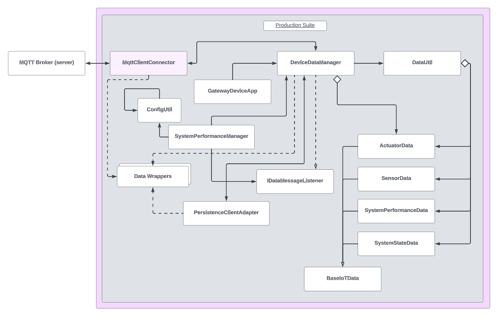

# Gateway Device Application

## Lab Module 07

## Description
### What does your implementation do?
A Gateway Device Application, or GDA, is a software application that acts as an intermediary between IoT devices (ie. constrained devices) and a cloud/edge-computing infrastructure. In particular, the GDA faciliates the communication and the exchange of data between the CDA and the cloud.

This module focuses on building on the functionality of the GDA by integrating it with an open source MQTT library. The integration process is similar to the implementation created in the last module for the CDA. An adapter is used in conjunction with the Eclipse Paho Client MQTT library to connect a Paho Java Client with an MQTT broker. This will server as the foundation for the eventual integration of cloud services and communication with the CDA in a reliable manner.

### How does your implementation work?

The implementation functions by initially preparing the GDA for MQTT integration. It introduces the **MqttClientConnector**, an essential component which handles MQTT communication. Upon initialization, the GDA establishes a connection to the MQTT broker via the **DeviceDataManager**, retrieving connection details from a configuration file. **Callback methods** are registered to manage MQTT events, including connection setup, connection loss, message delivery completion, and message reception. The GDA can **publish** messages to MQTT topics, allowing for different Quality of Service (QoS) levels, and **subscribe/unsubscribe** to specific MQTT topics relevant to its operation. Integration tests are performed to validate the entire process, ensuring proper connectivity, message publishing, subscription functionality, and event handling. The GDA can manage the MQTT connection effectively, enhancing its communication capabilities within the broader IoT ecosystem.

## Code Repository and Branch
Please click the link before to be directed to the <b>GDA</b> repository.

URL: https://github.com/Darren-C26/piot-java-components/tree/labmodule07

## UML Design Diagram(s)
<p align="center">

</p>

<p align="center">GDA Implementation UML (Module07)</p>

## Unit Tests Executed
The unit tests executed for the <b>GDA</b> are listed below. Sample test executions can be seen by clicking on the dropdown icon.

<b>Tests from Previous Modules (Re-run):</b>
<details close>
<summary>ConfigUtilTest</summary>

```
Nov. 03, 2023 10:27:10 P.M. programmingtheiot.common.ConfigUtil getCredentials
INFO: Successfully loaded credentials from file: ./src/test/java/programmingtheiot/part01/unit/common/DummyCredFile.props
```
</details>
<br>

<details close>
<summary>SystemCpuUtilTaskTest</summary>

```
Nov. 03, 2023 10:27:48 P.M. programmingtheiot.part01.unit.system.SystemCpuUtilTaskTest testGetTelemetryValue
INFO: Test 1: CPU Util not supported on this OS: -1.0
Nov. 03, 2023 10:27:48 P.M. programmingtheiot.part01.unit.system.SystemCpuUtilTaskTest testGetTelemetryValue
INFO: Test 2: CPU Util not supported on this OS: -1.0
Nov. 03, 2023 10:27:48 P.M. programmingtheiot.part01.unit.system.SystemCpuUtilTaskTest testGetTelemetryValue
INFO: Test 3: CPU Util not supported on this OS: -1.0
Nov. 03, 2023 10:27:48 P.M. programmingtheiot.part01.unit.system.SystemCpuUtilTaskTest testGetTelemetryValue
INFO: Test 4: CPU Util not supported on this OS: -1.0
Nov. 03, 2023 10:27:48 P.M. programmingtheiot.part01.unit.system.SystemCpuUtilTaskTest testGetTelemetryValue
INFO: Test 5: CPU Util not supported on this OS: -1.0
```
</details>

<br>

<details close>
<summary>SystemMemUtilTaskTest</summary>

```
Nov. 03, 2023 10:28:08 P.M. programmingtheiot.part01.unit.system.SystemMemUtilTaskTest testGetTelemetryValue
INFO: Test 1: Memory Util: 0.19753087
Nov. 03, 2023 10:28:08 P.M. programmingtheiot.part01.unit.system.SystemMemUtilTaskTest testGetTelemetryValue
INFO: Test 2: Memory Util: 0.19753087
Nov. 03, 2023 10:28:08 P.M. programmingtheiot.part01.unit.system.SystemMemUtilTaskTest testGetTelemetryValue
INFO: Test 3: Memory Util: 0.19753087
Nov. 03, 2023 10:28:08 P.M. programmingtheiot.part01.unit.system.SystemMemUtilTaskTest testGetTelemetryValue
INFO: Test 4: Memory Util: 0.19753087
Nov. 03, 2023 10:28:08 P.M. programmingtheiot.part01.unit.system.SystemMemUtilTaskTest testGetTelemetryValue
INFO: Test 5: Memory Util: 0.19753087
```
</details>

<br>

<details close>
<summary>ActuatorDataTest</summary>
</details>

<br>

<details close>
<summary>SensorDataTest</summary>

```
Nov. 03, 2023 10:44:05 P.M. programmingtheiot.part02.unit.data.SensorDataTest testDifferentDataInstanceUpdate
INFO: name=Foobar,typeID=0,timeStamp=2023-11-04T02:44:05.234166500Z,statusCode=0,hasError=false,locationID=gatewaydevice001,latitude=0.0,longitude=0.0,elevation=0.0,value=0.0
Nov. 03, 2023 10:44:05 P.M. programmingtheiot.part02.unit.data.SensorDataTest testDifferentDataInstanceUpdate
INFO: name=Foobar,typeID=0,timeStamp=2023-11-04T02:44:05.233465100Z,statusCode=0,hasError=false,locationID=gatewaydevice001,latitude=0.0,longitude=0.0,elevation=0.0,cpuUtil=52.5,diskUtil=0.0,memUtil=21.4
```

</details>

<br>

<details close>
<summary>SystemPerformanceDataTest</summary>

```
Nov. 03, 2023 10:45:31 P.M. programmingtheiot.part02.unit.data.SystemPerformanceDataTest testFullUpdate
INFO: Created first data obj: name=SysPerfData,typeID=0,timeStamp=2023-11-04T02:45:31.490620300Z,statusCode=0,hasError=false,locationID=gatewaydevice001,latitude=0.0,longitude=0.0,elevation=0.0,cpuUtil=0.0,diskUtil=0.0,memUtil=0.0
Nov. 03, 2023 10:45:31 P.M. programmingtheiot.part02.unit.data.SystemPerformanceDataTest testFullUpdate
INFO: Created second data obj: name=SystemPerformanceDataFooBar,typeID=0,timeStamp=2023-11-04T02:45:31.529574300Z,statusCode=0,hasError=false,locationID=gatewaydevice001,latitude=0.0,longitude=0.0,elevation=0.0,cpuUtil=10.0,diskUtil=10.0,memUtil=10.0
Nov. 03, 2023 10:45:31 P.M. programmingtheiot.part02.unit.data.SystemPerformanceDataTest testFullUpdate
INFO: Updated second data obj: name=SystemPerformanceDataFooBar,typeID=0,timeStamp=2023-11-04T02:45:31.529574300Z,statusCode=0,hasError=false,locationID=gatewaydevice001,latitude=0.0,longitude=0.0,elevation=0.0,cpuUtil=10.0,diskUtil=10.0,memUtil=10.0
Nov. 03, 2023 10:45:31 P.M. programmingtheiot.part02.unit.data.SystemPerformanceDataTest testDefaultValues
INFO: Created data obj: name=SysPerfData,typeID=0,timeStamp=2023-11-04T02:45:31.535574400Z,statusCode=0,hasError=false,locationID=gatewaydevice001,latitude=0.0,longitude=0.0,elevation=0.0,cpuUtil=0.0,diskUtil=0.0,memUtil=0.0
Nov. 03, 2023 10:45:31 P.M. programmingtheiot.part02.unit.data.SystemPerformanceDataTest testParameterUpdates
INFO: Created data obj: name=SystemPerformanceDataFooBar,typeID=0,timeStamp=2023-11-04T02:45:31.536577200Z,statusCode=0,hasError=false,locationID=gatewaydevice001,latitude=0.0,longitude=0.0,elevation=0.0,cpuUtil=10.0,diskUtil=10.0,memUtil=10.0

```
</details>

<br>

<details close>
<summary>SystemStateDataTest</summary>
</details>

<br>

<details close>
<summary>DataUtilTest</summary>
</details>

<br>


<b>New Tests Executed:</b>

No new unit tests were introduced in this module.

<br>


## Integration Tests Executed
The integration tests for the <b>GDA</b> are listed below. Sample test executions can be seen by clicking on the dropdown icon.

<b>Tests from Previous Modules (Re-run):</b>
<details close>
<summary>DataIntegrationTest</summary>

```
Nov. 03, 2023 10:55:26 P.M. programmingtheiot.part02.integration.data.DataIntegrationTest testReadActuatorDataFromCdaDataPath
INFO: 

----- [ActuatorData JSON from file to object] -----
Nov. 03, 2023 10:55:26 P.M. programmingtheiot.part02.integration.data.DataIntegrationTest testReadActuatorDataFromCdaDataPath
INFO: ActuatorData JSON from CDA: {
    "timeStamp": "2023-10-27T20:03:16.602434+00:00",
    "hasError": false,
    "name": "Not Set",
    "typeID": 0,
    "statusCode": 0,
    "latitude": 0.0,
    "longitude": 0.0,
    "elevation": 0.0,
    "locationID": "constraineddevice001",
    "value": 0.0,
    "command": 0,
    "stateData": "",
    "isResponse": false
}
Nov. 03, 2023 10:55:26 P.M. programmingtheiot.part02.integration.data.DataIntegrationTest testReadActuatorDataFromCdaDataPath
INFO: ActuatorData object: name=Not Set,typeID=0,timeStamp=2023-10-27T20:03:16.602434+00:00,statusCode=0,hasError=false,locationID=constraineddevice001,latitude=0.0,longitude=0.0,elevation=0.0,command=0,isResponse=false,value=0.0
Nov. 03, 2023 10:55:26 P.M. programmingtheiot.part02.integration.data.DataIntegrationTest testWriteSystemPerformanceDataToGdaDataPath
INFO: 

----- [SystemPerformanceData to JSON to file] -----
Nov. 03, 2023 10:55:26 P.M. programmingtheiot.part02.integration.data.DataIntegrationTest testWriteSystemPerformanceDataToGdaDataPath
INFO: Sample SystemPerformanceData JSON (validated): {"cpuUtil":0.0,"diskUtil":0.0,"memUtil":0.0,"name":"SysPerfData","timeStamp":"2023-11-04T02:55:26.860121100Z","statusCode":0,"typeID":0,"locationID":"gatewaydevice001","latitude":0.0,"longitude":0.0,"elevation":0.0,"timeStampMillis":1699066526860}
Nov. 03, 2023 10:55:26 P.M. programmingtheiot.part02.integration.data.DataIntegrationTest testWriteSystemPerformanceDataToGdaDataPath
INFO: Writing SystemPerformanceData JSON to GDA data path: \tmp\gda-data\SystemPerformanceData.dat
Nov. 03, 2023 10:55:26 P.M. programmingtheiot.part02.integration.data.DataIntegrationTest testReadSystemPerformanceDataFromCdaDataPath
INFO: 

----- [SystemPerformanceData JSON from file to object] -----
Nov. 03, 2023 10:55:26 P.M. programmingtheiot.part02.integration.data.DataIntegrationTest testReadSystemPerformanceDataFromCdaDataPath
INFO: SystemPerformanceData JSON from CDA: {
    "timeStamp": "2023-10-27T20:03:16.605231+00:00",
    "hasError": false,
    "name": "SystemPerfMsg",
    "typeID": 9000,
    "statusCode": 0,
    "latitude": 0.0,
    "longitude": 0.0,
    "elevation": 0.0,
    "locationID": "constraineddevice001",
    "cpuUtil": 0.0,
    "memUtil": 0.0,
    "diskUtil": 0.0
}
Nov. 03, 2023 10:55:26 P.M. programmingtheiot.part02.integration.data.DataIntegrationTest testReadSystemPerformanceDataFromCdaDataPath
INFO: SystemPerformanceData object: name=SystemPerfMsg,typeID=9000,timeStamp=2023-10-27T20:03:16.605231+00:00,statusCode=0,hasError=false,locationID=constraineddevice001,latitude=0.0,longitude=0.0,elevation=0.0,cpuUtil=0.0,diskUtil=0.0,memUtil=0.0
Nov. 03, 2023 10:55:26 P.M. programmingtheiot.part02.integration.data.DataIntegrationTest testWriteActuatorDataToGdaDataPath
INFO: 

----- [ActuatorData to JSON to file] -----
Nov. 03, 2023 10:55:26 P.M. programmingtheiot.part02.integration.data.DataIntegrationTest testWriteActuatorDataToGdaDataPath
INFO: Sample ActuatorData JSON (validated): {"command":0,"value":0.0,"isResponse":false,"stateData":"","name":"Not Set","timeStamp":"2023-11-04T02:55:26.884124700Z","statusCode":0,"typeID":0,"locationID":"gatewaydevice001","latitude":0.0,"longitude":0.0,"elevation":0.0,"timeStampMillis":1699066526884}
Nov. 03, 2023 10:55:26 P.M. programmingtheiot.part02.integration.data.DataIntegrationTest testWriteActuatorDataToGdaDataPath
INFO: Writing ActuatorData JSON to GDA data path: \tmp\gda-data\ActuatorData.dat
Nov. 03, 2023 10:55:26 P.M. programmingtheiot.part02.integration.data.DataIntegrationTest testWriteSensorDataToGdaDataPath
INFO: 

----- [SensorData to JSON to file] -----
Nov. 03, 2023 10:55:26 P.M. programmingtheiot.part02.integration.data.DataIntegrationTest testWriteSensorDataToGdaDataPath
INFO: Sample SensorData JSON (validated): {"value":0.0,"name":"Not Set","timeStamp":"2023-11-04T02:55:26.889151Z","statusCode":0,"typeID":0,"locationID":"gatewaydevice001","latitude":0.0,"longitude":0.0,"elevation":0.0,"timeStampMillis":1699066526889}
Nov. 03, 2023 10:55:26 P.M. programmingtheiot.part02.integration.data.DataIntegrationTest testWriteSensorDataToGdaDataPath
INFO: Writing SensorData JSON to GDA data path: \tmp\gda-data\SensorData.dat
Nov. 03, 2023 10:55:26 P.M. programmingtheiot.part02.integration.data.DataIntegrationTest testReadSensorDataFromCdaDataPath
INFO: 

----- [SensorData JSON from file to object] -----
Nov. 03, 2023 10:55:26 P.M. programmingtheiot.part02.integration.data.DataIntegrationTest testReadSensorDataFromCdaDataPath
INFO: SensorData JSON from CDA: {
    "timeStamp": "2023-10-27T20:03:16.604231+00:00",
    "hasError": false,
    "name": "Not Set",
    "typeID": 0,
    "statusCode": 0,
    "latitude": 0.0,
    "longitude": 0.0,
    "elevation": 0.0,
    "locationID": "constraineddevice001",
    "value": 0.0,
    "command": 0,
    "stateData": "",
    "isResponse": false
}
Nov. 03, 2023 10:55:26 P.M. programmingtheiot.part02.integration.data.DataIntegrationTest testReadSensorDataFromCdaDataPath
INFO: SensorData object: name=Not Set,typeID=0,timeStamp=2023-10-27T20:03:16.604231+00:00,statusCode=0,hasError=false,locationID=constraineddevice001,latitude=0.0,longitude=0.0,elevation=0.0,value=0.0

```
</details>

<br>
<details close>
<summary>GatewayDeviceAppTest</summary>

```
Nov. 03, 2023 10:56:13 P.M. programmingtheiot.gda.app.GatewayDeviceApp <init>
INFO: Initializing GDA...
Nov. 03, 2023 10:56:14 P.M. programmingtheiot.gda.app.GatewayDeviceApp startApp
INFO: Starting GDA...
Nov. 03, 2023 10:56:14 P.M. programmingtheiot.gda.system.SystemPerformanceManager startManager
INFO: SystemPerformanceManager is starting...
Nov. 03, 2023 10:56:14 P.M. programmingtheiot.gda.connection.MqttClientConnector connectClient
INFO: MQTT client connecting to broker: tcp://localhost:1883
Nov. 03, 2023 10:56:14 P.M. programmingtheiot.gda.app.DeviceDataManager startManager
INFO: Successfully connected MQTT client to broker.
Nov. 03, 2023 10:56:14 P.M. programmingtheiot.gda.connection.MqttClientConnector subscribeToTopic
INFO: Successfully subscribed to topic: PIOT/GatewayDevice/MgmtStatusMsg
Nov. 03, 2023 10:56:14 P.M. programmingtheiot.gda.connection.MqttClientConnector subscribeToTopic
INFO: Successfully subscribed to topic: PIOT/ConstrainedDevice/ActuatorResponse
Nov. 03, 2023 10:56:14 P.M. programmingtheiot.gda.connection.MqttClientConnector subscribeToTopic
INFO: Successfully subscribed to topic: PIOT/ConstrainedDevice/SensorMsg
Nov. 03, 2023 10:56:14 P.M. programmingtheiot.gda.connection.MqttClientConnector subscribeToTopic
INFO: Successfully subscribed to topic: PIOT/ConstrainedDevice/SystemPerfMsg
Nov. 03, 2023 10:56:14 P.M. programmingtheiot.gda.app.GatewayDeviceApp startApp
INFO: GDA started successfully.
Nov. 03, 2023 10:56:15 P.M. programmingtheiot.gda.system.SystemPerformanceManager handleTelemetry
INFO: CPU utilization: -1.0, Mem utilization: 0.11527055
Nov. 03, 2023 10:56:15 P.M. programmingtheiot.gda.app.DeviceDataManager handleSystemPerformanceMessage
INFO: Handling system performance message: SysPerfData
Nov. 03, 2023 10:57:15 P.M. programmingtheiot.gda.system.SystemPerformanceManager handleTelemetry
INFO: CPU utilization: -1.0, Mem utilization: 0.11527055
Nov. 03, 2023 10:57:15 P.M. programmingtheiot.gda.app.DeviceDataManager handleSystemPerformanceMessage
INFO: Handling system performance message: SysPerfData
Nov. 03, 2023 10:57:19 P.M. programmingtheiot.gda.app.GatewayDeviceApp stopApp
INFO: Stopping GDA...
Nov. 03, 2023 10:57:19 P.M. programmingtheiot.gda.system.SystemPerformanceManager stopManager
INFO: SystemPerformanceManager is stopped.
Nov. 03, 2023 10:57:19 P.M. programmingtheiot.gda.connection.MqttClientConnector unsubscribeFromTopic
INFO: Successfully unsubscribed from topic: PIOT/GatewayDevice/MgmtStatusMsg
Nov. 03, 2023 10:57:19 P.M. programmingtheiot.gda.connection.MqttClientConnector unsubscribeFromTopic
INFO: Successfully unsubscribed from topic: PIOT/ConstrainedDevice/ActuatorResponse
Nov. 03, 2023 10:57:19 P.M. programmingtheiot.gda.connection.MqttClientConnector unsubscribeFromTopic
INFO: Successfully unsubscribed from topic: PIOT/ConstrainedDevice/SensorMsg
Nov. 03, 2023 10:57:19 P.M. programmingtheiot.gda.connection.MqttClientConnector unsubscribeFromTopic
INFO: Successfully unsubscribed from topic: PIOT/ConstrainedDevice/SystemPerfMsg
Nov. 03, 2023 10:57:19 P.M. programmingtheiot.gda.connection.MqttClientConnector disconnectClient
INFO: Disconnecting MQTT client from broker: tcp://localhost:1883
Nov. 03, 2023 10:57:19 P.M. programmingtheiot.gda.app.DeviceDataManager stopManager
INFO: Successfully disconnected MQTT client from broker.
Nov. 03, 2023 10:57:19 P.M. programmingtheiot.gda.app.GatewayDeviceApp stopApp
INFO: GDA stopped successfully with exit code 0.

```
</details>

<br>

<details close>
<summary>SystemPerformanceManagerTest</summary>

```
Nov. 03, 2023 10:59:55 P.M. programmingtheiot.gda.system.SystemPerformanceManager startManager
INFO: SystemPerformanceManager is starting...
Nov. 03, 2023 10:59:56 P.M. programmingtheiot.gda.system.SystemPerformanceManager handleTelemetry
INFO: CPU utilization: -1.0, Mem utilization: 0.34567901
Nov. 03, 2023 11:00:55 P.M. programmingtheiot.gda.system.SystemPerformanceManager stopManager
INFO: SystemPerformanceManager is stopped.
```
</details>

<br>

<details close>
<summary>DeviceDataManagerNoCommsTest</summary>

```
Nov. 03, 2023 11:04:41 P.M. programmingtheiot.gda.system.SystemPerformanceManager startManager
INFO: SystemPerformanceManager is starting...
Nov. 03, 2023 11:04:41 P.M. programmingtheiot.gda.connection.MqttClientConnector connectClient
INFO: MQTT client connecting to broker: tcp://localhost:1883
Nov. 03, 2023 11:04:41 P.M. programmingtheiot.gda.app.DeviceDataManager startManager
INFO: Successfully connected MQTT client to broker.
Nov. 03, 2023 11:04:41 P.M. programmingtheiot.gda.connection.MqttClientConnector subscribeToTopic
INFO: Successfully subscribed to topic: PIOT/GatewayDevice/MgmtStatusMsg
Nov. 03, 2023 11:04:41 P.M. programmingtheiot.gda.connection.MqttClientConnector subscribeToTopic
INFO: Successfully subscribed to topic: PIOT/ConstrainedDevice/ActuatorResponse
Nov. 03, 2023 11:04:41 P.M. programmingtheiot.gda.connection.MqttClientConnector subscribeToTopic
INFO: Successfully subscribed to topic: PIOT/ConstrainedDevice/SensorMsg
Nov. 03, 2023 11:04:41 P.M. programmingtheiot.gda.connection.MqttClientConnector subscribeToTopic
INFO: Successfully subscribed to topic: PIOT/ConstrainedDevice/SystemPerfMsg
Nov. 03, 2023 11:04:42 P.M. programmingtheiot.gda.system.SystemPerformanceManager handleTelemetry
INFO: CPU utilization: -1.0, Mem utilization: 0.117573306
Nov. 03, 2023 11:04:42 P.M. programmingtheiot.gda.app.DeviceDataManager handleSystemPerformanceMessage
INFO: Handling system performance message: SysPerfData
Nov. 03, 2023 11:04:47 P.M. programmingtheiot.gda.system.SystemPerformanceManager stopManager
INFO: SystemPerformanceManager is stopped.
Nov. 03, 2023 11:04:47 P.M. programmingtheiot.gda.connection.MqttClientConnector unsubscribeFromTopic
INFO: Successfully unsubscribed from topic: PIOT/GatewayDevice/MgmtStatusMsg
Nov. 03, 2023 11:04:47 P.M. programmingtheiot.gda.connection.MqttClientConnector unsubscribeFromTopic
INFO: Successfully unsubscribed from topic: PIOT/ConstrainedDevice/ActuatorResponse
Nov. 03, 2023 11:04:48 P.M. programmingtheiot.gda.connection.MqttClientConnector unsubscribeFromTopic
INFO: Successfully unsubscribed from topic: PIOT/ConstrainedDevice/SensorMsg
Nov. 03, 2023 11:04:48 P.M. programmingtheiot.gda.connection.MqttClientConnector unsubscribeFromTopic
INFO: Successfully unsubscribed from topic: PIOT/ConstrainedDevice/SystemPerfMsg
Nov. 03, 2023 11:04:48 P.M. programmingtheiot.gda.connection.MqttClientConnector disconnectClient
INFO: Disconnecting MQTT client from broker: tcp://localhost:1883
Nov. 03, 2023 11:04:48 P.M. programmingtheiot.gda.app.DeviceDataManager stopManager
INFO: Successfully disconnected MQTT client from broker.

```
</details>

<br>

<b>New Tests Executed:</b>

<details close>
<summary>MqttClientConnectorTest</summary>

```
Nov. 03, 2023 1:43:39 P.M. programmingtheiot.gda.connection.MqttClientConnector connectClient
INFO: MQTT client connecting to broker: tcp://localhost:1883
Nov. 03, 2023 1:43:40 P.M. programmingtheiot.gda.connection.MqttClientConnector subscribeToTopic
INFO: Successfully subscribed to topic: PIOT/GatewayDevice/MgmtStatusMsg
Nov. 03, 2023 1:43:40 P.M. programmingtheiot.gda.connection.MqttClientConnector subscribeToTopic
INFO: Successfully subscribed to topic: PIOT/ConstrainedDevice/ActuatorResponse
Nov. 03, 2023 1:43:40 P.M. programmingtheiot.gda.connection.MqttClientConnector subscribeToTopic
INFO: Successfully subscribed to topic: PIOT/ConstrainedDevice/SensorMsg
Nov. 03, 2023 1:43:40 P.M. programmingtheiot.gda.connection.MqttClientConnector subscribeToTopic
INFO: Successfully subscribed to topic: PIOT/ConstrainedDevice/SystemPerfMsg
Nov. 03, 2023 1:43:45 P.M. programmingtheiot.gda.connection.MqttClientConnector deliveryComplete
INFO: Delivered message with ID: 0
Nov. 03, 2023 1:43:45 P.M. programmingtheiot.gda.connection.MqttClientConnector messageArrived
INFO: MQTT message arrived on topic: PIOT/GatewayDevice/MgmtStatusMsg
Nov. 03, 2023 1:43:45 P.M. programmingtheiot.gda.connection.MqttClientConnector deliveryComplete
INFO: Delivered message with ID: 0
Nov. 03, 2023 1:43:45 P.M. programmingtheiot.gda.connection.MqttClientConnector messageArrived
INFO: MQTT message arrived on topic: PIOT/GatewayDevice/MgmtStatusMsg
Nov. 03, 2023 1:43:45 P.M. programmingtheiot.gda.connection.MqttClientConnector deliveryComplete
INFO: Delivered message with ID: 0
Nov. 03, 2023 1:43:45 P.M. programmingtheiot.gda.connection.MqttClientConnector messageArrived
INFO: MQTT message arrived on topic: PIOT/GatewayDevice/MgmtStatusMsg
Nov. 03, 2023 1:44:10 P.M. programmingtheiot.gda.connection.MqttClientConnector unsubscribeFromTopic
INFO: Successfully unsubscribed from topic: PIOT/GatewayDevice/MgmtStatusMsg
Nov. 03, 2023 1:44:10 P.M. programmingtheiot.gda.connection.MqttClientConnector unsubscribeFromTopic
INFO: Successfully unsubscribed from topic: PIOT/ConstrainedDevice/ActuatorResponse
Nov. 03, 2023 1:44:10 P.M. programmingtheiot.gda.connection.MqttClientConnector unsubscribeFromTopic
INFO: Successfully unsubscribed from topic: PIOT/ConstrainedDevice/SensorMsg
Nov. 03, 2023 1:44:10 P.M. programmingtheiot.gda.connection.MqttClientConnector unsubscribeFromTopic
INFO: Successfully unsubscribed from topic: PIOT/ConstrainedDevice/SystemPerfMsg
Nov. 03, 2023 1:45:15 P.M. programmingtheiot.gda.connection.MqttClientConnector disconnectClient
INFO: Disconnecting MQTT client from broker: tcp://localhost:1883
```
</details>

<br>

<hr></hr>

<b>Extras:</b>
<details close>
<summary>GDA Terminal Output</summary>

```
Nov. 03, 2023 1:43:31 P.M. programmingtheiot.gda.app.GatewayDeviceApp <init>
INFO: Initializing GDA...
Nov. 03, 2023 1:43:31 P.M. programmingtheiot.gda.app.GatewayDeviceApp startApp
INFO: Starting GDA...
Nov. 03, 2023 1:43:31 P.M. programmingtheiot.gda.system.SystemPerformanceManager startManager
INFO: SystemPerformanceManager is starting...
Nov. 03, 2023 1:43:31 P.M. programmingtheiot.gda.connection.MqttClientConnector connectClient
INFO: MQTT client connecting to broker: tcp://localhost:1883
Nov. 03, 2023 1:43:31 P.M. programmingtheiot.gda.app.DeviceDataManager startManager
INFO: Successfully connected MQTT client to broker.
Nov. 03, 2023 1:43:31 P.M. programmingtheiot.gda.connection.MqttClientConnector subscribeToTopic
INFO: Successfully subscribed to topic: PIOT/GatewayDevice/MgmtStatusMsg
Nov. 03, 2023 1:43:31 P.M. programmingtheiot.gda.connection.MqttClientConnector subscribeToTopic
INFO: Successfully subscribed to topic: PIOT/ConstrainedDevice/ActuatorResponse
Nov. 03, 2023 1:43:31 P.M. programmingtheiot.gda.connection.MqttClientConnector subscribeToTopic
INFO: Successfully subscribed to topic: PIOT/ConstrainedDevice/SensorMsg
Nov. 03, 2023 1:43:31 P.M. programmingtheiot.gda.connection.MqttClientConnector subscribeToTopic
INFO: Successfully subscribed to topic: PIOT/ConstrainedDevice/SystemPerfMsg
Nov. 03, 2023 1:43:31 P.M. programmingtheiot.gda.app.GatewayDeviceApp startApp
INFO: GDA started successfully.
Nov. 03, 2023 1:43:32 P.M. programmingtheiot.gda.system.SystemPerformanceManager handleTelemetry
INFO: CPU utilization: -1.0, Mem utilization: 0.34567901
Nov. 03, 2023 1:43:32 P.M. programmingtheiot.gda.app.DeviceDataManager handleSystemPerformanceMessage
INFO: Handling system performance message: SysPerfData
Nov. 03, 2023 1:43:45 P.M. programmingtheiot.gda.connection.MqttClientConnector messageArrived
INFO: MQTT message arrived on topic: PIOT/GatewayDevice/MgmtStatusMsg
Nov. 03, 2023 1:43:45 P.M. programmingtheiot.gda.connection.MqttClientConnector messageArrived
INFO: MQTT message arrived on topic: PIOT/GatewayDevice/MgmtStatusMsg
Nov. 03, 2023 1:43:45 P.M. programmingtheiot.gda.connection.MqttClientConnector messageArrived
INFO: MQTT message arrived on topic: PIOT/GatewayDevice/MgmtStatusMsg
Nov. 03, 2023 1:44:32 P.M. programmingtheiot.gda.system.SystemPerformanceManager handleTelemetry
INFO: CPU utilization: -1.0, Mem utilization: 0.34567901
Nov. 03, 2023 1:44:37 P.M. programmingtheiot.gda.app.DeviceDataManager handleSystemPerformanceMessage
INFO: Handling system performance message: SysPerfData
Nov. 03, 2023 1:45:32 P.M. programmingtheiot.gda.system.SystemPerformanceManager handleTelemetry
INFO: CPU utilization: -1.0, Mem utilization: 0.34567901
Nov. 03, 2023 1:45:32 P.M. programmingtheiot.gda.app.DeviceDataManager handleSystemPerformanceMessage
INFO: Handling system performance message: SysPerfData
Nov. 03, 2023 1:46:32 P.M. programmingtheiot.gda.system.SystemPerformanceManager handleTelemetry
INFO: CPU utilization: -1.0, Mem utilization: 0.34567901
Nov. 03, 2023 1:46:32 P.M. programmingtheiot.gda.app.DeviceDataManager handleSystemPerformanceMessage
INFO: Handling system performance message: SysPerfData
Nov. 03, 2023 1:47:32 P.M. programmingtheiot.gda.system.SystemPerformanceManager handleTelemetry
INFO: CPU utilization: -1.0, Mem utilization: 0.34567901
Nov. 03, 2023 1:47:32 P.M. programmingtheiot.gda.app.DeviceDataManager handleSystemPerformanceMessage
INFO: Handling system performance message: SysPerfData
Nov. 03, 2023 1:48:32 P.M. programmingtheiot.gda.system.SystemPerformanceManager handleTelemetry
INFO: CPU utilization: -1.0, Mem utilization: 0.34567901
Nov. 03, 2023 1:48:32 P.M. programmingtheiot.gda.app.DeviceDataManager handleSystemPerformanceMessage
INFO: Handling system performance message: SysPerfData
Nov. 03, 2023 1:49:32 P.M. programmingtheiot.gda.system.SystemPerformanceManager handleTelemetry
INFO: CPU utilization: -1.0, Mem utilization: 0.34567901
Nov. 03, 2023 1:49:32 P.M. programmingtheiot.gda.app.DeviceDataManager handleSystemPerformanceMessage
INFO: Handling system performance message: SysPerfData
Nov. 03, 2023 1:50:32 P.M. programmingtheiot.gda.system.SystemPerformanceManager handleTelemetry
INFO: CPU utilization: -1.0, Mem utilization: 0.34567901
Nov. 03, 2023 1:50:32 P.M. programmingtheiot.gda.app.DeviceDataManager handleSystemPerformanceMessage
INFO: Handling system performance message: SysPerfData
Nov. 03, 2023 1:51:32 P.M. programmingtheiot.gda.system.SystemPerformanceManager handleTelemetry
INFO: CPU utilization: -1.0, Mem utilization: 0.34567901
Nov. 03, 2023 1:51:32 P.M. programmingtheiot.gda.app.DeviceDataManager handleSystemPerformanceMessage
INFO: Handling system performance message: SysPerfData
Nov. 03, 2023 1:52:32 P.M. programmingtheiot.gda.system.SystemPerformanceManager handleTelemetry
INFO: CPU utilization: -1.0, Mem utilization: 0.34567901
Nov. 03, 2023 1:52:32 P.M. programmingtheiot.gda.app.DeviceDataManager handleSystemPerformanceMessage
INFO: Handling system performance message: SysPerfData
Nov. 03, 2023 1:53:31 P.M. programmingtheiot.gda.app.GatewayDeviceApp stopApp
INFO: Stopping GDA...
Nov. 03, 2023 1:53:31 P.M. programmingtheiot.gda.system.SystemPerformanceManager stopManager
INFO: SystemPerformanceManager is stopped.
Nov. 03, 2023 1:53:31 P.M. programmingtheiot.gda.connection.MqttClientConnector unsubscribeFromTopic
INFO: Successfully unsubscribed from topic: PIOT/GatewayDevice/MgmtStatusMsg
Nov. 03, 2023 1:53:31 P.M. programmingtheiot.gda.connection.MqttClientConnector unsubscribeFromTopic
INFO: Successfully unsubscribed from topic: PIOT/ConstrainedDevice/ActuatorResponse
Nov. 03, 2023 1:53:31 P.M. programmingtheiot.gda.connection.MqttClientConnector unsubscribeFromTopic
INFO: Successfully unsubscribed from topic: PIOT/ConstrainedDevice/SensorMsg
Nov. 03, 2023 1:53:31 P.M. programmingtheiot.gda.connection.MqttClientConnector unsubscribeFromTopic
INFO: Successfully unsubscribed from topic: PIOT/ConstrainedDevice/SystemPerfMsg
Nov. 03, 2023 1:53:31 P.M. programmingtheiot.gda.connection.MqttClientConnector disconnectClient
INFO: Disconnecting MQTT client from broker: tcp://localhost:1883
Nov. 03, 2023 1:53:31 P.M. programmingtheiot.gda.app.DeviceDataManager stopManager
INFO: Successfully disconnected MQTT client from broker.
Nov. 03, 2023 1:53:31 P.M. programmingtheiot.gda.app.GatewayDeviceApp stopApp
INFO: GDA stopped successfully with exit code 0.
```
</details>

<br>
