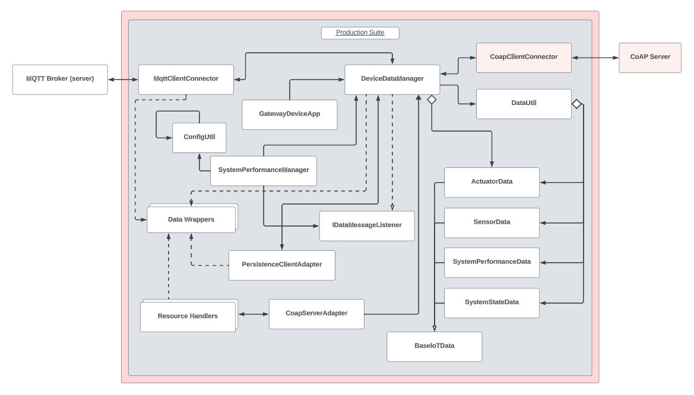

# Gateway Device Application

## Lab Module 10

## Description
### What does your implementation do?
A Gateway Device Application, or GDA, is a software application that acts as an intermediary between IoT devices (ie. constrained devices) and a cloud/edge-computing infrastructure. In particular, the GDA faciliates the communication and the exchange of data between the CDA and the cloud.

In this implementation, the focus is on integrating the Edge Tier applications—the Constrained Device Application (CDA) and the Gateway Device Application (GDA) within an IoT ecosystem. The integration involves dealing with challenges such as multiple protocols, security constraints, and data formatting idiosyncrasies. The chapter describes the integration of the two applications using both CoAP and MQTT protocols. Specifically, it discusses testing the connection layers, such as the MqttClientConnector with a locally running MQTT broker and the GDA’s CoapServerGateway with the CDA’s CoapClientConnector.

### How does your implementation work?

Regarding the GDA, modifications are made to the MQTT client connector class to support TLS-encrypted connections with the broker. Additionally, the DeviceDataManager in both applications gains additional intelligence to process messages intelligently and make decisions based on the received data. The chapter spans configuration, programming, and integration testing, emphasizing functional exercises to enhance the capabilities of both the CDA and GDA. The design remains consistent with the Edge Tier integration circle, building on the foundation laid out in

## Code Repository and Branch
Please click the link before to be directed to the <b>GDA</b> repository.

URL: https://github.com/Darren-C26/piot-java-components/tree/labmodule10

## UML Design Diagram(s)
<p align="center">

|</p>|
|-|

<p align="center">GDA Implementation UML (Module10)</p>

## Unit Tests Executed
The unit tests executed for the <b>GDA</b> are listed below. Sample test executions can be seen by clicking on the dropdown icon.

<b>Tests from Previous Modules (Re-run):</b>
<details close>
<summary>ConfigUtilTest</summary>

```
Nov. 17, 2023 10:27:10 P.M. programmingtheiot.common.ConfigUtil getCredentials
INFO: Successfully loaded credentials from file: ./src/test/java/programmingtheiot/part01/unit/common/DummyCredFile.props
```
</details>
<br>

<details close>
<summary>SystemCpuUtilTaskTest</summary>

```
Nov. 17, 2023 10:27:48 P.M. programmingtheiot.part01.unit.system.SystemCpuUtilTaskTest testGetTelemetryValue
INFO: Test 1: CPU Util not supported on this OS: -1.0
Nov. 17, 2023 10:27:48 P.M. programmingtheiot.part01.unit.system.SystemCpuUtilTaskTest testGetTelemetryValue
INFO: Test 2: CPU Util not supported on this OS: -1.0
Nov. 17, 2023 10:27:48 P.M. programmingtheiot.part01.unit.system.SystemCpuUtilTaskTest testGetTelemetryValue
INFO: Test 3: CPU Util not supported on this OS: -1.0
Nov. 17, 2023 10:27:48 P.M. programmingtheiot.part01.unit.system.SystemCpuUtilTaskTest testGetTelemetryValue
INFO: Test 4: CPU Util not supported on this OS: -1.0
Nov. 17, 2023 10:27:48 P.M. programmingtheiot.part01.unit.system.SystemCpuUtilTaskTest testGetTelemetryValue
INFO: Test 5: CPU Util not supported on this OS: -1.0
```
</details>

<br>

<details close>
<summary>SystemMemUtilTaskTest</summary>

```
Nov. 17, 2023 10:28:08 P.M. programmingtheiot.part01.unit.system.SystemMemUtilTaskTest testGetTelemetryValue
INFO: Test 1: Memory Util: 0.19753087
Nov. 17, 2023 10:28:08 P.M. programmingtheiot.part01.unit.system.SystemMemUtilTaskTest testGetTelemetryValue
INFO: Test 2: Memory Util: 0.19753087
Nov. 17, 2023 10:28:08 P.M. programmingtheiot.part01.unit.system.SystemMemUtilTaskTest testGetTelemetryValue
INFO: Test 3: Memory Util: 0.19753087
Nov. 17, 2023 10:28:08 P.M. programmingtheiot.part01.unit.system.SystemMemUtilTaskTest testGetTelemetryValue
INFO: Test 4: Memory Util: 0.19753087
Nov. 17, 2023 10:28:08 P.M. programmingtheiot.part01.unit.system.SystemMemUtilTaskTest testGetTelemetryValue
INFO: Test 5: Memory Util: 0.19753087
```
</details>

<br>

<details close>
<summary>ActuatorDataTest</summary>
</details>

<br>

<details close>
<summary>SensorDataTest</summary>

```
Nov. 17, 2023 10:44:05 P.M. programmingtheiot.part02.unit.data.SensorDataTest testDifferentDataInstanceUpdate
INFO: name=Foobar,typeID=0,timeStamp=2023-11-04T02:44:05.234166500Z,statusCode=0,hasError=false,locationID=gatewaydevice001,latitude=0.0,longitude=0.0,elevation=0.0,value=0.0
Nov. 17, 2023 10:44:05 P.M. programmingtheiot.part02.unit.data.SensorDataTest testDifferentDataInstanceUpdate
INFO: name=Foobar,typeID=0,timeStamp=2023-11-04T02:44:05.233465100Z,statusCode=0,hasError=false,locationID=gatewaydevice001,latitude=0.0,longitude=0.0,elevation=0.0,cpuUtil=52.5,diskUtil=0.0,memUtil=21.4
```

</details>

<br>

<details close>
<summary>SystemPerformanceDataTest</summary>

```
Nov. 17, 2023 10:45:31 P.M. programmingtheiot.part02.unit.data.SystemPerformanceDataTest testFullUpdate
INFO: Created first data obj: name=SysPerfData,typeID=0,timeStamp=2023-11-04T02:45:31.490620300Z,statusCode=0,hasError=false,locationID=gatewaydevice001,latitude=0.0,longitude=0.0,elevation=0.0,cpuUtil=0.0,diskUtil=0.0,memUtil=0.0
Nov. 17, 2023 10:45:31 P.M. programmingtheiot.part02.unit.data.SystemPerformanceDataTest testFullUpdate
INFO: Created second data obj: name=SystemPerformanceDataFooBar,typeID=0,timeStamp=2023-11-04T02:45:31.529574300Z,statusCode=0,hasError=false,locationID=gatewaydevice001,latitude=0.0,longitude=0.0,elevation=0.0,cpuUtil=10.0,diskUtil=10.0,memUtil=10.0
Nov. 17, 2023 10:45:31 P.M. programmingtheiot.part02.unit.data.SystemPerformanceDataTest testFullUpdate
INFO: Updated second data obj: name=SystemPerformanceDataFooBar,typeID=0,timeStamp=2023-11-04T02:45:31.529574300Z,statusCode=0,hasError=false,locationID=gatewaydevice001,latitude=0.0,longitude=0.0,elevation=0.0,cpuUtil=10.0,diskUtil=10.0,memUtil=10.0
Nov. 17, 2023 10:45:31 P.M. programmingtheiot.part02.unit.data.SystemPerformanceDataTest testDefaultValues
INFO: Created data obj: name=SysPerfData,typeID=0,timeStamp=2023-11-04T02:45:31.535574400Z,statusCode=0,hasError=false,locationID=gatewaydevice001,latitude=0.0,longitude=0.0,elevation=0.0,cpuUtil=0.0,diskUtil=0.0,memUtil=0.0
Nov. 17, 2023 10:45:31 P.M. programmingtheiot.part02.unit.data.SystemPerformanceDataTest testParameterUpdates
INFO: Created data obj: name=SystemPerformanceDataFooBar,typeID=0,timeStamp=2023-11-04T02:45:31.536577200Z,statusCode=0,hasError=false,locationID=gatewaydevice001,latitude=0.0,longitude=0.0,elevation=0.0,cpuUtil=10.0,diskUtil=10.0,memUtil=10.0

```
</details>

<br>

<details close>
<summary>SystemStateDataTest</summary>
</details>

<br>

<details close>
<summary>DataUtilTest</summary>
</details>

<br>


<b>New Tests Executed:</b>

No new unit tests were introduced in this module.

<br>


## Integration Tests Executed
The integration tests for the <b>GDA</b> are listed below. Sample test executions can be seen by clicking on the dropdown icon.

<b>Tests from Previous Modules (Re-run):</b>
<details close>
<summary>DataIntegrationTest</summary>

```
Nov. 17, 2023 10:55:26 P.M. programmingtheiot.part02.integration.data.DataIntegrationTest testReadActuatorDataFromCdaDataPath
INFO: 

----- [ActuatorData JSON from file to object] -----
Nov. 17, 2023 10:55:26 P.M. programmingtheiot.part02.integration.data.DataIntegrationTest testReadActuatorDataFromCdaDataPath
INFO: ActuatorData JSON from CDA: {
    "timeStamp": "2023-10-27T20:03:16.602434+00:00",
    "hasError": false,
    "name": "Not Set",
    "typeID": 0,
    "statusCode": 0,
    "latitude": 0.0,
    "longitude": 0.0,
    "elevation": 0.0,
    "locationID": "constraineddevice001",
    "value": 0.0,
    "command": 0,
    "stateData": "",
    "isResponse": false
}
Nov. 17, 2023 10:55:26 P.M. programmingtheiot.part02.integration.data.DataIntegrationTest testReadActuatorDataFromCdaDataPath
INFO: ActuatorData object: name=Not Set,typeID=0,timeStamp=2023-10-27T20:03:16.602434+00:00,statusCode=0,hasError=false,locationID=constraineddevice001,latitude=0.0,longitude=0.0,elevation=0.0,command=0,isResponse=false,value=0.0
Nov. 17, 2023 10:55:26 P.M. programmingtheiot.part02.integration.data.DataIntegrationTest testWriteSystemPerformanceDataToGdaDataPath
INFO: 

----- [SystemPerformanceData to JSON to file] -----
Nov. 17, 2023 10:55:26 P.M. programmingtheiot.part02.integration.data.DataIntegrationTest testWriteSystemPerformanceDataToGdaDataPath
INFO: Sample SystemPerformanceData JSON (validated): {"cpuUtil":0.0,"diskUtil":0.0,"memUtil":0.0,"name":"SysPerfData","timeStamp":"2023-11-04T02:55:26.860121100Z","statusCode":0,"typeID":0,"locationID":"gatewaydevice001","latitude":0.0,"longitude":0.0,"elevation":0.0,"timeStampMillis":1699066526860}
Nov. 17, 2023 10:55:26 P.M. programmingtheiot.part02.integration.data.DataIntegrationTest testWriteSystemPerformanceDataToGdaDataPath
INFO: Writing SystemPerformanceData JSON to GDA data path: \tmp\gda-data\SystemPerformanceData.dat
Nov. 17, 2023 10:55:26 P.M. programmingtheiot.part02.integration.data.DataIntegrationTest testReadSystemPerformanceDataFromCdaDataPath
INFO: 

----- [SystemPerformanceData JSON from file to object] -----
Nov. 17, 2023 10:55:26 P.M. programmingtheiot.part02.integration.data.DataIntegrationTest testReadSystemPerformanceDataFromCdaDataPath
INFO: SystemPerformanceData JSON from CDA: {
    "timeStamp": "2023-10-27T20:03:16.605231+00:00",
    "hasError": false,
    "name": "SystemPerfMsg",
    "typeID": 9000,
    "statusCode": 0,
    "latitude": 0.0,
    "longitude": 0.0,
    "elevation": 0.0,
    "locationID": "constraineddevice001",
    "cpuUtil": 0.0,
    "memUtil": 0.0,
    "diskUtil": 0.0
}
Nov. 17, 2023 10:55:26 P.M. programmingtheiot.part02.integration.data.DataIntegrationTest testReadSystemPerformanceDataFromCdaDataPath
INFO: SystemPerformanceData object: name=SystemPerfMsg,typeID=9000,timeStamp=2023-10-27T20:03:16.605231+00:00,statusCode=0,hasError=false,locationID=constraineddevice001,latitude=0.0,longitude=0.0,elevation=0.0,cpuUtil=0.0,diskUtil=0.0,memUtil=0.0
Nov. 17, 2023 10:55:26 P.M. programmingtheiot.part02.integration.data.DataIntegrationTest testWriteActuatorDataToGdaDataPath
INFO: 

----- [ActuatorData to JSON to file] -----
Nov. 17, 2023 10:55:26 P.M. programmingtheiot.part02.integration.data.DataIntegrationTest testWriteActuatorDataToGdaDataPath
INFO: Sample ActuatorData JSON (validated): {"command":0,"value":0.0,"isResponse":false,"stateData":"","name":"Not Set","timeStamp":"2023-11-04T02:55:26.884124700Z","statusCode":0,"typeID":0,"locationID":"gatewaydevice001","latitude":0.0,"longitude":0.0,"elevation":0.0,"timeStampMillis":1699066526884}
Nov. 17, 2023 10:55:26 P.M. programmingtheiot.part02.integration.data.DataIntegrationTest testWriteActuatorDataToGdaDataPath
INFO: Writing ActuatorData JSON to GDA data path: \tmp\gda-data\ActuatorData.dat
Nov. 17, 2023 10:55:26 P.M. programmingtheiot.part02.integration.data.DataIntegrationTest testWriteSensorDataToGdaDataPath
INFO: 

----- [SensorData to JSON to file] -----
Nov. 17, 2023 10:55:26 P.M. programmingtheiot.part02.integration.data.DataIntegrationTest testWriteSensorDataToGdaDataPath
INFO: Sample SensorData JSON (validated): {"value":0.0,"name":"Not Set","timeStamp":"2023-11-04T02:55:26.889151Z","statusCode":0,"typeID":0,"locationID":"gatewaydevice001","latitude":0.0,"longitude":0.0,"elevation":0.0,"timeStampMillis":1699066526889}
Nov. 17, 2023 10:55:26 P.M. programmingtheiot.part02.integration.data.DataIntegrationTest testWriteSensorDataToGdaDataPath
INFO: Writing SensorData JSON to GDA data path: \tmp\gda-data\SensorData.dat
Nov. 17, 2023 10:55:26 P.M. programmingtheiot.part02.integration.data.DataIntegrationTest testReadSensorDataFromCdaDataPath
INFO: 

----- [SensorData JSON from file to object] -----
Nov. 17, 2023 10:55:26 P.M. programmingtheiot.part02.integration.data.DataIntegrationTest testReadSensorDataFromCdaDataPath
INFO: SensorData JSON from CDA: {
    "timeStamp": "2023-10-27T20:03:16.604231+00:00",
    "hasError": false,
    "name": "Not Set",
    "typeID": 0,
    "statusCode": 0,
    "latitude": 0.0,
    "longitude": 0.0,
    "elevation": 0.0,
    "locationID": "constraineddevice001",
    "value": 0.0,
    "command": 0,
    "stateData": "",
    "isResponse": false
}
Nov. 17, 2023 10:55:26 P.M. programmingtheiot.part02.integration.data.DataIntegrationTest testReadSensorDataFromCdaDataPath
INFO: SensorData object: name=Not Set,typeID=0,timeStamp=2023-10-27T20:03:16.604231+00:00,statusCode=0,hasError=false,locationID=constraineddevice001,latitude=0.0,longitude=0.0,elevation=0.0,value=0.0

```
</details>

<br>
<details close>
<summary>GatewayDeviceAppTest</summary>

```
Nov. 17, 2023 10:56:13 P.M. programmingtheiot.gda.app.GatewayDeviceApp <init>
INFO: Initializing GDA...
Nov. 17, 2023 10:56:14 P.M. programmingtheiot.gda.app.GatewayDeviceApp startApp
INFO: Starting GDA...
Nov. 17, 2023 10:56:14 P.M. programmingtheiot.gda.system.SystemPerformanceManager startManager
INFO: SystemPerformanceManager is starting...
Nov. 17, 2023 10:56:14 P.M. programmingtheiot.gda.connection.MqttClientConnector connectClient
INFO: MQTT client connecting to broker: tcp://localhost:1883
Nov. 17, 2023 10:56:14 P.M. programmingtheiot.gda.app.DeviceDataManager startManager
INFO: Successfully connected MQTT client to broker.
Nov. 17, 2023 10:56:14 P.M. programmingtheiot.gda.connection.MqttClientConnector subscribeToTopic
INFO: Successfully subscribed to topic: PIOT/GatewayDevice/MgmtStatusMsg
Nov. 17, 2023 10:56:14 P.M. programmingtheiot.gda.connection.MqttClientConnector subscribeToTopic
INFO: Successfully subscribed to topic: PIOT/ConstrainedDevice/ActuatorResponse
Nov. 17, 2023 10:56:14 P.M. programmingtheiot.gda.connection.MqttClientConnector subscribeToTopic
INFO: Successfully subscribed to topic: PIOT/ConstrainedDevice/SensorMsg
Nov. 17, 2023 10:56:14 P.M. programmingtheiot.gda.connection.MqttClientConnector subscribeToTopic
INFO: Successfully subscribed to topic: PIOT/ConstrainedDevice/SystemPerfMsg
Nov. 17, 2023 10:56:14 P.M. programmingtheiot.gda.app.GatewayDeviceApp startApp
INFO: GDA started successfully.
Nov. 17, 2023 10:56:15 P.M. programmingtheiot.gda.system.SystemPerformanceManager handleTelemetry
INFO: CPU utilization: -1.0, Mem utilization: 0.11527055
Nov. 17, 2023 10:56:15 P.M. programmingtheiot.gda.app.DeviceDataManager handleSystemPerformanceMessage
INFO: Handling system performance message: SysPerfData
Nov. 17, 2023 10:57:15 P.M. programmingtheiot.gda.system.SystemPerformanceManager handleTelemetry
INFO: CPU utilization: -1.0, Mem utilization: 0.11527055
Nov. 17, 2023 10:57:15 P.M. programmingtheiot.gda.app.DeviceDataManager handleSystemPerformanceMessage
INFO: Handling system performance message: SysPerfData
Nov. 17, 2023 10:57:19 P.M. programmingtheiot.gda.app.GatewayDeviceApp stopApp
INFO: Stopping GDA...
Nov. 17, 2023 10:57:19 P.M. programmingtheiot.gda.system.SystemPerformanceManager stopManager
INFO: SystemPerformanceManager is stopped.
Nov. 17, 2023 10:57:19 P.M. programmingtheiot.gda.connection.MqttClientConnector unsubscribeFromTopic
INFO: Successfully unsubscribed from topic: PIOT/GatewayDevice/MgmtStatusMsg
Nov. 17, 2023 10:57:19 P.M. programmingtheiot.gda.connection.MqttClientConnector unsubscribeFromTopic
INFO: Successfully unsubscribed from topic: PIOT/ConstrainedDevice/ActuatorResponse
Nov. 17, 2023 10:57:19 P.M. programmingtheiot.gda.connection.MqttClientConnector unsubscribeFromTopic
INFO: Successfully unsubscribed from topic: PIOT/ConstrainedDevice/SensorMsg
Nov. 17, 2023 10:57:19 P.M. programmingtheiot.gda.connection.MqttClientConnector unsubscribeFromTopic
INFO: Successfully unsubscribed from topic: PIOT/ConstrainedDevice/SystemPerfMsg
Nov. 17, 2023 10:57:19 P.M. programmingtheiot.gda.connection.MqttClientConnector disconnectClient
INFO: Disconnecting MQTT client from broker: tcp://localhost:1883
Nov. 17, 2023 10:57:19 P.M. programmingtheiot.gda.app.DeviceDataManager stopManager
INFO: Successfully disconnected MQTT client from broker.
Nov. 17, 2023 10:57:19 P.M. programmingtheiot.gda.app.GatewayDeviceApp stopApp
INFO: GDA stopped successfully with exit code 0.

```
</details>

<br>

<details close>
<summary>SystemPerformanceManagerTest</summary>

```
Nov. 17, 2023 10:59:55 P.M. programmingtheiot.gda.system.SystemPerformanceManager startManager
INFO: SystemPerformanceManager is starting...
Nov. 17, 2023 10:59:56 P.M. programmingtheiot.gda.system.SystemPerformanceManager handleTelemetry
INFO: CPU utilization: -1.0, Mem utilization: 0.34567901
Nov. 17, 2023 11:00:55 P.M. programmingtheiot.gda.system.SystemPerformanceManager stopManager
INFO: SystemPerformanceManager is stopped.
```
</details>

<br>

<details close>
<summary>DeviceDataManagerNoCommsTest</summary>

```
Nov. 17, 2023 11:04:41 P.M. programmingtheiot.gda.system.SystemPerformanceManager startManager
INFO: SystemPerformanceManager is starting...
Nov. 17, 2023 11:04:41 P.M. programmingtheiot.gda.connection.MqttClientConnector connectClient
INFO: MQTT client connecting to broker: tcp://localhost:1883
Nov. 17, 2023 11:04:41 P.M. programmingtheiot.gda.app.DeviceDataManager startManager
INFO: Successfully connected MQTT client to broker.
Nov. 17, 2023 11:04:41 P.M. programmingtheiot.gda.connection.MqttClientConnector subscribeToTopic
INFO: Successfully subscribed to topic: PIOT/GatewayDevice/MgmtStatusMsg
Nov. 17, 2023 11:04:41 P.M. programmingtheiot.gda.connection.MqttClientConnector subscribeToTopic
INFO: Successfully subscribed to topic: PIOT/ConstrainedDevice/ActuatorResponse
Nov. 17, 2023 11:04:41 P.M. programmingtheiot.gda.connection.MqttClientConnector subscribeToTopic
INFO: Successfully subscribed to topic: PIOT/ConstrainedDevice/SensorMsg
Nov. 17, 2023 11:04:41 P.M. programmingtheiot.gda.connection.MqttClientConnector subscribeToTopic
INFO: Successfully subscribed to topic: PIOT/ConstrainedDevice/SystemPerfMsg
Nov. 17, 2023 11:04:42 P.M. programmingtheiot.gda.system.SystemPerformanceManager handleTelemetry
INFO: CPU utilization: -1.0, Mem utilization: 0.117573306
Nov. 17, 2023 11:04:42 P.M. programmingtheiot.gda.app.DeviceDataManager handleSystemPerformanceMessage
INFO: Handling system performance message: SysPerfData
Nov. 17, 2023 11:04:47 P.M. programmingtheiot.gda.system.SystemPerformanceManager stopManager
INFO: SystemPerformanceManager is stopped.
Nov. 17, 2023 11:04:47 P.M. programmingtheiot.gda.connection.MqttClientConnector unsubscribeFromTopic
INFO: Successfully unsubscribed from topic: PIOT/GatewayDevice/MgmtStatusMsg
Nov. 17, 2023 11:04:47 P.M. programmingtheiot.gda.connection.MqttClientConnector unsubscribeFromTopic
INFO: Successfully unsubscribed from topic: PIOT/ConstrainedDevice/ActuatorResponse
Nov. 17, 2023 11:04:48 P.M. programmingtheiot.gda.connection.MqttClientConnector unsubscribeFromTopic
INFO: Successfully unsubscribed from topic: PIOT/ConstrainedDevice/SensorMsg
Nov. 17, 2023 11:04:48 P.M. programmingtheiot.gda.connection.MqttClientConnector unsubscribeFromTopic
INFO: Successfully unsubscribed from topic: PIOT/ConstrainedDevice/SystemPerfMsg
Nov. 17, 2023 11:04:48 P.M. programmingtheiot.gda.connection.MqttClientConnector disconnectClient
INFO: Disconnecting MQTT client from broker: tcp://localhost:1883
Nov. 17, 2023 11:04:48 P.M. programmingtheiot.gda.app.DeviceDataManager stopManager
INFO: Successfully disconnected MQTT client from broker.

```
</details>
<br>

<details close>
<summary>MqttClientConnectorTest</summary>

```
Nov. 17, 2023 1:43:39 P.M. programmingtheiot.gda.connection.MqttClientConnector connectClient
INFO: MQTT client connecting to broker: tcp://localhost:1883
Nov. 17, 2023 1:43:40 P.M. programmingtheiot.gda.connection.MqttClientConnector subscribeToTopic
INFO: Successfully subscribed to topic: PIOT/GatewayDevice/MgmtStatusMsg
Nov. 17, 2023 1:43:40 P.M. programmingtheiot.gda.connection.MqttClientConnector subscribeToTopic
INFO: Successfully subscribed to topic: PIOT/ConstrainedDevice/ActuatorResponse
Nov. 17, 2023 1:43:40 P.M. programmingtheiot.gda.connection.MqttClientConnector subscribeToTopic
INFO: Successfully subscribed to topic: PIOT/ConstrainedDevice/SensorMsg
Nov. 17, 2023 1:43:40 P.M. programmingtheiot.gda.connection.MqttClientConnector subscribeToTopic
INFO: Successfully subscribed to topic: PIOT/ConstrainedDevice/SystemPerfMsg
Nov. 17, 2023 1:43:45 P.M. programmingtheiot.gda.connection.MqttClientConnector deliveryComplete
INFO: Delivered message with ID: 0
Nov. 17, 2023 1:43:45 P.M. programmingtheiot.gda.connection.MqttClientConnector messageArrived
INFO: MQTT message arrived on topic: PIOT/GatewayDevice/MgmtStatusMsg
Nov. 17, 2023 1:43:45 P.M. programmingtheiot.gda.connection.MqttClientConnector deliveryComplete
INFO: Delivered message with ID: 0
Nov. 17, 2023 1:43:45 P.M. programmingtheiot.gda.connection.MqttClientConnector messageArrived
INFO: MQTT message arrived on topic: PIOT/GatewayDevice/MgmtStatusMsg
Nov. 17, 2023 1:43:45 P.M. programmingtheiot.gda.connection.MqttClientConnector deliveryComplete
INFO: Delivered message with ID: 0
Nov. 17, 2023 1:43:45 P.M. programmingtheiot.gda.connection.MqttClientConnector messageArrived
INFO: MQTT message arrived on topic: PIOT/GatewayDevice/MgmtStatusMsg
Nov. 17, 2023 1:44:10 P.M. programmingtheiot.gda.connection.MqttClientConnector unsubscribeFromTopic
INFO: Successfully unsubscribed from topic: PIOT/GatewayDevice/MgmtStatusMsg
Nov. 17, 2023 1:44:10 P.M. programmingtheiot.gda.connection.MqttClientConnector unsubscribeFromTopic
INFO: Successfully unsubscribed from topic: PIOT/ConstrainedDevice/ActuatorResponse
Nov. 17, 2023 1:44:10 P.M. programmingtheiot.gda.connection.MqttClientConnector unsubscribeFromTopic
INFO: Successfully unsubscribed from topic: PIOT/ConstrainedDevice/SensorMsg
Nov. 17, 2023 1:44:10 P.M. programmingtheiot.gda.connection.MqttClientConnector unsubscribeFromTopic
INFO: Successfully unsubscribed from topic: PIOT/ConstrainedDevice/SystemPerfMsg
Nov. 17, 2023 1:45:15 P.M. programmingtheiot.gda.connection.MqttClientConnector disconnectClient
INFO: Disconnecting MQTT client from broker: tcp://localhost:1883
```
</details>

<br>

<details close>
<summary>CoAPServerAdapterTest</summary>

```
[main] INFO org.eclipse.californium.elements.config.Configuration - defaults added COAP.
[main] INFO org.eclipse.californium.elements.config.Configuration - defaults added SYS.
[main] INFO org.eclipse.californium.elements.config.Configuration - defaults added UDP.
[main] INFO org.eclipse.californium.elements.config.Configuration - writing properties to C:\Users\Owner\Documents\Fall 2023\IoT Design and Analysis\programmingtheiot\java-components\Californium3.properties
Nov. 17, 2023 11:48:48 P.M. programmingtheiot.gda.connection.CoapServerGateway createAndAddResourceChain
INFO: Adding server resource handler chain: PIOT/ConstrainedDevice/ActuatorCmd
Nov. 17, 2023 11:48:48 P.M. programmingtheiot.gda.connection.CoapServerGateway createAndAddResourceChain
INFO: Adding server resource handler chain: PIOT/ConstrainedDevice/SensorMsg
Nov. 17, 2023 11:48:48 P.M. programmingtheiot.gda.connection.CoapServerGateway createAndAddResourceChain
INFO: Adding server resource handler chain: PIOT/ConstrainedDevice/SystemPerfMsg
[main] INFO org.eclipse.californium.core.CoapServer - Starting server
[main] INFO org.eclipse.californium.core.CoapServer - no endpoints have been defined for server, setting up server endpoint on default port 5683
[main] INFO org.eclipse.californium.core.network.RandomTokenGenerator - using tokens of 8 bytes in length
[main] INFO org.eclipse.californium.ban - Started.
[main] INFO org.eclipse.californium.core.network.CoapEndpoint - coap CoapEndpoint uses udp context
[main] INFO org.eclipse.californium.core.network.stack.BlockwiseLayer - coap BlockwiseLayer uses MAX_MESSAGE_SIZE=1024, PREFERRED_BLOCK_SIZE=512, BLOCKWISE_STATUS_LIFETIME=300000, MAX_RESOURCE_BODY_SIZE=8192, BLOCKWISE_STRICT_BLOCK2_OPTION=false
[main] INFO org.eclipse.californium.elements.UDPConnector - UDPConnector starts up 2 sender threads and 2 receiver threads
[main] INFO org.eclipse.californium.elements.UDPConnector - UDPConnector listening on /[0:0:0:0:0:0:0:0]:5683, recv buf = 65536, send buf = 65536, recv packet size = 2048
[main] INFO org.eclipse.californium.core.network.CoapEndpoint - coap Started endpoint at coap://[0:0:0:0:0:0:0:0]:5683
[main] INFO org.eclipse.californium.core.network.RandomTokenGenerator - using tokens of 8 bytes in length
[main] INFO org.eclipse.californium.core.network.CoapEndpoint - coap CoapEndpoint uses udp context
[main] INFO org.eclipse.californium.core.network.stack.BlockwiseLayer - coap BlockwiseLayer uses MAX_MESSAGE_SIZE=1024, PREFERRED_BLOCK_SIZE=512, BLOCKWISE_STATUS_LIFETIME=300000, MAX_RESOURCE_BODY_SIZE=8192, BLOCKWISE_STRICT_BLOCK2_OPTION=false
[main] INFO org.eclipse.californium.core.network.CoapEndpoint - coap Endpoint [coap://0.0.0.0:0] requires an executor to start, using default single-threaded daemon executor
[main] INFO org.eclipse.californium.elements.UDPConnector - UDPConnector starts up 2 sender threads and 2 receiver threads
[main] INFO org.eclipse.californium.elements.UDPConnector - UDPConnector listening on /[0:0:0:0:0:0:0:0]:49665, recv buf = 65536, send buf = 65536, recv packet size = 2048
[main] INFO org.eclipse.californium.core.network.CoapEndpoint - coap Started endpoint at coap://[0:0:0:0:0:0:0:0]:49665
[main] INFO org.eclipse.californium.core.network.EndpointManager - created implicit endpoint coap://[0:0:0:0:0:0:0:0]:49665 for coap
[CoapServer(main)#4] INFO org.eclipse.californium.core.network.interceptors.MessageTracer - UDP(127.0.0.1:49665) ==> req CON-GET    MID=41462, Token=F4E509AA003AF9F4, OptionSet={"Uri-Host":"localhost", "Uri-Path":[".well-known","core"]}, <empty data>
[CoapServer(main)#5] INFO org.eclipse.californium.core.network.interceptors.MessageTracer - UDP(127.0.0.1:49665) <== res ACK-2.05   MID=41462, Token=F4E509AA003AF9F4, OptionSet={"Content-Format":"application/link-format"}, "</PIOT>,</PIOT/ConstrainedDevice".. 151 bytes
Nov. 17, 2023 11:48:53 P.M. programmingtheiot.part03.integration.connection.CoapServerGatewayTest testRunSimpleCoapServerGatewayIntegration
INFO:  --> WebLink: /PIOT. Attributes: org.eclipse.californium.core.server.resources.ResourceAttributes@5a56cdac
Nov. 17, 2023 11:48:53 P.M. programmingtheiot.part03.integration.connection.CoapServerGatewayTest testRunSimpleCoapServerGatewayIntegration
INFO:  --> WebLink: /PIOT/ConstrainedDevice. Attributes: org.eclipse.californium.core.server.resources.ResourceAttributes@7c711375
Nov. 17, 2023 11:48:53 P.M. programmingtheiot.part03.integration.connection.CoapServerGatewayTest testRunSimpleCoapServerGatewayIntegration
INFO:  --> WebLink: /PIOT/ConstrainedDevice/ActuatorCmd. Attributes: org.eclipse.californium.core.server.resources.ResourceAttributes@57cf54e1
Nov. 17, 2023 11:48:53 P.M. programmingtheiot.part03.integration.connection.CoapServerGatewayTest testRunSimpleCoapServerGatewayIntegration
INFO:  --> WebLink: /PIOT/ConstrainedDevice/SensorMsg. Attributes: org.eclipse.californium.core.server.resources.ResourceAttributes@5b03b9fe
Nov. 17, 2023 11:48:53 P.M. programmingtheiot.part03.integration.connection.CoapServerGatewayTest testRunSimpleCoapServerGatewayIntegration
INFO:  --> WebLink: /PIOT/ConstrainedDevice/SystemPerfMsg. Attributes: org.eclipse.californium.core.server.resources.ResourceAttributes@37d4349f
[CoapServer(main)#6] INFO org.eclipse.californium.core.network.interceptors.MessageTracer - UDP(127.0.0.1:49665) ==> req CON-GET    MID=41463, Token=4869060C30008E16, OptionSet={"Uri-Host":"localhost", "Uri-Path":"PIOT"}, <empty data>
[CoapServer(main)#7] INFO org.eclipse.californium.core.network.interceptors.MessageTracer - UDP(127.0.0.1:49665) <== res ACK-4.05   MID=41463, Token=4869060C30008E16, OptionSet={}, <empty data>
[CoapServer(main)#8] INFO org.eclipse.californium.core.network.interceptors.MessageTracer - UDP(127.0.0.1:49665) ==> req CON-GET    MID=41464, Token=00E3B808EBF935FD, OptionSet={"Uri-Host":"localhost", "Uri-Path":["PIOT","ConstrainedDevice"]}, <empty data>
[CoapServer(main)#8] INFO org.eclipse.californium.core.network.interceptors.MessageTracer - UDP(127.0.0.1:49665) <== res ACK-4.05   MID=41464, Token=00E3B808EBF935FD, OptionSet={}, <empty data>
[CoapServer(main)#2] INFO org.eclipse.californium.core.network.interceptors.MessageTracer - UDP(127.0.0.1:49665) ==> req CON-GET    MID=41465, Token=F404E5C15DB54607, OptionSet={"Uri-Host":"localhost", "Uri-Path":["PIOT","ConstrainedDevice","SystemPerfMsg"]}, <empty data>
[CoapServer(main)#2] INFO org.eclipse.californium.core.network.interceptors.MessageTracer - UDP(127.0.0.1:49665) <== res ACK-4.05   MID=41465, Token=F404E5C15DB54607, OptionSet={}, <empty data>
[main] INFO org.eclipse.californium.core.CoapServer - Stopping server ...
[main] INFO org.eclipse.californium.core.CoapServer - Stopped server.
```
</details>

<br>

<details close>
<summary>CoapClientConnectorTest (testConnectAndDiscover)</summary>

```
[main] INFO org.eclipse.californium.elements.config.Configuration - defaults added COAP.
[main] INFO org.eclipse.californium.elements.config.Configuration - defaults added SYS.
[main] INFO org.eclipse.californium.elements.config.Configuration - defaults added UDP.
Nov. 17, 2023 7:05:02 P.M. programmingtheiot.gda.connection.CoapClientConnector initClient
INFO: Created client connection to server / resource: coap://localhost:5683
Nov. 17, 2023 7:05:02 P.M. programmingtheiot.gda.connection.CoapClientConnector <init>
INFO: Using URL for server conn: coap://localhost:5683
[main] INFO org.eclipse.californium.elements.config.Configuration - loading properties from file C:\Users\Owner\Documents\Fall 2023\IoT Design and Analysis\programmingtheiot\java-components\Californium3.properties
[main] INFO org.eclipse.californium.core.network.RandomTokenGenerator - using tokens of 8 bytes in length
[main] INFO org.eclipse.californium.ban - Started.
[main] INFO org.eclipse.californium.core.network.CoapEndpoint - coap CoapEndpoint uses udp context
[main] INFO org.eclipse.californium.core.network.stack.BlockwiseLayer - coap BlockwiseLayer uses MAX_MESSAGE_SIZE=1024, PREFERRED_BLOCK_SIZE=512, BLOCKWISE_STATUS_LIFETIME=300000, MAX_RESOURCE_BODY_SIZE=8192, BLOCKWISE_STRICT_BLOCK2_OPTION=false
[main] INFO org.eclipse.californium.core.network.CoapEndpoint - coap Endpoint [coap://0.0.0.0:0] requires an executor to start, using default single-threaded daemon executor
[main] INFO org.eclipse.californium.elements.UDPConnector - UDPConnector starts up 2 sender threads and 2 receiver threads
[main] INFO org.eclipse.californium.elements.UDPConnector - UDPConnector listening on /[0:0:0:0:0:0:0:0]:63940, recv buf = 65536, send buf = 65536, recv packet size = 2048
[main] INFO org.eclipse.californium.core.network.CoapEndpoint - coap Started endpoint at coap://[0:0:0:0:0:0:0:0]:63940
[main] INFO org.eclipse.californium.core.network.EndpointManager - created implicit endpoint coap://[0:0:0:0:0:0:0:0]:63940 for coap
Nov. 17, 2023 7:05:03 P.M. programmingtheiot.gda.connection.CoapClientConnector sendDiscoveryRequest
INFO:  --> URI: /PIOT. Attributes: org.eclipse.californium.core.server.resources.ResourceAttributes@2584b82d
Nov. 17, 2023 7:05:03 P.M. programmingtheiot.gda.connection.CoapClientConnector sendDiscoveryRequest
INFO:  --> URI: /PIOT/ConstrainedDevice. Attributes: org.eclipse.californium.core.server.resources.ResourceAttributes@7bbc8656
Nov. 17, 2023 7:05:03 P.M. programmingtheiot.gda.connection.CoapClientConnector sendDiscoveryRequest
INFO:  --> URI: /PIOT/ConstrainedDevice/ActuatorCmd. Attributes: org.eclipse.californium.core.server.resources.ResourceAttributes@6933b6c6
Nov. 17, 2023 7:05:03 P.M. programmingtheiot.gda.connection.CoapClientConnector sendDiscoveryRequest
INFO:  --> URI: /PIOT/ConstrainedDevice/SensorMsg. Attributes: org.eclipse.californium.core.server.resources.ResourceAttributes@7d3e8655
Nov. 17, 2023 7:05:03 P.M. programmingtheiot.gda.connection.CoapClientConnector sendDiscoveryRequest
INFO:  --> URI: /PIOT/ConstrainedDevice/SystemPerfMsg. Attributes: org.eclipse.californium.core.server.resources.ResourceAttributes@7dfb0c0f
```
</details>

<br>

<details close>
<summary>CoapClientConnectorTest (testGetRequests)</summary>

```
[main] INFO org.eclipse.californium.elements.config.Configuration - defaults added COAP.
[main] INFO org.eclipse.californium.elements.config.Configuration - defaults added SYS.
[main] INFO org.eclipse.californium.elements.config.Configuration - defaults added UDP.
Nov. 17, 2023 7:45:55 P.M. programmingtheiot.gda.connection.CoapClientConnector initClient
INFO: Created client connection to server / resource: coap://localhost:5683
Nov. 17, 2023 7:45:55 P.M. programmingtheiot.gda.connection.CoapClientConnector <init>
INFO: Using URL for server conn: coap://localhost:5683
[main] INFO org.eclipse.californium.elements.config.Configuration - loading properties from file C:\Users\Owner\Documents\Fall 2023\IoT Design and Analysis\programmingtheiot\java-components\Californium3.properties
[main] INFO org.eclipse.californium.core.network.RandomTokenGenerator - using tokens of 8 bytes in length
[main] INFO org.eclipse.californium.ban - Started.
[main] INFO org.eclipse.californium.core.network.CoapEndpoint - coap CoapEndpoint uses udp context
[main] INFO org.eclipse.californium.core.network.stack.BlockwiseLayer - coap BlockwiseLayer uses MAX_MESSAGE_SIZE=1024, PREFERRED_BLOCK_SIZE=512, BLOCKWISE_STATUS_LIFETIME=300000, MAX_RESOURCE_BODY_SIZE=8192, BLOCKWISE_STRICT_BLOCK2_OPTION=false
[main] INFO org.eclipse.californium.core.network.CoapEndpoint - coap Endpoint [coap://0.0.0.0:0] requires an executor to start, using default single-threaded daemon executor
[main] INFO org.eclipse.californium.elements.UDPConnector - UDPConnector starts up 2 sender threads and 2 receiver threads
[main] INFO org.eclipse.californium.elements.UDPConnector - UDPConnector listening on /[0:0:0:0:0:0:0:0]:49235, recv buf = 65536, send buf = 65536, recv packet size = 2048
[main] INFO org.eclipse.californium.core.network.CoapEndpoint - coap Started endpoint at coap://[0:0:0:0:0:0:0:0]:49235
[main] INFO org.eclipse.californium.core.network.EndpointManager - created implicit endpoint coap://[0:0:0:0:0:0:0:0]:49235 for coap
Nov. 17, 2023 7:46:40 P.M. programmingtheiot.gda.connection.CoapClientConnector sendGetRequest
INFO: Handling GET. Response: false - {} - 4.04 - 
Nov. 17, 2023 7:46:40 P.M. programmingtheiot.gda.connection.CoapClientConnector initClient
INFO: Created client connection to server / resource: coap://localhost:5683
Nov. 17, 2023 7:46:40 P.M. programmingtheiot.gda.connection.CoapClientConnector <init>
INFO: Using URL for server conn: coap://localhost:5683
Nov. 17, 2023 7:46:40 P.M. programmingtheiot.gda.connection.CoapClientConnector sendGetRequest
INFO: Handling GET. Response: false - {} - 4.04 - 
```
</details>

<br>

<details close>
<summary>CoapClientConnectorTest (testPutRequests)</summary>

```
[main] INFO org.eclipse.californium.elements.config.Configuration - defaults added COAP.
[main] INFO org.eclipse.californium.elements.config.Configuration - defaults added SYS.
[main] INFO org.eclipse.californium.elements.config.Configuration - defaults added UDP.
Nov. 17, 2023 7:49:06 P.M. programmingtheiot.gda.connection.CoapClientConnector initClient
INFO: Created client connection to server / resource: coap://localhost:5683
Nov. 17, 2023 7:49:06 P.M. programmingtheiot.gda.connection.CoapClientConnector <init>
INFO: Using URL for server conn: coap://localhost:5683
[main] INFO org.eclipse.californium.elements.config.Configuration - loading properties from file C:\Users\Owner\Documents\Fall 2023\IoT Design and Analysis\programmingtheiot\java-components\Californium3.properties
[main] INFO org.eclipse.californium.core.network.RandomTokenGenerator - using tokens of 8 bytes in length
[main] INFO org.eclipse.californium.ban - Started.
[main] INFO org.eclipse.californium.core.network.CoapEndpoint - coap CoapEndpoint uses udp context
[main] INFO org.eclipse.californium.core.network.stack.BlockwiseLayer - coap BlockwiseLayer uses MAX_MESSAGE_SIZE=1024, PREFERRED_BLOCK_SIZE=512, BLOCKWISE_STATUS_LIFETIME=300000, MAX_RESOURCE_BODY_SIZE=8192, BLOCKWISE_STRICT_BLOCK2_OPTION=false
[main] INFO org.eclipse.californium.core.network.CoapEndpoint - coap Endpoint [coap://0.0.0.0:0] requires an executor to start, using default single-threaded daemon executor
[main] INFO org.eclipse.californium.elements.UDPConnector - UDPConnector starts up 2 sender threads and 2 receiver threads
[main] INFO org.eclipse.californium.elements.UDPConnector - UDPConnector listening on /[0:0:0:0:0:0:0:0]:50660, recv buf = 65536, send buf = 65536, recv packet size = 2048
[main] INFO org.eclipse.californium.core.network.CoapEndpoint - coap Started endpoint at coap://[0:0:0:0:0:0:0:0]:50660
[main] INFO org.eclipse.californium.core.network.EndpointManager - created implicit endpoint coap://[0:0:0:0:0:0:0:0]:50660 for coap
Nov. 17, 2023 7:49:07 P.M. programmingtheiot.gda.connection.CoapClientConnector sendPutRequest
INFO: Handling PUT. Response: false - {} - 4.04 - 
Nov. 17, 2023 7:49:07 P.M. programmingtheiot.gda.connection.CoapClientConnector initClient
INFO: Created client connection to server / resource: coap://localhost:5683
Nov. 17, 2023 7:49:07 P.M. programmingtheiot.gda.connection.CoapClientConnector <init>
INFO: Using URL for server conn: coap://localhost:5683
Nov. 17, 2023 7:49:07 P.M. programmingtheiot.gda.connection.CoapClientConnector sendPutRequest
INFO: Handling PUT. Response: false - {} - 4.04 -  
```
</details>

<br>

<details close>
<summary>CoapClientConnectorTest (testPostRequests)</summary>

```
[main] INFO org.eclipse.californium.elements.config.Configuration - defaults added COAP.
[main] INFO org.eclipse.californium.elements.config.Configuration - defaults added SYS.
[main] INFO org.eclipse.californium.elements.config.Configuration - defaults added UDP.
Nov. 17, 2023 7:45:55 P.M. programmingtheiot.gda.connection.CoapClientConnector initClient
INFO: Created client connection to server / resource: coap://localhost:5683
Nov. 17, 2023 7:45:55 P.M. programmingtheiot.gda.connection.CoapClientConnector <init>
INFO: Using URL for server conn: coap://localhost:5683
[main] INFO org.eclipse.californium.elements.config.Configuration - loading properties from file C:\Users\Owner\Documents\Fall 2023\IoT Design and Analysis\programmingtheiot\java-components\Californium3.properties
[main] INFO org.eclipse.californium.core.network.RandomTokenGenerator - using tokens of 8 bytes in length
[main] INFO org.eclipse.californium.ban - Started.
[main] INFO org.eclipse.californium.core.network.CoapEndpoint - coap CoapEndpoint uses udp context
[main] INFO org.eclipse.californium.core.network.stack.BlockwiseLayer - coap BlockwiseLayer uses MAX_MESSAGE_SIZE=1024, PREFERRED_BLOCK_SIZE=512, BLOCKWISE_STATUS_LIFETIME=300000, MAX_RESOURCE_BODY_SIZE=8192, BLOCKWISE_STRICT_BLOCK2_OPTION=false
[main] INFO org.eclipse.californium.core.network.CoapEndpoint - coap Endpoint [coap://0.0.0.0:0] requires an executor to start, using default single-threaded daemon executor
[main] INFO org.eclipse.californium.elements.UDPConnector - UDPConnector starts up 2 sender threads and 2 receiver threads
[main] INFO org.eclipse.californium.elements.UDPConnector - UDPConnector listening on /[0:0:0:0:0:0:0:0]:49235, recv buf = 65536, send buf = 65536, recv packet size = 2048
[main] INFO org.eclipse.californium.core.network.CoapEndpoint - coap Started endpoint at coap://[0:0:0:0:0:0:0:0]:49235
[main] INFO org.eclipse.californium.core.network.EndpointManager - created implicit endpoint coap://[0:0:0:0:0:0:0:0]:49235 for coap
Nov. 17, 2023 7:46:40 P.M. programmingtheiot.gda.connection.CoapClientConnector sendPostRequest
INFO: Handling POST. Response: false - {} - 4.04 - 
Nov. 17, 2023 7:46:40 P.M. programmingtheiot.gda.connection.CoapClientConnector initClient
INFO: Created client connection to server / resource: coap://localhost:5683
Nov. 17, 2023 7:46:40 P.M. programmingtheiot.gda.connection.CoapClientConnector <init>
INFO: Using URL for server conn: coap://localhost:5683
Nov. 17, 2023 7:46:40 P.M. programmingtheiot.gda.connection.CoapClientConnector sendPostRequest
INFO: Handling POST. Response: false - {} - 4.04 - 
```
</details>

<br>

<details close>
<summary>CoapClientConnectorTest (testDeleteRequests)</summary>

```
[main] INFO org.eclipse.californium.elements.config.Configuration - defaults added COAP.
[main] INFO org.eclipse.californium.elements.config.Configuration - defaults added SYS.
[main] INFO org.eclipse.californium.elements.config.Configuration - defaults added UDP.
Nov. 17, 2023 7:45:55 P.M. programmingtheiot.gda.connection.CoapClientConnector initClient
INFO: Created client connection to server / resource: coap://localhost:5683
Nov. 17, 2023 7:45:55 P.M. programmingtheiot.gda.connection.CoapClientConnector <init>
INFO: Using URL for server conn: coap://localhost:5683
[main] INFO org.eclipse.californium.elements.config.Configuration - loading properties from file C:\Users\Owner\Documents\Fall 2023\IoT Design and Analysis\programmingtheiot\java-components\Californium3.properties
[main] INFO org.eclipse.californium.core.network.RandomTokenGenerator - using tokens of 8 bytes in length
[main] INFO org.eclipse.californium.ban - Started.
[main] INFO org.eclipse.californium.core.network.CoapEndpoint - coap CoapEndpoint uses udp context
[main] INFO org.eclipse.californium.core.network.stack.BlockwiseLayer - coap BlockwiseLayer uses MAX_MESSAGE_SIZE=1024, PREFERRED_BLOCK_SIZE=512, BLOCKWISE_STATUS_LIFETIME=300000, MAX_RESOURCE_BODY_SIZE=8192, BLOCKWISE_STRICT_BLOCK2_OPTION=false
[main] INFO org.eclipse.californium.core.network.CoapEndpoint - coap Endpoint [coap://0.0.0.0:0] requires an executor to start, using default single-threaded daemon executor
[main] INFO org.eclipse.californium.elements.UDPConnector - UDPConnector starts up 2 sender threads and 2 receiver threads
[main] INFO org.eclipse.californium.elements.UDPConnector - UDPConnector listening on /[0:0:0:0:0:0:0:0]:49235, recv buf = 65536, send buf = 65536, recv packet size = 2048
[main] INFO org.eclipse.californium.core.network.CoapEndpoint - coap Started endpoint at coap://[0:0:0:0:0:0:0:0]:49235
[main] INFO org.eclipse.californium.core.network.EndpointManager - created implicit endpoint coap://[0:0:0:0:0:0:0:0]:49235 for coap
Nov. 17, 2023 7:46:40 P.M. programmingtheiot.gda.connection.CoapClientConnector sendDeleteRequest
INFO: Handling DELETE. Response: false - {} - 4.04 - 
Nov. 17, 2023 7:46:40 P.M. programmingtheiot.gda.connection.CoapClientConnector initClient
INFO: Created client connection to server / resource: coap://localhost:5683
Nov. 17, 2023 7:46:40 P.M. programmingtheiot.gda.connection.CoapClientConnector <init>
INFO: Using URL for server conn: coap://localhost:5683
Nov. 17, 2023 7:46:40 P.M. programmingtheiot.gda.connection.CoapClientConnector sendDeleteRequest
INFO: Handling DELETE. Response: false - {} - 4.04 - 
```
</details>

<br>

<details close>
<summary>CoapClientConnectorTest (testObserve)</summary>

```
[main] INFO org.eclipse.californium.elements.config.Configuration - defaults added COAP.
[main] INFO org.eclipse.californium.elements.config.Configuration - defaults added SYS.
[main] INFO org.eclipse.californium.elements.config.Configuration - defaults added UDP.
Nov. 17, 2023 8:13:13 P.M. programmingtheiot.gda.connection.CoapClientConnector initClient
INFO: Created client connection to server / resource: coap://localhost:5683
Nov. 17, 2023 8:13:13 P.M. programmingtheiot.gda.connection.CoapClientConnector <init>
INFO: Using URL for server conn: coap://localhost:5683
Nov. 17, 2023 8:13:13 P.M. programmingtheiot.gda.connection.CoapClientConnector startObserver
INFO: Observing resource [START]: coap://localhost:5683/PIOT/GatewayDevice/MgmtStatusCmd
[main] INFO org.eclipse.californium.elements.config.Configuration - loading properties from file C:\Users\Owner\Documents\Fall 2023\IoT Design and Analysis\programmingtheiot\java-components\Californium3.properties
[main] INFO org.eclipse.californium.core.network.RandomTokenGenerator - using tokens of 8 bytes in length
[main] INFO org.eclipse.californium.ban - Started.
[main] INFO org.eclipse.californium.core.network.CoapEndpoint - coap CoapEndpoint uses udp context
[main] INFO org.eclipse.californium.core.network.stack.BlockwiseLayer - coap BlockwiseLayer uses MAX_MESSAGE_SIZE=1024, PREFERRED_BLOCK_SIZE=512, BLOCKWISE_STATUS_LIFETIME=300000, MAX_RESOURCE_BODY_SIZE=8192, BLOCKWISE_STRICT_BLOCK2_OPTION=false
[main] INFO org.eclipse.californium.core.network.CoapEndpoint - coap Endpoint [coap://0.0.0.0:0] requires an executor to start, using default single-threaded daemon executor
[main] INFO org.eclipse.californium.elements.UDPConnector - UDPConnector starts up 2 sender threads and 2 receiver threads
[main] INFO org.eclipse.californium.elements.UDPConnector - UDPConnector listening on /[0:0:0:0:0:0:0:0]:65208, recv buf = 65536, send buf = 65536, recv packet size = 2048
[main] INFO org.eclipse.californium.core.network.CoapEndpoint - coap Started endpoint at coap://[0:0:0:0:0:0:0:0]:65208
[main] INFO org.eclipse.californium.core.network.EndpointManager - created implicit endpoint coap://[0:0:0:0:0:0:0:0]:65208 for coap
```
</details>

<br>

<b>New Tests Executed:</b>

<details close>
<summary>DeviceDataManagerIntegrationTest</summary>

```
2023-11-30 01:40:38,710:DeviceDataManagerIntegrationTest:INFO:Testing DeviceDataManager class...
2023-11-30 01:40:38,710:ConfigUtil:INFO:Loading config: ../../../../../../../config/PiotConfig.props
2023-11-30 01:40:38,711:ConfigUtil:DEBUG:Config: ['Mqtt.GatewayService', 'Coap.GatewayService', 'ConstrainedDevice']
2023-11-30 01:40:38,711:ConfigUtil:INFO:Created instance of ConfigUtil: <programmingtheiot.common.ConfigUtil.ConfigUtil object at 0x000002726949A1D0>
2023-11-30 01:40:38,712:MqttClientConnector:INFO:	MQTT Client ID:   DeviceDataMQTT
2023-11-30 01:40:38,712:MqttClientConnector:INFO:	MQTT Broker Host: 127.0.0.1
2023-11-30 01:40:38,712:MqttClientConnector:INFO:	MQTT Broker Port: 1883
2023-11-30 01:40:38,712:MqttClientConnector:INFO:	MQTT Keep Alive:  60
2023-11-30 01:40:38,712:DeviceDataManager:INFO:Starting DeviceDataManager...
2023-11-30 01:40:38,712:MqttClientConnector:INFO:MQTT client connecting to broker at host: 127.0.0.1
2023-11-30 01:40:38,718:MqttClientConnector:INFO:[Callback] Connected to MQTT broker. Result code: 0
2023-11-30 01:40:38,718:DeviceDataManager:INFO:Started DeviceDataManager.
2023-11-30 01:40:38,719:MqttClientConnector:INFO:MQTT client subscribed: <paho.mqtt.client.Client object at 0x000002726949A140>
2023-11-30 01:40:38,719:MqttClientConnector:INFO:MQTT client subscribed: <paho.mqtt.client.Client object at 0x000002726949A140>
2023-11-30 01:41:38,732:DeviceDataManager:INFO:Stopping DeviceDataManager...
2023-11-30 01:41:38,732:MqttClientConnector:INFO:Disconnecting MQTT client from broker: 127.0.0.1
2023-11-30 01:41:38,733:DeviceDataManager:INFO:Stopped DeviceDataManager.
.
----------------------------------------------------------------------
Ran 1 test in 60.023s

OK
```
</details>

<br>

<details close>
<summary>MQTTClientTest (messagePublish)</summary>

```
Nov 30, 2023 5:05:57 PM programmingtheiot.gda.connection.MqttClientConnector connectClient
INFO: Attempting to connect to broker: tcp://localhost:1883
Nov 30, 2023 5:05:57 PM programmingtheiot.gda.connection.MqttClientConnector connectClient
INFO: Connected to broker: tcp://localhost:1883
Nov 30, 2023 5:05:57 PM programmingtheiot.gda.connection.MqttClientConnector connectComplete
INFO: MQTT connection successful (is reconnect = false). Broker: tcp://localhost:1883
Nov 30, 2023 5:06:10 PM programmingtheiot.gda.connection.MqttClientConnector disconnectClient
INFO: Disconnecting from broker...
Nov 30, 2023 5:06:10 PM programmingtheiot.gda.connection.MqttClientConnector disconnectClient
INFO: Disconnected from broker: tcp://localhost:1883
Nov 30, 2023 5:06:10 PM programmingtheiot.part03.integration.connection.MqttClientPerformanceTest execTestPublish
INFO: Publish message - QoS 0 [100000]: 12616 ms
Nov 30, 2023 5:06:10 PM programmingtheiot.gda.connection.MqttClientConnector connectClient
INFO: Attempting to connect to broker: tcp://localhost:1883
Nov 30, 2023 5:06:10 PM programmingtheiot.gda.connection.MqttClientConnector connectComplete
INFO: MQTT connection successful (is reconnect = false). Broker: tcp://localhost:1883
Nov 30, 2023 5:06:10 PM programmingtheiot.gda.connection.MqttClientConnector connectClient
INFO: Connected to broker: tcp://localhost:1883
Nov 30, 2023 5:06:29 PM programmingtheiot.gda.connection.MqttClientConnector disconnectClient
INFO: Disconnecting from broker...
Nov 30, 2023 5:06:29 PM programmingtheiot.gda.connection.MqttClientConnector disconnectClient
INFO: Disconnected from broker: tcp://localhost:1883
Nov 30, 2023 5:06:29 PM programmingtheiot.part03.integration.connection.MqttClientPerformanceTest execTestPublish
INFO: Publish message - QoS 1 [100000]: 18931 ms
Nov 30, 2023 5:06:29 PM programmingtheiot.gda.connection.MqttClientConnector connectClient
INFO: Attempting to connect to broker: tcp://localhost:1883
Nov 30, 2023 5:06:30 PM programmingtheiot.gda.connection.MqttClientConnector connectComplete
INFO: MQTT connection successful (is reconnect = false). Broker: tcp://localhost:1883
Nov 30, 2023 5:06:30 PM programmingtheiot.gda.connection.MqttClientConnector connectClient
INFO: Connected to broker: tcp://localhost:1883
Nov 30, 2023 5:07:00 PM programmingtheiot.gda.connection.MqttClientConnector disconnectClient
INFO: Disconnecting from broker...
Nov 30, 2023 5:07:00 PM programmingtheiot.gda.connection.MqttClientConnector disconnectClient
INFO: Disconnected from broker: tcp://localhost:1883
Nov 30, 2023 5:07:00 PM programmingtheiot.part03.integration.connection.MqttClientPerformanceTest execTestPublish
INFO: Publish message - QoS 2 [100000]: 30161 ms
.
----------------------------------------------------------------------
Ran 1 test in 60.023s

OK
```
</details>

<br>